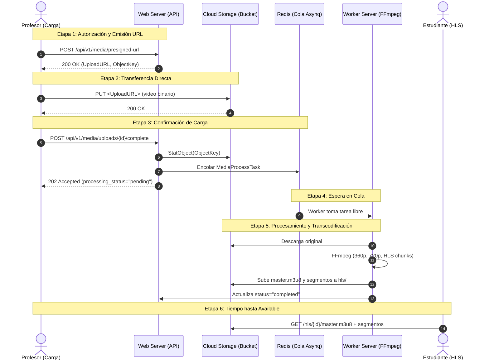

# Escenario 2: Carga, procesamiento y consumo multimedia — Plan de pruebas y capacidad

**Bloque:** H — Análisis de capacidad  
**Rúbrica:** Análisis de capacidad — Escenario 2 (10%)  
**Dependencias:** E1 (Worker Server en red privada y Redis/Asynq), G1 (Perfiles multimedia y datos sintéticos)  
**Desbloquea:** H5 (Ejecución formal de pruebas de capacidad y reporte consolidado)  
**Documento previo acordado:** Este plan define formalmente los perfiles, tasas, concurrencia, cadencia, instrumentación y criterios de parada antes de iniciar la ejecución de carga a gran escala.

---

## 1. Definición de Perfiles Multimedia y Rendiciones Esperadas

El escenario utiliza exactamente los tres perfiles de video introducidos en G1 ([`cmd/seed-media`](../cmd/seed-media/main.go) y [`docs/entrega2/evidencias/G1/README.md`](../docs/entrega2/evidencias/G1/README.md)) y costizados en [`docs/entrega2/CONFIGURACION_Y_COSTOS.md`](../docs/entrega2/CONFIGURACION_Y_COSTOS.md) §3.

### 1.1 Perfiles de Entrada

| Perfil | Duración | Resolución original | Códecs fuente | Tamaño original estimado | Objetos derivados esperados |
| :--- | :---: | :---: | :---: | :---: | :---: |
| **Corto** | 2 min (120 s) | 1280×720 (720p) | H.264 / AAC 44.1 kHz | ~2.6 MB | 1 original + 42 derivados |
| **Medio** | 10 min (600 s) | 1280×720 (720p) | H.264 / AAC 44.1 kHz | ~13.0 MB | 1 original + ~202 derivados |
| **Largo** | 30 min (1800 s) | 1280×720 (720p) | H.264 / AAC 44.1 kHz | ~39.0 MB | 1 original + ~602 derivados |

### 1.2 Escalera HLS Declarada y Regla de NO Upscaling

La transcodificación aplica estrictamente la escalera por defecto del sistema ([`internal/transcode.DefaultLadder`](../internal/transcode/rendition.go#L49)):

| Rendición | Resolución | Bitrate de Video | Bitrate de Audio | Ancho de banda anunciado (`BANDWIDTH`) | Duración de segmento TS |
| :--- | :---: | :---: | :---: | :---: | :---: |
| **360p** | 640×360 | 800 kbps | 96 kbps | 896 000 bps | ~6.0 s |
| **720p** | 1280×720 | 2500 kbps | 128 kbps | 2 628 000 bps | ~6.0 s |

Adicionalmente, el pipeline genera:
* `master.m3u8`: Manifiesto maestro HLS que declara las variantes `360p.m3u8` y `720p.m3u8` mediante rutas relativas.
* `360p.m3u8` y `720p.m3u8`: Listas de reproducción de variantes que indexan sus respectivos segmentos (`360p_0000.ts`, etc.).

> [!IMPORTANT]
> **Garantía estricta de NO upscaling:**  
> Como los videos fuente tienen una altura nativa de 720p, la función [`SelectRenditions`](../internal/transcode/rendition.go#L60) restringe la generación exclusivamente a 360p y 720p. El sistema prohíbe explícitamente generar peldaños superiores (como 1080p), evitando desperdiciar ciclos de CPU de los workers en agrandar artificialmente un archivo sin aportar detalle visual real.

---

## 2. Concurrencia Fija y Niveles Crecientes de Carga

### 2.1 Concurrencia de Workers Fija

La infraestructura de procesamiento en la nube está dimensionada y fijada desde el aprovisionamiento de E1 ([`docs/entrega2/evidencias/E1/concurrencia_y_disco_temporal.txt`](../docs/entrega2/evidencias/E1/concurrencia_y_disco_temporal.txt)):
* **Instancia:** `mooc-worker-server` (`e2-highcpu-2`: 2 vCPU dedicadas, 2 GiB RAM, 30 GiB SSD equilibrado).
* **Concurrencia efectiva:** `WORKER_CONCURRENCY=2` (1 worker por cada vCPU física).
* **Justificación:** Cada proceso de FFmpeg a 720p satura 1 núcleo y consume 400–600 MiB de RAM. Concurrencia fijada en 2 garantiza la máxima utilización del procesador sin degradación por cambios de contexto ni riesgo de *Out Of Memory* (OOM). La concurrencia no se altera durante los experimentos.

### 2.2 Niveles Crecientes de Carga (Subida vs Consumo HLS)

Se evalúan 5 niveles escalonados que contrastan la generación de contenido por profesores con el consumo concurrente por estudiantes:

| Nivel | Rol Carga (Profesores) | Perfil Subido | Tasa de Inyección Carga | Rol Consumo (Estudiantes) | Régimen Esperado |
| :---: | :---: | :---: | :---: | :---: | :--- |
| **Nivel 0 (Piloto H4)** | 1 profesor | Corto (2m) | 1 video secuencial | 2 estudiantes | Verificación de instrumentación y línea base limpia |
| **Nivel 1 (Sub-saturación)** | 2 profesores concurrentes | Corto (2m) | 1 subida cada 2 min (0.5 vid/min) | 10 estudiantes concurrentes | Tasa de llegada < Tasa de servicio. Cola Asynq en 0 o 1. |
| **Nivel 2 (Equilibrio nominal)** | 4 profesores concurrentes | Corto y Medio (10m) | ~1.5 vid/min promedio | 25 estudiantes concurrentes | Tasa de llegada ≈ Tasa de servicio. Workers al 85–100% CPU. |
| **Nivel 3 (Saturación de cola)** | 8 profesores concurrentes | Corto, Medio y Largo (30m) | ~3.0 vid/min promedio | 50 estudiantes concurrentes | Tasa de llegada > Tasa de servicio. Cola acumula tareas (`pending` crece monótonamente). |
| **Nivel 4 (Estrés y drenaje)** | 12 profesores en ráfaga | Corto y Medio | Ráfaga masiva inicial | 100 estudiantes concurrentes | Saturación total. Se detiene la inyección y se cronometra el tiempo de drenaje total de la cola. |

---

## 3. Cadencia de Descarga de Segmentos: Reproducción Real vs "Lo Más Rápido Posible"

### 3.1 Modelado de Cadencia Real (Streaming HLS)

Un reproductor real (Hls.js, ExoPlayer, Safari) no descarga todos los segmentos en un solo bloque, sino que sigue una cadencia sincronizada con el tiempo de reproducción:
1. **Petición del Manifiesto Maestro:** `GET /hls/<resource_stable_id>/master.m3u8`
2. **Selección de Variante:** `GET /hls/<resource_stable_id>/360p.m3u8` (o `720p.m3u8`).
3. **Fase de Llenado de Buffer (Ráfaga Inicial):** Descarga inmediata de los 2 primeros segmentos (`_0000.ts` y `_0001.ts`, ~12 segundos de video) para iniciar la reproducción sin congelamientos.
4. **Cadencia Sostenida (Pacing):** A partir del tercer segmento, el cliente emite una petición de segmento cada 6.0 segundos (la duración objetivo declarada del chunk en el manifiesto), simulando el consumo del buffer a velocidad 1.0x.

En el generador de carga (JMeter o scripts de carga), esto se implementa mediante un temporizador uniforme/gaussiano con media de 6 000 ms y dispersión de $\pm 500$ ms.

### 3.2 Variante "Lo Más Rápido Posible" (Greedy / Bulk Download)

Descargar todos los segmentos de forma continua y consecutiva con pausa cero:
* **Identificación:** Se clasifica formalmente como un patrón de *scraping*, descarga masiva fuera de línea o prueba de estrés de I/O de red del almacenamiento de objetos.
* **Aislamiento:** Este patrón **no** representa consumo multimedia de usuarios y se reporta en una sección independiente para no desvirtuar las métricas de streaming continuo.

### 3.3 Mitigación de Costos de Egreso en la Nube

> [!WARNING]
> **Presupuesto y Egreso de Red (Nota técnica 13):**  
> Reproducir íntegramente videos de 10 o 30 minutos a 720p consume ~197 MB por sesión. Mil reproducciones completas transferirían 192 GB de egreso a internet facturado (más de 36 USD, agotando el crédito de la entrega).  
> Por tanto, en el escenario de carga cada sesión de usuario virtual consume una ventana controlada de **60 a 90 segundos de reproducción continua** (manifiesto + buffer + 8 a 12 segmentos). Esto demuestra la cadencia real y mide la estabilidad sin incurrir en transferencias innecesarias.

---

## 4. Decisión: Tiempo al Primer Cuadro (TTFF) e Interrupciones (Stalls)

El enunciado oficial estipula:
> *«Si se reporta tiempo hasta el primer cuadro o interrupciones de reproducción, deben medirse con un reproductor; las peticiones HTTP por sí solas no demuestran esas métricas.»*

### 4.1 Análisis y Decisión

Un cliente HTTP puro (JMeter, curl o Postman) recibe flujos de bytes TCP/TLS y únicamente puede registrar métricas de red: TTFB (*Time To First Byte*), latencia de petición y tiempo de transferencia del objeto. Un cliente HTTP **no decodifica vídeo H.264**, no procesa paquetes TS en un *SourceBuffer* ni dibuja píxeles en pantalla. Asumir que el tiempo de descarga del primer segmento equivale al "tiempo al primer cuadro" es técnicamente incorrecto y contrario a la rúbrica.

**Decisión metodológica:**
1. **Medición de Red y Transporte (Escala masiva):** El generador JMeter mide exclusivamente latencia de peticiones HTTP, tasa de transferencia (MB/s) y errores hacia los manifiestos y segmentos alojados en Cloud Storage.
2. **Medición de QoE (TTFF e Interrupciones con Reproductor Real):** Se implementa una **sonda de medición con un reproductor real** (navegador headless basado en Chromium instrumentado con la API de eventos HTML5 Media: `loadstart`, `loadeddata`, `canplay`, `playing`, `waiting`, `stalled`).
   * **TTFF (Time to First Frame):** Intervalo exacto entre la asignación del `src` (`master.m3u8`) y el disparo del primer evento `playing` (primer cuadro renderizado).
   * **Interrupciones (Rebuffering):** Frecuencia y duración acumulada de eventos `waiting` o `stalled` ocurridos tras el inicio de la reproducción.
   * La sonda corre de manera sincronizada durante las pruebas de carga para capturar el impacto de la saturación sobre la experiencia de usuario real.

---

## 5. Instrumentación por Etapas (6 Etapas Desacopladas)

El flujo se divide e instrumenta en seis etapas con límites de inicio y fin rigurosamente definidos:

### Detalle de Instrumentación

1. **Etapa 1: Autorización y Emisión de URL Prefirmada (Control API)**
   * **Inicio:** Envío del JSON con metadatos del recurso a `POST /api/v1/media/presigned-url`.
   * **Fin:** Recepción de código HTTP 200 con la URL firmada V4.
   * **Métrica:** Latencia del endpoint de firma en la API (ms).

2. **Etapa 2: Transferencia Directa al Almacenamiento (Plano de Datos)**
   * **Inicio:** Primer byte enviado en la petición `PUT <upload_url>`.
   * **Fin:** Recepción del código HTTP 200/204 emitido directamente por Google Cloud Storage.
   * **Métrica:** Tiempo de transferencia directa (s) y velocidad efectiva de subida (MB/s).

3. **Etapa 3: Confirmación de Carga Completa (Control API)**
   * **Inicio:** Envío de `POST /api/v1/media/uploads/{id}/complete` con `Idempotency-Key`.
   * **Fin:** Recepción de código HTTP 202 Accepted.
   * **Métrica:** Latencia del endpoint de confirmación (ms), incluyendo `StatObject` en GCS y encolado en Redis.

4. **Etapa 4: Espera en Cola (Latencia de Mensajería)**
   * **Inicio:** Marca de tiempo de encolado de la tarea en Redis Asynq (`enqueued_at`).
   * **Fin:** Marca de tiempo en que un proceso worker descola la tarea (`started_at`).
   * **Métrica:** Tiempo de residencia en cola (s), profundidad (`worker.queue.pending`) y antigüedad máxima (`worker.queue.oldest_pending_age_seconds`).

5. **Etapa 5: Duración de Procesamiento (Worker FFmpeg)**
   * **Inicio:** Inicio de descarga del original al directorio temporal `/tmp/mooc-media`.
   * **Fin:** Finalización de la subida del último segmento derivado al bucket público de HLS.
   * **Métrica:** Tiempo puro de cómputo y subida de derivados (s) por perfil.

6. **Etapa 6: Tiempo Total hasta Available (`completed`)**
   * **Inicio:** Momento de confirmación HTTP 202 Accepted (Etapa 3).
   * **Fin:** Momento en que la consulta a la API (`GET /api/v1/units/{unitID}/resources`) o base de datos reporta `processing_status = 'completed'` y el manifiesto `master.m3u8` responde HTTP 200 de forma pública.
   * **Métrica:** Tiempo total de ciclo de vida del contenido multimedia ($T_{\text{available}} = T_{\text{cola}} + T_{\text{transcode}}$).

---

## 6. Separación del Tráfico de Control y Transferencia de Archivos

Una premisa de diseño de la plataforma es la separación arquitectural de planos:

| Característica | Plano de Control (API REST) | Plano de Datos (Almacenamiento de Objetos) |
| :--- | :--- | :--- |
| **Componente receptor** | Nginx Proxy / Go API en VM `mooc-web-server` | Google Cloud Storage (`storage.googleapis.com`) |
| **Tráfico involucrado** | Sesiones, emisión de URLs firmadas, confirmación, consultas de catálogo y estado | Transferencia binaria de videos originales (PUT) y descarga de segmentos HLS (GET) |
| **Tipo de carga** | Peticiones HTTP ligeras (JSON < 10 KB), alta concurrencia | Transferencias de alto ancho de banda (flujos de 2.6 MB a 39 MB, segmentos de ~1 MB) |
| **Carga en la VM Web** | Consume CPU, memoria de la API y conexiones a Cloud SQL | **Cero bytes y cero impacto** en la interfaz de red de la VM Web |
| **Métricas observadas** | RPS, latencia p50/p95/p99 de endpoints, uso de CPU en `mooc-web-server` | Ancho de banda (MB/s), latencia de I/O de Cloud Storage, códigos HTTP de GCS |

Los reportes y gráficas de carga mantendrán estas dos categorías estrictamente segregadas.

---

## 7. Criterios de Éxito, Saturación y Parada

### 7.1 Criterios de Éxito
* **Plano de Control:** Latencia p95 de la API inferior a 500 ms en endpoints de multimedia; tasa de error HTTP < 0.1% (cero errores 5xx).
* **Plano de Datos:** 100% de transferencias directas al bucket exitosas (código 200/204); 100% de peticiones de segmentos HLS disponibles con HTTP 200.
* **Procesamiento Asíncrono:** Todas las tareas encoladas alcanzan el estado `completed`; cero tareas enviadas a la cola de fallidos (DLQ) (`worker.jobs.failed = 0`).
* **Experiencia de Streaming:** Cero interrupciones de reproducción (*stalls*) en la cadencia de reproducción real bajo condiciones nominales.

### 7.2 Criterios de Saturación
* **Cola de Mensajería:** Tasa de llegada superior a la tasa de procesamiento; acumulación sostenida en `worker.queue.pending` y antigüedad de tareas superando los 300 segundos.
* **Worker Server:** Utilización sostenida de CPU > 90% en la instancia `mooc-worker-server`.
* **Streaming:** Latencia de entrega de un segmento TS > 3.0 segundos (50% de la duración del chunk), indicando riesgo inminente de agotamiento del buffer del reproductor.

### 7.3 Criterios de Parada Inmediata (Kill Switch)
1. **Tasa de error HTTP en la API > 5%** en una ventana continua de 30 segundos (502 Bad Gateway, 500 Internal Error, o 504 Gateway Timeout).
2. **Tasa de fallos en Cloud Storage > 1%** (403 Forbidden por expiración de firma, 429 Too Many Requests, o 503 Service Unavailable).
3. **Antigüedad de tareas en cola > 15 minutos** sin evidencia de procesamiento continuo (bloqueo o falla del worker).
4. **Reinicio o caída de contenedores** en cualquiera de las VMs por agotamiento de memoria (*OOMKilled*).
5. **Consumo de egreso imprevisto** que supere el límite de seguridad de 20 GB en la sesión de pruebas.
