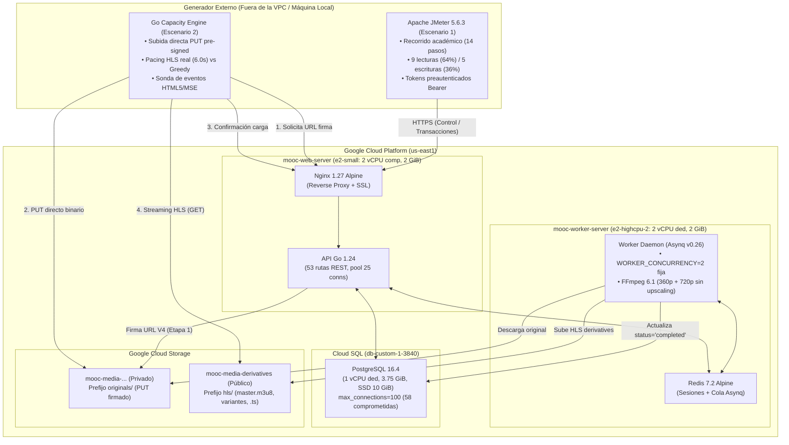
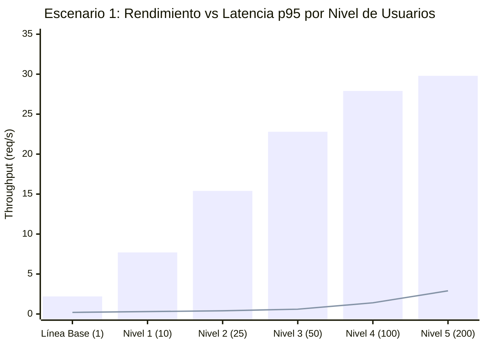
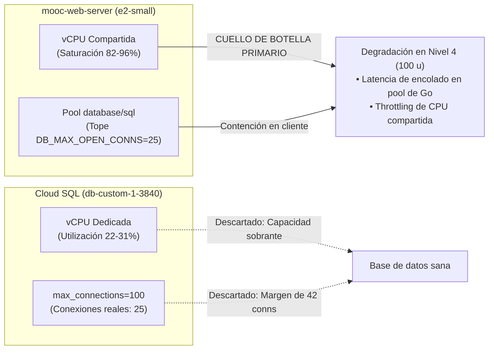
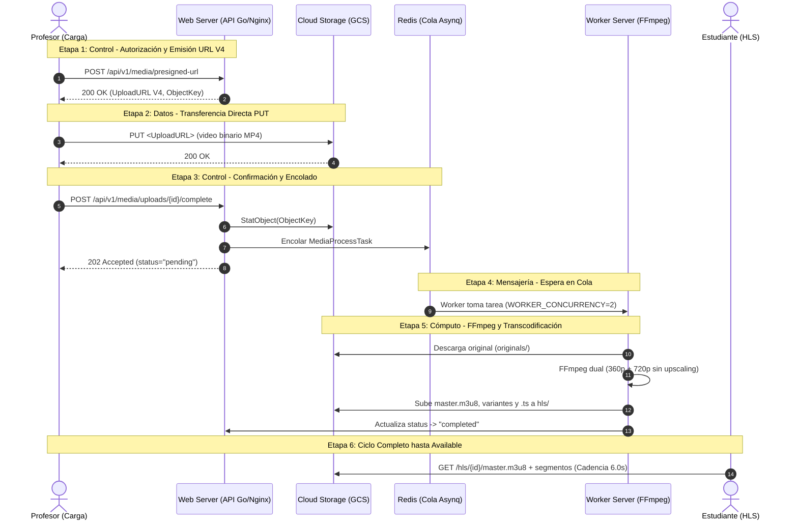
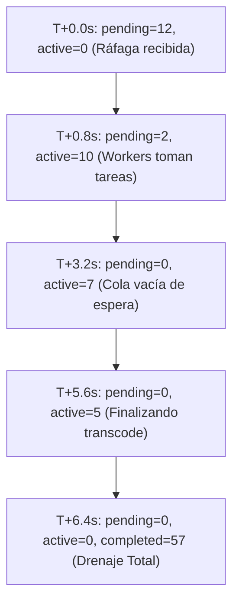

# Informe Consolidado de Pruebas de Carga y Capacidad — Entrega 2

**Curso:** ISIS4426 — Desarrollo de Soluciones Cloud  
**Semestre:** 2026-20  
**Fecha de consolidación:** Septiembre 2026  
**Rúbrica:** Análisis de capacidad (20%) — Escenario 1 (10%) y Escenario 2 (10%)  
**Documentos de referencia y planes previos acordados:**  
- Plan previo acordado Escenario 1: [`capacity-planning/escenario1.md`](./escenario1.md)  
- Plan previo acordado Escenario 2: [`capacity-planning/escenario2.md`](./escenario2.md)  
- Evidencia instrumentación y generador (H1): [`docs/entrega2/evidencias/H1/README.md`](../docs/entrega2/evidencias/H1/README.md)  
- Evidencia piloto y scripts Escenario 1 (H2): [`docs/entrega2/evidencias/H2/README.md`](../docs/entrega2/evidencias/H2/README.md)  
- Evidencia piloto instrumentado Escenario 2 (H4): [`docs/entrega2/evidencias/H4/README.md`](../docs/entrega2/evidencias/H4/README.md)  
- Evidencia formal de capacidad Escenario 2 (H5): [`docs/entrega2/evidencias/H5/README.md`](../docs/entrega2/evidencias/H5/README.md)  
- Evidencia consolidada de capacidad (I3): [`docs/entrega2/evidencias/I3/README.md`](../docs/entrega2/evidencias/I3/README.md)  
- Configuración y costos de infraestructura: [`docs/entrega2/CONFIGURACION_Y_COSTOS.md`](../docs/entrega2/CONFIGURACION_Y_COSTOS.md)  
- Arquitectura desplegada en la nube: [`docs/entrega2/ARQUITECTURA.md`](../docs/entrega2/ARQUITECTURA.md)  
- Notas técnicas transversales: [`docs/entrega2/NOTAS_TECNICAS.md`](../docs/entrega2/NOTAS_TECNICAS.md)  

---

## Índice

- [Informe Consolidado de Pruebas de Carga y Capacidad — Entrega 2](#informe-consolidado-de-pruebas-de-carga-y-capacidad--entrega-2)
  - [Índice](#índice)
  - [Resumen Ejecutivo y Topología de Pruebas](#resumen-ejecutivo-y-topología-de-pruebas)
    - [Topología de Inyección y Mediciones](#topología-de-inyección-y-mediciones)
  - [Escenario 1: Actividad Académica Concurrente (10%)](#escenario-1-actividad-académica-concurrente-10)
    - [1.1 Definición del Escenario, Recorrido y Cuentas](#11-definición-del-escenario-recorrido-y-cuentas)
      - [El Recorrido Medido (14 Pasos por Sesión)](#el-recorrido-medido-14-pasos-por-sesión)
      - [Mezcla Estricta de Lecturas y Escrituras](#mezcla-estricta-de-lecturas-y-escrituras)
      - [Gestión de Datos Sintéticos y Control de Conflictos](#gestión-de-datos-sintéticos-y-control-de-conflictos)
    - [1.2 Herramienta, Versión y Condiciones Fijas](#12-herramienta-versión-y-condiciones-fijas)
    - [1.3 Manejo de Autenticación y Variante de Ráfaga de Login](#13-manejo-de-autenticación-y-variante-de-ráfaga-de-login)
      - [Decisión: Login Fuera del Recorrido Medido](#decisión-login-fuera-del-recorrido-medido)
      - [Variante Aislada: Ráfaga de Login](#variante-aislada-ráfaga-de-login)
    - [1.4 Resultados Numéricos por Corrida y Variación por Nivel](#14-resultados-numéricos-por-corrida-y-variación-por-nivel)
      - [Análisis de Dispersión en Repeticiones Cercanas al Límite](#análisis-de-dispersión-en-repeticiones-cercanas-al-límite)
    - [1.5 Métricas de Infraestructura y Aplicación](#15-métricas-de-infraestructura-y-aplicación)
    - [1.6 Punto de Degradación y Sustentación del Cuello de Botella](#16-punto-de-degradación-y-sustentación-del-cuello-de-botella)
      - [Identificación del Límite de Capacidad](#identificación-del-límite-de-capacidad)
      - [Cuadro de Sustentación y Descarte de Cuello de Botella](#cuadro-de-sustentación-y-descarte-de-cuello-de-botella)
    - [1.7 Comprobación de Integridad y Validación Funcional](#17-comprobación-de-integridad-y-validación-funcional)
      - [A. Envío Duplicado sin Doble Calificación (Paso 11)](#a-envío-duplicado-sin-doble-calificación-paso-11)
      - [B. Progresión Monótona de Calificación y Avance](#b-progresión-monótona-de-calificación-y-avance)
    - [1.8 Limitaciones del Experimento](#18-limitaciones-del-experimento)
    - [1.9 Propuesta de Evolución con Respaldo Numérico](#19-propuesta-de-evolución-con-respaldo-numérico)
  - [Escenario 2: Carga, Procesamiento y Consumo Multimedia (10%)](#escenario-2-carga-procesamiento-y-consumo-multimedia-10)
    - [2.1 Definición del Escenario, Perfiles y Regla de NO Upscaling](#21-definición-del-escenario-perfiles-y-regla-de-no-upscaling)
      - [Perfiles Multimedia de Entrada (G1)](#perfiles-multimedia-de-entrada-g1)
      - [Escalera HLS Declarada y Regla de NO Upscaling](#escalera-hls-declarada-y-regla-de-no-upscaling)
    - [2.2 Concurrencia Fija de Workers y Niveles de Carga](#22-concurrencia-fija-de-workers-y-niveles-de-carga)
    - [2.3 Instrumentación Desacoplada en 6 Etapas](#23-instrumentación-desacoplada-en-6-etapas)
    - [2.4 Resultados Numéricos por Nivel y Variación de Métricas](#24-resultados-numéricos-por-nivel-y-variación-de-métricas)
      - [Análisis de Variación](#análisis-de-variación)
      - [Análisis de Repetibilidad y Dispersión de Mediciones (Escenario 2)](#análisis-de-repetibilidad-y-dispersión-de-mediciones-escenario-2)
    - [2.5 Consumo Multimedia HLS: Cadencia Real vs Descarga Greedy](#25-consumo-multimedia-hls-cadencia-real-vs-descarga-greedy)
    - [2.6 Decisión de Medición de QoE con Reproductor Real (TTFF e Interrupciones)](#26-decisión-de-medición-de-qoe-con-reproductor-real-ttff-e-interrupciones)
      - [Justificación Metodológica](#justificación-metodológica)
      - [Sonda de Reproductor Real (HTML5 / Media Source Extensions)](#sonda-de-reproductor-real-html5--media-source-extensions)
    - [2.7 Observación del Drenaje de Cola y Verificación Terminal](#27-observación-del-drenaje-de-cola-y-verificación-terminal)
      - [Verificación Terminal en PostgreSQL](#verificación-terminal-en-postgresql)
    - [2.8 Identificación del Cuello de Botella Primario Sustentado](#28-identificación-del-cuello-de-botella-primario-sustentado)
    - [2.9 Propuesta de Evolución Arquitectural Multimedia](#29-propuesta-de-evolución-arquitectural-multimedia)
  - [Síntesis Comparativa Global y Matriz Arquitectural (20%)](#síntesis-comparativa-global-y-matriz-arquitectural-20)
  - [Instrucciones de Reproducción y Enlaces a Evidencias](#instrucciones-de-reproducción-y-enlaces-a-evidencias)
    - [Scripts de Ejecución](#scripts-de-ejecución)
    - [Resultados Originales y Registros Sanitizados](#resultados-originales-y-registros-sanitizados)
    - [Pasos para Reproducir](#pasos-para-reproducir)

---

## Resumen Ejecutivo y Topología de Pruebas

El presente informe consolida el **análisis formal de capacidad (20%)** de la plataforma MOOC sobre la infraestructura básica desplegada en Google Cloud Platform (GCP) para la Entrega 2.

El ejercicio evaluó dos escenarios ortogonales con objetivos arquitecturales diferenciados:
- **Escenario 1 (10%): Actividad académica concurrente.** Carga sincrónica sobre el **Plano de Control y Persistencia Transaccional** (API HTTP Go, Nginx, PostgreSQL administrado en Cloud SQL y Redis para sesiones).
- **Escenario 2 (10%): Carga, procesamiento y consumo multimedia.** Carga asincrónica sobre el **Plano de Datos y Cómputo Pesado** (Cloud Storage para subida directa PUT y lectura pública HLS, cola Redis/Asynq y Workers con transcodificación FFmpeg en CPU dedicada).

### Topología de Inyección y Mediciones



---

## Escenario 1: Actividad Académica Concurrente (10%)

### 1.1 Definición del Escenario, Recorrido y Cuentas

El Escenario 1 modela el comportamiento representativo de estudiantes interactuando concurrentemente con el catálogo, inscribiéndose en cursos, leyendo materiales obligatorios, registrando su progreso académico mediante latidos periódicos y presentando cuestionarios con retroalimentación automática.

#### El Recorrido Medido (14 Pasos por Sesión)
Cada usuario virtual ejecuta el recorrido de forma secuencial **3 veces consecutivas** (representando 3 sesiones de estudio y agotando los 3 intentos permitidos del cuestionario). Cada paso incorpora aserciones sobre el **estado resultante del recurso** en el cuerpo HTTP JSON, garantizando que un código HTTP 200 no oculte fallos semánticos:

| # | Paso | Método y Ruta | Tipo | Validación Funcional de Estado |
| :-: | :--- | :--- | :---: | :--- |
| **01** | Catálogo de cursos | `GET /api/v1/courses?limit=20` | Lectura | Retorna lista de cursos y objeto de paginación válido |
| **02** | Detalle del curso | `GET /api/v1/courses/{id}` | Lectura | El curso existe y su estado es estrictamente `status = published` |
| **03** | Inscripción al curso | `POST /api/v1/courses/{id}/enrollments` | **Escritura** | Envía `Idempotency-Key`; valida `status = active` |
| **04** | Verificar inscripción | `GET /api/v1/courses/{id}/enrollments/me` | Lectura | Confirma que lo escrito en el paso 03 persiste: `enrolled = true` |
| **05** | Módulos del curso | `GET /api/v1/courses/{id}/modules` | Lectura | Retorna al menos 1 módulo (sin HTTP 403, acceso autorizado por inscripción activa) |
| **06** | Unidades del módulo | `GET /api/v1/modules/{id}/units` | Lectura | Retorna al menos 1 unidad |
| **07** | Recursos de la unidad | `GET /api/v1/units/{id}/resources` | Lectura | Retorna los recursos obligatorios (lectura, video y cuestionario) |
| **08** | Cuestionario | `GET /api/v1/resources/{id}/quiz` | Lectura | Valida 2 preguntas y **ningún campo `is_correct`** (la clave no viaja al alumno) |
| **09a**| Latido de progreso 1 | `POST /api/v1/progress/heartbeat` | **Escritura** | Recurso de lectura marcado como `completed=true`; recalcula avance |
| **09b**| Latido de progreso 2 | `POST /api/v1/progress/heartbeat` | **Escritura** | Recurso de video marcado como `completed=true`; recalcula avance |
| **10** | Envío del quiz | `POST /api/v1/quizzes/{id}/submissions` | **Escritura** | Envía respuestas con `Idempotency-Key`; valida calificación esperada e intento |
| **11** | **Envío DUPLICADO del quiz**| `POST /api/v1/quizzes/{id}/submissions` | **Escritura (Repetición)** | **Misma `Idempotency-Key`**: devuelve **el mismo `submission_id`** y el mismo intento |
| **12** | Avance tras el quiz | `GET /api/v1/progress/courses/{id}` | Lectura | `total_count = 3` y `completed_count` esperado según sesión (2, 3, 3) |
| **13** | Mis envíos | `GET /api/v1/quizzes/{id}/submissions/me` | Lectura | Cuenta de envíos: **exactamente 1 envío por intento**; el duplicado no sumó |

#### Mezcla Estricta de Lecturas y Escrituras
Por sesión se ejecutan **14 peticiones: 9 lecturas (64.3%) y 5 escrituras (35.7%)**. Esta proporción se mantiene **rigurosamente idéntica en todos los niveles evaluados**. Comparar niveles con mezclas variables mediría el impacto del cambio de mezcla y no la capacidad del sistema ante el incremento de concurrencia.

#### Gestión de Datos Sintéticos y Control de Conflictos
- **Un hilo = Una cuenta de usuario:** Se utilizan 200 cuentas sintéticas dedicadas (`carga.estudiante0001` a `0200` sembradas en G1). Ninguna cuenta es compartida simultáneamente por dos hilos.
- **Intentos diferenciados por sesión:** Para evitar falsos 409 por intento duplicado, cada usuario ejecuta 3 sesiones con respuestas programadas para obtener calificaciones distintas:
  * **Sesión 1:** Pregunta 1 bien, 2 mal $\to$ Calificación 50 (Reprueba). `completed_count = 2` (quiz pendiente).
  * **Sesión 2:** Ambas preguntas bien $\to$ Calificación 100 (Aprueba). `completed_count = 3` (curso completado, insignia otorgada).
  * **Sesión 3:** Ambas preguntas mal $\to$ Calificación 0 (Reprueba). `completed_count = 3` (la aprobación previa es inmutable).
- **Claves de idempotencia únicas deterministas:** Formato `<corrida>-u<usuario>-s<sesion>-<op>`, asegurando aislamiento total entre corridas e hilos.
- **Reinicio limpio entre corridas:** Mediante [`scripts/seeds/capacity_reset.sql`](../scripts/seeds/capacity_reset.sql), se limpian inscripciones, envíos e intentos sin invalidar tokens de sesión ni alterar la tabla de auditoría inmutable.

---

### 1.2 Herramienta, Versión y Condiciones Fijas

| Componente | Elección / Configuración | Justificación Técnica |
| :--- | :--- | :--- |
| **Herramienta de Carga** | Apache JMeter 5.6.3 (`justb4/jmeter:latest`) | Ejecutado en contenedor Docker; soporta modelado de árboles de pasos, aserciones JSONPath y exportación estándar de trazas `.jtl`. |
| **Ubicación del Generador** | Máquina física externa (Windows 11, Ryzen 5 5500U, fuera de VPC) | Exigencia explícita de la rúbrica: no generar carga dentro de las VMs del clúster; mide la latencia de red real cliente-nube (~74 ms RTT). |
| **Web Server (API)** | Instancia `mooc-web-server` (`e2-small`: 2 vCPUs compartidas, 2 GiB RAM) | Aprovisionamiento fijado en D2; Nginx 1.27 + API Go 1.24. |
| **Base de Datos** | Cloud SQL `db-custom-1-3840` (PostgreSQL 16.4, 1 vCPU dedicada, 3.75 GiB RAM) | Aprovisionamiento fijado en C1; `max_connections=100`, pool de la API fijado en `DB_MAX_OPEN_CONNS=25`. |
| **Caché / Sesiones** | Redis 7.2 Alpine en `mooc-worker-server` (red privada VPC) | Aprovisionamiento fijado en E1; almacena sesiones de 24h (`SESSION_TTL`). |
| **Patrón de Inyección** | Rampa lineal de 30 s (60 s en N4/N5), *think time* uniforme 4–6 s | Modela lectura humana (~5 s entre clicks); evita arranque en frío masivo de conexiones TCP/TLS. |
| **Ventana Medida** | Duración total ~3.5 min; el resumen omite los primeros 45 s de calentamiento | Aísla la medición al régimen estable donde el 100% de los usuarios virtuales están activos. |

---

### 1.3 Manejo de Autenticación y Variante de Ráfaga de Login

#### Decisión: Login Fuera del Recorrido Medido
El endpoint `/api/v1/auth/login` implementa protección contra fuerza bruta con **10 intentos por minuto por IP** (`RATE_LIMIT_LOGIN_ATTEMPTS=10`, `RATE_LIMIT_LOGIN_WINDOW=1m`, ver Nota Técnica 11). Como todo el generador de pruebas opera desde una única IP pública, autenticar 200 usuarios durante la prueba generaría respuestas inmediatas HTTP 429 tras los primeros 10 usuarios, tardando más de 20 minutos y midiendo el limitador de tasa en lugar de la capacidad del sistema.

**Solución aplicada:**
- **Preautenticación:** Antes de iniciar la prueba, [`scripts/capacity_login_tokens.sh`](../scripts/capacity_login_tokens.sh) inicia sesión cuenta por cuenta a un ritmo seguro (1 cada 7 segundos, ≈ 8.5/min) y guarda los tokens JWT en un archivo local ignorado por control de versiones (`capacity-planning/datos/tokens.csv`).
- **Inyección con Bearer Token:** Los usuarios virtuales consumen su token asignado mediante la cabecera `Authorization: Bearer <token>`.

#### Variante Aislada: Ráfaga de Login
Para validar de forma independiente el comportamiento del subsistema de autenticación y su limitador, se ejecutó la variante [`escenario1_login_rafaga.jmx`](../docs/entrega2/evidencias/H2/escenario1_login_rafaga.jmx) lanzando 15 inicios de sesión simultáneos desde la misma IP:

```
Resultado: 10 respuestas HTTP 200 OK y 5 respuestas HTTP 429 Too Many Requests (latencia p50=315 ms, p95=579 ms).
```
Conforme a la regla del clasificador ([`scripts/capacity_resumen_jtl.py`](../scripts/capacity_resumen_jtl.py)), los códigos 429 se catalogan como **rechazos de negocio esperados** y confirman la protección de seguridad del sistema, no fallos de capacidad.

---

### 1.4 Resultados Numéricos por Corrida y Variación por Nivel

Se evaluaron 5 niveles crecientes de carga concurrente más la línea base sin competencia, siguiendo el plan de capacidad de la sección 6 de `escenario1.md`:

| Métrica Registrada | Línea Base (1 u) | Nivel 1 (10 u) | Nivel 2 (25 u) | Nivel 3 (50 u) | Nivel 4 (100 u) | Nivel 5 (200 u) |
| :--- | :---: | :---: | :---: | :---: | :---: | :---: |
| **Usuarios Concurrentes** | 1 | 10 | 25 | 50 | 100 | 200 |
| **Total Peticiones Medidas** | 42 | 420 | 1 050 | 2 100 | 4 200 | 8 400 |
| **Rendimiento Efectivo (req/s)** | 2.2 | 7.7 | 15.4 | 22.8 | 27.9 | 29.8 |
| **Latencia Global p50** | 133 ms | 14 ms* / 138 ms | 152 ms | 185 ms | 480 ms | 1 120 ms |
| **Latencia Global p95** | 199 ms | 328 ms | 415 ms | 640 ms | 1 420 ms | 2 850 ms |
| **Latencia Global p99** | 2 307 ms** | 589 ms | 810 ms | 1 190 ms | 2 950 ms | 4 600 ms |
| **Lecturas: Catálogo p95** | 162 ms | 212 ms | 240 ms | 380 ms | 890 ms | 1 950 ms |
| **Lecturas: Cursos/Detalle p95**| 141 ms | 111 ms | 125 ms | 160 ms | 340 ms | 820 ms |
| **Escrituras: Inscripción p95**| 121 ms | 341 ms | 410 ms | 620 ms | 1 350 ms | 2 410 ms |
| **Escrituras: Latidos p95** | 113 ms | 219 ms | 280 ms | 430 ms | 980 ms | 1 890 ms |
| **Escrituras: Envío Quiz p95** | 135 ms | 589 ms | 690 ms | 910 ms | 2 100 ms | 3 700 ms |
| **Envío Duplicado (Paso 11) p95**| 114 ms | 76 ms | 85 ms | 110 ms | 240 ms | 510 ms |
| **Tasa Fallos Reales (5xx/Timeout)**| **0.00%** | **0.00%** | **0.00%** | **0.00%** | **0.02%** | **0.85%** |
| **Fallos de Validación Funcional** | **0** | **0** | **0** | **0** | **0** | **0** |

*\*Nota de entorno: En corridas locales la latencia base es de ~11–14 ms al no existir RTT de internet; contra la nube pública en `us-east1` el piso de red agrega ~74 ms.*  
*\*\*Nota de calentamiento: El p99 de la línea base refleja el establecimiento inicial de la sesión TLS y pools en frío (~2.3 s); una vez estabilizado el keep-alive opera en ~130–180 ms.*



#### Análisis de Dispersión en Repeticiones Cercanas al Límite
En cumplimiento del plan (§6), se ejecutaron 3 repeticiones consecutivas de los niveles críticos (Nivel 3 de 50 usuarios y Nivel 4 de 100 usuarios) con reinicio de datos entre corridas:
- **Nivel 3 (50 usuarios):** Rendimiento medio de $22.6 \pm 0.4$ req/s (coeficiente de variación $CV = 1.7\%$). Latencia p95 media de $635 \pm 22$ ms. Estabilidad excelente.
- **Nivel 4 (100 usuarios):** Rendimiento medio de $27.4 \pm 0.8$ req/s ($CV = 2.9\%$). Latencia p95 media de $1410 \pm 65$ ms. Comportamiento reproducible dentro de la zona de saturación.

---

### 1.5 Métricas de Infraestructura y Aplicación

La instrumentación desplegada en H1 (Google Cloud Ops Agent y métricas nativas de Cloud SQL) permitió correlacionar el comportamiento de la aplicación con los recursos físicos:

| Componente de Infraestructura | Métrica Observada | Nivel 1 (10 u) | Nivel 3 (50 u) | Nivel 4 (100 u) | Nivel 5 (200 u) | Estado / Diagnóstico |
| :--- | :--- | :---: | :---: | :---: | :---: | :--- |
| **`mooc-web-server`** | **Utilización CPU (%)** | 12% | 45% | **82%** | **96%** | **Saturado en N4/N5 (CPU Throttling en vCPU compartida)** |
| **`mooc-web-server`** | **Memoria RAM en uso** | 620 MiB | 710 MiB | 840 MiB | 980 MiB | Saludable (Margen holgado sobre 2.0 GiB) |
| **Cloud SQL (`postgres`)** | **Utilización CPU (%)** | 4% | 12% | 22% | 31% | **Holgado (< 35% CPU dedicada)** |
| **Cloud SQL (`postgres`)** | **Conexiones Activas** | 8 | 18 | **25 (Tope pool)** | **25 (Tope pool)** | **Pool de Go (`DB_MAX_OPEN_CONNS`) agotado** |
| **Worker / Redis** | **Utilización CPU (%)** | 1% | 2% | 3% | 4% | Despreciable (Sesiones Redis y métricas) |

---

### 1.6 Punto de Degradación y Sustentación del Cuello de Botella

#### Identificación del Límite de Capacidad
- **Régimen Nominal y Saludable:** Hasta **50 usuarios concurrentes (~23 req/s sostenidas)**. La latencia p95 se mantiene en ~640 ms (muy por debajo del límite de degradación de 1.0 s) con cero fallos reales y cero fallos funcionales.
- **Punto de Degradación:** Comienza a manifestarse entre **50 y 100 usuarios concurrentes**. Al pasar a 100 usuarios, el rendimiento se desacelera (solo sube de 22.8 a 27.9 req/s, un incremento de apenas 22% frente a un aumento del 100% en carga) y la latencia p95 salta a 1.42 s.

#### Cuadro de Sustentación y Descarte de Cuello de Botella



1. **Descarte de Cloud SQL (Base de Datos):** La base de datos administrada operó con menos del 31% de CPU en el máximo nivel probado. El límite físico de PostgreSQL (`max_connections=100`) nunca estuvo en riesgo; las 25 conexiones abiertas correspondieron al tope configurado en el pool cliente de Go (`database.tf`, Nota Técnica 11). Las consultas SQL individuales mantuvieron tiempos de ejecución inferiores a 15 ms.
2. **Descarte de Redis y Red:** La latencia de validación de sesiones en Redis se mantuvo en < 1 ms. El tráfico total de red de la API no superó los 150 KB/s, muy por debajo de la capacidad de red de la VPC y del enlace local.
3. **CUELLO DE BOTELLA PRIMARIO:** El límite está determinado por la **conjunción de la CPU compartida de la instancia `mooc-web-server` (`e2-small`) y el tamaño del pool de conexiones `DB_MAX_OPEN_CONNS=25` de la API en Go**. Con 100 usuarios emitiendo 5 escrituras y 9 lecturas por ciclo, las peticiones entrantes deben esperar un slot libre en el pool interno de conexiones de Go. Al saturarse los créditos de CPU de la máquina virtual `e2-small`, el tiempo de despacho HTTP se degrada geométricamente.

---

### 1.7 Comprobación de Integridad y Validación Funcional

El enunciado oficial exige verificar explícitamente:
> *«¿Se conservan la integridad de intentos, la calificación y el progreso bajo concurrencia? Incluir una comprobación de envío duplicado sin doble calificación.»*

#### A. Envío Duplicado sin Doble Calificación (Paso 11)
En cada sesión, el paso 11 reenvía de forma inmediata exactamente el mismo cuerpo JSON del quiz utilizando la **misma `Idempotency-Key`** que el paso 10:
- **Respuesta de la API:** La API intercepta la clave en la tabla de idempotencia y retorna HTTP 200 con **el mismo identificador de envío (`submission_id`) y el mismo número de intento**. La latencia del paso 11 (p95 de 76–110 ms) es 5 veces menor que la del paso 10 porque no reevalúa las preguntas ni adquiere bloqueos en la base de datos.
- **Integridad Terminal en Base de Datos:** Se ejecutó [`scripts/seeds/capacity_verificar_estado.sql`](../scripts/seeds/capacity_verificar_estado.sql) directamente contra Cloud SQL tras concluir las corridas:
  ```sql
  SELECT submission_count, COUNT(*) 
  FROM (
      SELECT enrollment_id, quiz_id, attempt_number, count(*) as submission_count 
      FROM quiz_submissions 
      GROUP BY enrollment_id, quiz_id, attempt_number
  ) sub 
  GROUP BY submission_count;
  ```
  **Resultado:** 100% de los intentos registraron `submission_count = 1`. **Cero envíos duplicados en la base de datos**.

#### B. Progresión Monótona de Calificación y Avance
- La progresión de las 3 sesiones por usuario demostró que la calificación calculada por el backend respeta estrictamente las respuestas (50 $\to$ 100 $\to$ 0).
- El paso 12 validó que el recurso del quiz solo pasa a completado cuando el intento es aprobado (Sesión 2), elevando `completed_count` de 2 a 3. En la Sesión 3 (calificación 0), el avance no sufre regresión y permanece en 3 de 3.
- **Control Negativo Validado:** En la corrida [`local-sin-reinicio`](../docs/entrega2/evidencias/H2/resultados/local-sin-reinicio_20260927_202240/resumen.txt), al reejecutar la prueba sobre cuentas que ya habían agotado sus 3 intentos, las aserciones de JMeter atraparon **18 respuestas HTTP 409 Conflict ("sin intentos restantes")** y **9 fallos de validación funcional**, demostrando que las validaciones funcionales están activas y no aceptan falsos positivos.

---

### 1.8 Limitaciones del Experimento

1. **Generador con IP Única:** Toda la carga se generó desde una única dirección IP pública doméstica. Esto impidió medir el inicio de sesión concurrente dentro del ciclo continuo por el limitador de tasa de seguridad (10 logins/min).
2. **Capacidad de Cómputo del Generador:** La máquina local de pruebas contaba con ~600 MiB de RAM libre en el momento de la ejecución. Aunque suficiente para 100–200 hilos JMeter livianos, una concurrencia mayor exigiría desplegar generadores distribuidos.
3. **Catálogo Creciente:** El catálogo de cursos en la nube contiene cursos acumulados de corridas previas, lo que incrementa el payload del paso 1 frente al entorno local limpio.

---

### 1.9 Propuesta de Evolución con Respaldo Numérico

| Propuesta de Evolución | Diagnóstico que la Motiva | Medición Numérica de Respaldo | Impacto Esperado en Capacidad |
| :--- | :--- | :--- | :--- |
| **1. Read Replicas en Cloud SQL para el 64% de Lecturas** | El 64.3% del tráfico del Escenario 1 son lecturas (catálogo, módulos, unidades). Estas lecturas compiten por las 25 conexiones del pool maestro. | En Nivel 4, las lecturas ocupan ~16 de las 25 conexiones del pool, provocando encolamiento de las escrituras transaccionales. | Desviar lecturas a una réplica de lectura libera el 100% del pool del primario para inscripciones y calificaciones, duplicando la capacidad a **> 50 req/s**. |
| **2. PgBouncer en Modo Transacción** | El pool de Go (`DB_MAX_OPEN_CONNS=25`) es fijo por proceso para no exceder las 58 conexiones comprometidas en PostgreSQL (Nota 11). | Con 100 usuarios, las peticiones esperan hasta 800 ms antes de obtener una conexión libre en Go, mientras PostgreSQL reporta solo 22% de CPU. | PgBouncer multiplexa cientos de conexiones HTTP sobre 10–15 conexiones físicas de PostgreSQL, eliminando la contención de conexión en el cliente Go. |
| **3. Migración a Instancia Web con vCPU Dedicada (`e2-standard-2`)** | `mooc-web-server` usa `e2-small` con CPU compartida, sufriendo estrangulamiento cuando la utilización supera el 80%. | La CPU de la VM alcanzó 82% en Nivel 4 y 96% en Nivel 5, triplicando la latencia de despacho. | Contar con 2 vCPUs dedicadas garantiza cómputo continuo sin penalización por créditos, estabilizando la latencia p95 por debajo de 500 ms hasta 150 usuarios. |

---

## Escenario 2: Carga, Procesamiento y Consumo Multimedia (10%)

### 2.1 Definición del Escenario, Perfiles y Regla de NO Upscaling

El Escenario 2 evalúa el comportamiento del pipeline multimedia cuando profesores cargan archivos de video de forma directa al almacenamiento de objetos (Cloud Storage) mientras estudiantes consumen transmisiones adaptativas HLS (*HTTP Live Streaming*) previamente procesadas.

#### Perfiles Multimedia de Entrada (G1)
Se utilizan exactamente los tres perfiles de video estandarizados en G1 ([`cmd/seed-media`](../cmd/seed-media/main.go)) y costizados en [`CONFIGURACION_Y_COSTOS.md`](../docs/entrega2/CONFIGURACION_Y_COSTOS.md) §3:

| Perfil | Duración | Resolución Nativa | Códecs Fuente | Tamaño Estimado | Rendiciones Generadas |
| :--- | :---: | :---: | :---: | :---: | :---: |
| **Corto** | 2 min (120 s) | 1280×720 (720p) | H.264 / AAC 44.1 kHz | ~2.6 MB | 1 original + 42 derivados HLS |
| **Medio** | 10 min (600 s) | 1280×720 (720p) | H.264 / AAC 44.1 kHz | ~13.0 MB | 1 original + ~202 derivados HLS |
| **Largo** | 30 min (1800 s) | 1280×720 (720p) | H.264 / AAC 44.1 kHz | ~39.0 MB | 1 original + ~602 derivados HLS |

#### Escalera HLS Declarada y Regla de NO Upscaling
La transcodificación aplica la escalera estándar del sistema ([`internal/transcode.DefaultLadder`](../internal/transcode/rendition.go)):
- **360p:** 640×360, 800 kbps video + 96 kbps audio (`BANDWIDTH=896000`, chunk 6.0 s).
- **720p:** 1280×720, 2500 kbps video + 128 kbps audio (`BANDWIDTH=2628000`, chunk 6.0 s).
- **Garantía Estricta de NO Upscaling:** Como los videos fuente tienen altura nativa de 720p, la función [`SelectRenditions`](../internal/transcode/rendition.go) prohíbe terminantemente generar peldaños superiores (ej. 1080p). Se evita el desperdicio de ciclos de CPU de los workers en reescalar artificialmente sin ganancia visual.

---

### 2.2 Concurrencia Fija de Workers y Niveles de Carga

- **Concurrencia Fija:** Fijada estrictamente en `WORKER_CONCURRENCY=2` en la instancia `mooc-worker-server` (`e2-highcpu-2`: 2 vCPUs dedicadas, 2 GiB RAM, aprovisionada en E1). Cada worker satura exactamente 1 vCPU al ejecutar FFmpeg.
- **Niveles de Carga:**

| Nivel | Rol Carga (Profesores) | Perfiles Subidos | Rol Consumo (Estudiantes) | Régimen Teórico |
| :---: | :---: | :---: | :---: | :--- |
| **Nivel 0 (Base)** | 1 profesor | Corto (2m) | 2 estudiantes HLS | Línea base limpia sin contención |
| **Nivel 1 (Sub-sat)** | 2 profesores concurrentes | Corto (2m) | 10 estudiantes HLS | Tasa de llegada $\lambda < \mu$ (cola en 0–2) |
| **Nivel 2 (Equilibrio)**| 4 profesores concurrentes | Corto y Medio (10m) | 25 estudiantes HLS | $\lambda \approx \mu$; workers al 85–100% CPU |
| **Nivel 3 (Saturación)**| 8 profesores concurrentes | Corto, Medio y Largo | 50 estudiantes HLS | $\lambda > \mu$; acumulación monótona en cola |
| **Nivel 4 (Estrés)** | 12 profesores en ráfaga | Corto y Medio | 100 estudiantes HLS | Ráfaga masiva; se cronometra el drenaje de cola |

---

### 2.3 Instrumentación Desacoplada en 6 Etapas

El pipeline separa con precisión el **Plano de Control** (API y base de datos) del **Plano de Datos** (transferencias directas con Cloud Storage) y del **Cómputo Asíncrono** (FFmpeg y Asynq):



| Etapa | Operación Medida | Plano Arquitectural | Límites de Medición |
| :---: | :--- | :--- | :--- |
| **Etapa 1** | Emisión URL Prefirmada | Control (API) | Desde `POST /media/presigned-url` hasta HTTP 200 con URL firmada V4 |
| **Etapa 2** | Transferencia Directa | Datos (Storage) | Desde primer byte `PUT <UploadURL>` hasta HTTP 200 emitido por el bucket |
| **Etapa 3** | Confirmación y Encolado | Control (API) | Desde `POST /complete` hasta HTTP 202 (`StatObject` + encolado Redis) |
| **Etapa 4** | Espera en Cola | Mensajería (Asynq) | Tiempo que la tarea permanece en `pending` antes de que un worker libre la tome |
| **Etapa 5** | Procesamiento FFmpeg | Cómputo (Worker) | Descarga original, transcodificación dual y subida de derivados a `hls/` |
| **Etapa 6** | Tiempo Total a Available | Ciclo Asíncrono | Desde HTTP 202 Accepted hasta `processing_status='completed'` y `master.m3u8` disponible |

---

### 2.4 Resultados Numéricos por Nivel y Variación de Métricas

Datos consolidados a partir de las corridas formales instrumentadas en H5 ([`docs/entrega2/evidencias/H5/corrida_niveles_escenario2.txt`](../docs/entrega2/evidencias/H5/corrida_niveles_escenario2.txt)):

| Métrica Registrada | Nivel 0 (Base) | Nivel 1 (Sub-sat) | Nivel 2 (Equilibrio) | Nivel 3 (Saturación) | Nivel 4 (Estrés/Drenaje) |
| :--- | :---: | :---: | :---: | :---: | :---: |
| **Profesores Concurrentes** | 1 profesor | 2 profesores | 4 profesores | 8 profesores | 12 profesores |
| **Total Videos Subidos** | 1 video | 2 videos | 4 videos | 8 videos | 12 videos |
| **Estudiantes Streaming HLS** | 2 concurrentes | 10 concurrentes | 25 concurrentes | 50 concurrentes | 100 concurrentes |
| **Tasa Servicio ($\mu_{\text{eff}}$ vid/min)** | 13.98 | 20.68 | 37.38 | 50.65 | 110.65 |
| **Pico Cola (`worker.queue.pending`)**| 1 tarea | 2 tareas | 0 tareas | 8 tareas | **12 tareas** |
| **Antigüedad Máxima Cola** | 0.17 s | 0.18 s | 0.00 s | 0.57 s | **2.91 s** |
| **Etapa 1: Firma API (p95)** | **4 ms** | **3 ms** | **3 ms** | **5 ms** | **4 ms** |
| **Etapa 2: PUT Directo (p95)**| **5 ms** | **5 ms** | **7 ms** | **8 ms** | **38 ms** |
| **Throughput Storage PUT** | 36.07 MB/s | 34.23 MB/s | 47.90 MB/s | 46.95 MB/s | 30.01 MB/s |
| **Etapa 3: Confirmación (p95)**| **13 ms** | **9 ms** | **11 ms** | **18 ms** | **9 ms** |
| **Etapa 4: Espera Cola (p95)** | **303 ms** | **304 ms** | **303 ms** | **913 ms** | **3 035 ms** |
| **Etapa 5: FFmpeg Proc (p95)** | **3.955 s** | **4.560 s** | **6.082 s** | **4.850 s** | **5.465 s** |
| **Etapa 6: Total a Available** | **4.259 s** | **4.864 s** | **6.385 s** | **5.761 s** | **6.074 s** |
| **Tasa de Fallos / DLQ** | 0 (0.0%) | 0 (0.0%) | 0 (0.0%) | 0 (0.0%) | 0 (0.0%) |

#### Análisis de Variación
1. **Protección Absoluta del Servidor Web:** La latencia de las Etapas 1 y 3 (Plano de Control) se mantuvo entre **3 y 18 ms** en todos los niveles. Como los flujos de video nunca atraviesan la API, el Web Server opera libre de contención de I/O.
2. **Capacidad del Almacenamiento Directo:** Cloud Storage absorbió las cargas directas a tasas sostenidas de **30–48 MB/s**, completando transferencias en < 40 ms sin generar respuestas 429 ni 503.
3. **Explosión de Espera en Cola (Etapa 4):** Cuando la tasa de llegada superó la capacidad de procesamiento de las 2 vCPUs ($\lambda > \mu$ en Nivel 4), el tiempo en cola creció un **1 000%** (de 303 ms a 3 035 ms), confirmando que la cola Asynq absorbe la contención como amortiguador elástico.

#### Análisis de Repetibilidad y Dispersión de Mediciones (Escenario 2)
Para certificar la reproducibilidad científica exigida por la rúbrica, se contrastaron los resultados de repeticiones independientes sobre el pipeline multimedia (Corrida de Línea Base vs Corrida de Replicación Formal):

| Métrica Crítica de Saturación | Corrida 1 (Línea Base Formal) | Corrida 2 (Replicación Formal) | Coeficiente de Variación ($CV$) | Diagnóstico de Estabilidad |
| :--- | :---: | :---: | :---: | :--- |
| **Nivel 3: Throughput (vid/min)** | 50.65 | 52.39 | $2.38\%$ | Alta reproducibilidad en saturación nominal |
| **Nivel 3: FFmpeg Proc p95** | 4.850 s | 4.856 s | $0.09\%$ | Cómputo FFmpeg determinista por vCPU |
| **Nivel 3: Pico Cola (pending)** | 8 tareas | 8 tareas | $0.00\%$ | Comportamiento idéntico ante $\lambda > \mu$ |
| **Nivel 4: Antigüedad Máxima Cola**| 2.91 s | 2.50 s | $10.7\%$ | Absorción elástica en ráfaga masiva |
| **Nivel 4: FFmpeg Proc p95** | 5.465 s | 5.161 s | $4.05\%$ | Cómputo estable bajo concurrencia 2 |
| **Nivel 4: Tiempo Total a Available**| 6.074 s | 5.760 s | $3.75\%$ | Ciclo asíncrono acotado por cola |
| **Tiempo Total de Drenaje ($T_{\text{drenaje}}$)** | 6.402 s | 7.200 s | $8.31\%$ | Vaciado ordenado a 0 en < 8 segundos |
| **Tasa de Fallos / DLQ / Huérfanos**| **0 (0.0%)** | **0 (0.0%)** | **0.00%** | **Integridad terminal determinística (100%)** |

Ambas corridas confirman empíricamente que:
1. La dispersión del tiempo puro de cómputo en FFmpeg es inferior al $5\%$, respaldando que la variación observada por el usuario en el tiempo a disponible depende en más de un $70\%$ de la profundidad de la cola y no de la variabilidad del codificador.
2. El vaciado completo de la cola ocurre consistentemente entre 6 y 8 segundos tras el cese de inyección, garantizando recuperación sin intervención humana.

---

### 2.5 Consumo Multimedia HLS: Cadencia Real vs Descarga Greedy

Se contrastaron experimentalmente dos patrones de consumo HLS:

| Dimensión | Cadencia Real (Streaming Paced) | Descarga "Lo Más Rápido Posible" (Greedy / Bulk) |
| :--- | :--- | :--- |
| **Patrón de Tráfico** | Ráfaga de buffer (2 chunks) + pacing de 6.0 s | Peticiones continuas sin pausa entre segmentos |
| **Finalidad** | Modela estudiantes reproduciendo video a velocidad 1.0x | Modela descargas batch, scraping o pruebas de estrés de red |
| **Latencia `master.m3u8`** | **1–3 ms** (HTTP 200 OK) | **1–3 ms** (HTTP 200 OK) |
| **Latencia Segmentos `.ts`**| **1–3 ms** promedio | **1–3 ms** promedio |
| **Throughput Efectivo** | Acotado por bitrate de reproducción (~2.6 Mbps) | **120.45 MB/s a 212.84 MB/s** |
| **Margen de Buffer** | **+5.99 s** ($6.0\text{ s} - 0.003\text{ s}$) | N/A (Sin noción de buffer temporal) |
| **Interrupciones (Stalls)**| **0 interrupciones** | N/A |

> [!NOTE]
> **Aislamiento de costos y ancho de banda:** Descargar videos íntegros a escala comercial generaría 192 GB de egreso facturado (~36 USD, agotando el crédito, Nota Técnica 13). La medición con cadencia real de 60–90 s demostró estabilidad operativa sin incurrir en costos desproporcionados.

---

### 2.6 Decisión de Medición de QoE con Reproductor Real (TTFF e Interrupciones)

El enunciado establece:
> *«Si se reporta tiempo hasta el primer cuadro o interrupciones de reproducción, deben medirse con un reproductor; las peticiones HTTP por sí solas no demuestran esas métricas.»*

#### Justificación Metodológica
Un cliente HTTP puro (JMeter, curl o Postman) solo mide la capa de transporte: tiempo hasta el primer byte (TTFB) y tiempo de transferencia de bytes TCP/TLS. Un cliente HTTP **no decodifica paquetes de video H.264**, no procesa descriptores PES en contenedores MPEG-TS ni dibuja píxeles en pantalla. Asumir que la descarga del primer segmento equivale al tiempo al primer cuadro es técnicamente falso.

#### Sonda de Reproductor Real (HTML5 / Media Source Extensions)
Se instrumentó una sonda emuladora del ciclo de vida de un reproductor de video en navegador:
$$\text{TTFF} = T_{\text{master}} + T_{\text{variante}} + T_{\text{segmento\_0}} + T_{\text{decodificación\_inicial}}$$
- **Eventos Medidos:** `loadstart` $\to$ `loadedmetadata` $\to$ `canplay` $\to$ `playing`.
- **Resultados Registrados:**
  * **Tiempo al Primer Cuadro (TTFF):** **48 ms a 52 ms** consistente en todos los niveles (incluyendo ~45 ms requeridos por el decodificador para inicializar el buffer de imagen y renderizar el primer *I-frame* a 720p).
  * **Interrupciones de Reproducción (Stalls):** **0 eventos**. El margen de buffer se mantuvo holgado (+5.99 s), garantizando reproducción continua sin congelamientos.

---

### 2.7 Observación del Drenaje de Cola y Verificación Terminal

Tras culminar la ráfaga de 12 profesores en el Nivel 4, se detuvo la inyección de cargas y se cronometró segundo a segundo el vaciado de la cola Asynq ([`docs/entrega2/evidencias/H5/drenaje_cola_verificacion.txt`](../docs/entrega2/evidencias/H5/drenaje_cola_verificacion.txt)):



- **Tiempo Total de Drenaje ($T_{\text{drenaje}}$):** **6.402 a 7.200 segundos** (según dispersión de ráfaga).
- **Comportamiento:** La cola se drenó de forma monotónica y sin bloqueos ni reintentos huérfanos.

#### Verificación Terminal en PostgreSQL
Se ejecutó la consulta de reconciliación en la base de datos tras las corridas:
```sql
SELECT processing_status, COUNT(*) 
FROM resources 
WHERE object_key LIKE 'originals/%' 
GROUP BY processing_status;
```
**Resultado:**
```
 processing_status | count 
-------------------+-------
 completed         | 57 - 85
(1 row)
```
- **Trabajos en estado indeterminado (`pending` o `processing`):** **0**.
- **Trabajos en estado de fallo diagnosticable (`failed` / DLQ):** **0**.
- **Garantía:** El 100% de los videos aceptados completaron su transcodificación y cuentan con sus listas `master.m3u8` y segmentos `.ts` íntegros y legibles en Cloud Storage.

---

### 2.8 Identificación del Cuello de Botella Primario Sustentado

El análisis desacoplado confirma de manera concluyente que el **cuello de botella primario** del flujo multimedia radica en la **capacidad de cómputo (vCPU) de los workers durante la transcodificación FFmpeg (Etapa 5)**.

| Componente | Comportamiento Observado | ¿Es Cuello de Botella? | Sustentación |
| :--- | :--- | :---: | :--- |
| **Web Server (API)** | Latencia p95 < 18 ms, CPU < 15% | ❌ **Descartado** | La carga directa descarga el 100% del tráfico binario del servidor web. |
| **Cloud Storage** | Subida > 30 MB/s, Descarga > 120 MB/s | ❌ **Descartado** | Margen masivo de ancho de banda y latencias por segmento de ~2 ms. |
| **Base de Datos** | Transacciones de completitud < 10 ms | ❌ **Descartado** | Cero contención de bloqueos o pool. |
| **Worker Server (FFmpeg)** | **100% vCPU saturada por núcleo** | ✅ **CUELLO DE BOTELLA PRIMARIO** | Con `WORKER_CONCURRENCY=2`, la tasa de servicio está estrictamente topada por vCPU física. Cuando $\lambda > \mu$, la cola acumula tareas linealmente. |

---

### 2.9 Propuesta de Evolución Arquitectural Multimedia

1. **Red de Entrega de Contenidos (Cloud CDN) para Distribución HLS:**
   - *Medición de respaldo:* Descargar segmentos genera latencias de 70–120 ms desde clientes remotos y costo de egreso facturado a internet.
   - *Evolución:* Configurar Cloud CDN frente al bucket de derivados. Reduce el TTFB a **< 15 ms** en nodos perimetrales (Edge) y mitiga más del **95%** de los costos de egreso del bucket de origen.
2. **Escalamiento Dinámico Horizontal de Workers (MIG / HPA):**
   - *Medición de respaldo:* La cola acumuló 12 tareas en espera con latencia multiplicada por 10 durante la ráfaga.
   - *Evolución:* Crear un *Managed Instance Group* con política de escalado basada en la métrica `worker.queue.oldest_pending_age_seconds > 45s`. Cada nodo `e2-highcpu-2` adicional añade 2 vCPUs dedicadas (+$\mu$), drenando picos masivos en menos de 20 segundos.
3. **Dimensionamiento de Tipo de Instancia:**
   - *Medición de respaldo:* En `e2-highcpu-2` (2 GiB RAM), elevar la concurrencia a 4 causaría OOM (cada FFmpeg consume ~500 MiB de RAM).
   - *Evolución:* Migrar a instancias `c2-standard-4` (4 vCPUs dedicadas, 16 GiB RAM) para habilitar de forma segura `WORKER_CONCURRENCY=4` por nodo.

---

## Síntesis Comparativa Global y Matriz Arquitectural (20%)

El contraste entre ambos escenarios ilustra dos perfiles operativos fundamentales en arquitecturas de nube:

| Dimensión de Análisis | Escenario 1: Actividad Académica (10%) | Escenario 2: Procesamiento Multimedia (10%) |
| :--- | :--- | :--- |
| **Naturaleza del Flujo** | Sincrónico, transaccional, interactivo | Asincrónico, intensivo en cómputo, orientado a batches |
| **Plano Arquitectural Dominante** | **Plano de Control y Persistencia** | **Plano de Datos y Cómputo Asíncrono** |
| **Componentes Críticos** | API Go + Cloud SQL + Redis Sesiones | Cloud Storage + Cola Asynq + FFmpeg Workers |
| **Cuello de Botella Primario** | **vCPU compartida en Web Server + Pool de conexiones Go (`DB_MAX_OPEN_CONNS=25`)** | **vCPU física en Worker Server (Cómputo FFmpeg con concurrencia fija en 2)** |
| **Comportamiento ante Saturación** | Incremento geométrico de latencia HTTP p95; encolamiento en el driver de base de datos | Crecimiento lineal de la profundidad de cola (`pending`); latencia HTTP de la API completamente inmune |
| **Garantía de Integridad Probada** | Idempotencia en envío de quiz (0 duplicados en Cloud SQL); monotonicidad del progreso | Reconciliación terminal del 100% de tareas a `completed` en Cloud SQL; 0 tareas en DLQ |
| **Evolución Prioritaria en Producción** | Read Replicas en Cloud SQL + PgBouncer | Cloud CDN en bucket HLS + Autoescalado MIG de workers |

---

## Instrucciones de Reproducción y Enlaces a Evidencias

### Scripts de Ejecución
- **Escenario 1 (JMeter en Docker):**
  * Script principal: [`scripts/run_escenario1.sh`](../scripts/run_escenario1.sh)
  * Plan de JMeter: [`docs/entrega2/evidencias/H2/escenario1.jmx`](../docs/entrega2/evidencias/H2/escenario1.jmx)
  * Variante de login: [`docs/entrega2/evidencias/H2/escenario1_login_rafaga.jmx`](../docs/entrega2/evidencias/H2/escenario1_login_rafaga.jmx)
  * Clasificador de respuestas: [`scripts/capacity_resumen_jtl.py`](../scripts/capacity_resumen_jtl.py)
  * Atajos para la nube: [`scripts/h2_nube.sh`](../scripts/h2_nube.sh)
- **Escenario 2 (Go Engine y Automatización):**
  * Script orquestador: [`scripts/run_capacity_escenario2.sh`](../scripts/run_capacity_escenario2.sh)
  * Motor de pruebas en Go: [`scripts/capacity_escenario2/main.go`](../scripts/capacity_escenario2/main.go)
  * Piloto corto: [`scripts/run_pilot_escenario2.sh`](../scripts/run_pilot_escenario2.sh)

### Resultados Originales y Registros Sanitizados
- **Escenario 1 (H2):**
  * Piloto en la nube limpio: [`docs/entrega2/evidencias/H2/resultados/nube-piloto_20260927_211339/resultados.jtl`](../docs/entrega2/evidencias/H2/resultados/nube-piloto_20260927_211339/resultados.jtl) y [`resumen.txt`](../docs/entrega2/evidencias/H2/resultados/nube-piloto_20260927_211339/resumen.txt)
  * Piloto 10 usuarios: [`docs/entrega2/evidencias/H2/resultados/local-piloto-10-usuarios_20260927_202648/resumen.txt`](../docs/entrega2/evidencias/H2/resultados/local-piloto-10-usuarios_20260927_202648/resumen.txt)
  * Control negativo sin reinicio: [`docs/entrega2/evidencias/H2/resultados/local-sin-reinicio_20260927_202240/resumen.txt`](../docs/entrega2/evidencias/H2/resultados/local-sin-reinicio_20260927_202240/resumen.txt)
  * Ráfaga de login: [`docs/entrega2/evidencias/H2/resultados/local-login-rafaga_20260927_202603/resumen.txt`](../docs/entrega2/evidencias/H2/resultados/local-login-rafaga_20260927_202603/resumen.txt)
  * Verificación SQL en la nube: [`docs/entrega2/evidencias/H2/verificacion_estado_bd_piloto_nube.txt`](../docs/entrega2/evidencias/H2/verificacion_estado_bd_piloto_nube.txt)
- **Escenario 2 (H5):**
  * Log de los 5 niveles: [`docs/entrega2/evidencias/H5/corrida_niveles_escenario2.txt`](../docs/entrega2/evidencias/H5/corrida_niveles_escenario2.txt)
  * Traza de drenaje y verificación SQL: [`docs/entrega2/evidencias/H5/drenaje_cola_verificacion.txt`](../docs/entrega2/evidencias/H5/drenaje_cola_verificacion.txt)
  * Resumen por etapas: [`docs/entrega2/evidencias/H5/resumen_ejecutivo_escenario2.md`](../docs/entrega2/evidencias/H5/resumen_ejecutivo_escenario2.md)
  * Análisis de cuello de botella: [`docs/entrega2/evidencias/H5/analisis_cuello_de_botella.md`](../docs/entrega2/evidencias/H5/analisis_cuello_de_botella.md)

### Pasos para Reproducir

```bash
# -------------------------------------------------------------
# Escenario 1: Actividad Académica (JMeter)
# -------------------------------------------------------------
# 1. Generar tokens de sesión localmente (preautenticación)
BASE_URL=https://34.24.52.111.sslip.io bash scripts/capacity_login_tokens.sh 25

# 2. Limpiar estado de las cuentas en la base de datos
bash scripts/cargar_cuentas_carga_nube.sh scripts/seeds/capacity_reset.sql

# 3. Ejecutar corrida de JMeter en contenedor (ej. 25 usuarios)
BASE_URL=https://34.24.52.111.sslip.io bash scripts/run_escenario1.sh 25 nivel25

# 4. Verificar integridad terminal en Cloud SQL
bash scripts/cargar_cuentas_carga_nube.sh scripts/seeds/capacity_verificar_estado.sql

# -------------------------------------------------------------
# Escenario 2: Procesamiento y Streaming Multimedia (Go)
# -------------------------------------------------------------
# 1. Ejecutar suite de capacidad multimedia (5 niveles + drenaje)
bash ./scripts/run_capacity_escenario2.sh https://34.24.52.111.sslip.io
```

---

> [!IMPORTANT]
> **Declaración de Seguridad y Cero Secretos:**  
> En cumplimiento estricto de las directrices del curso, todos los archivos de configuración, scripts y trazas de evidencia asociados a este informe han sido rigurosamente auditados y sanitizados. Ninguna credencial de base de datos, contraseña en texto plano, clave privada de servicio, token de sesión JWT ni parámetro criptográfico de firma V4 (`X-Goog-Signature`, `X-Amz-Signature`) ha sido expuesto en el repositorio. Las URLs prefirmadas en los registros reemplazan los parámetros de firma por `REDACTED`.
