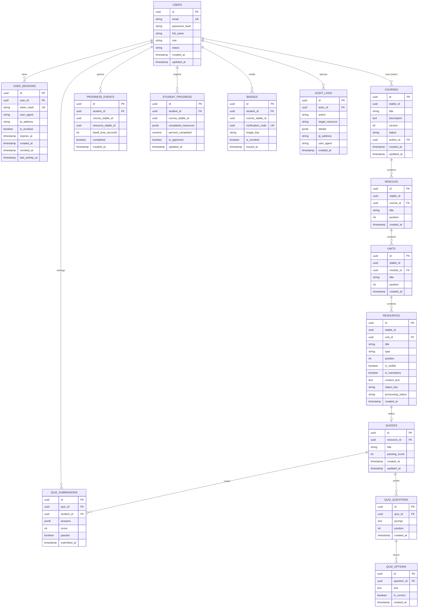

# Diseño de Base de Datos y Esquema Inicial — Plataforma MOOC

> **Referencia Técnica para el Equipo de Desarrollo**  
> Este documento detalla la arquitectura de base de datos relacional (PostgreSQL), la jerarquía académica, el modelo de versionamiento mediante identificadores estables (`stable_id`), la política de almacenamiento libre de binarios y la reversibilidad de migraciones.

---

## 1. Principios de Arquitectura e Invariantes del Esquema

1. **Fuente de Verdad Transaccional**: PostgreSQL gestiona la persistencia estructurada de usuarios, sesiones, estructura académica, cuestionarios, seguimiento de progreso, insignias y logs de auditoría.
2. **Cero Almacenamiento de Binarios en BD Relacional (Sección 7)**:
   * Ninguna tabla o campo almacena objetos binarios (`BYTEA`, `BLOB`).
   * Todos los assets multimedia (imágenes, video HLS, audio, PDFs, diplomas/insignias) residen exclusivamente en Object Storage (**AWS S3 / MinIO**).
   * La base de datos relacional almacena únicamente referencias en formato de clave (`object_key` / `image_key` de tipo `VARCHAR(512)`).
3. **Identificadores Estables e Independientes de la Versión (`stable_id`) (Sección 3)**:
   * Cada entidad de la jerarquía académica (`Curso` $\rightarrow$ `Módulo` $\rightarrow$ `Unidad` $\rightarrow$ `Recurso`) posee una llave primaria `id` (UUID) por registro/versión específica y un identificador estable `stable_id` (UUID).
   * Al publicar una nueva versión de un curso, se genera un nuevo snapshot de entidades con sus propios `id`, pero manteniendo los mismos `stable_id`.
   * El progreso de los estudiantes se vincula a `course_stable_id` y `resource_stable_id`, garantizando que el avance del estudiante no se pierda al actualizar versiones del curso.
4. **Auditoría Inmutable y Sesiones Revocables**:
   * Las sesiones activas de usuarios se persisten en `user_sessions` para permitir revocación explícita y auditoría administrativa.
   * La tabla `audit_logs` registra eventos críticos de seguridad de manera inalterable.

---

## 2. Diagrama Entidad-Relación (ERD)

---

## 3. Diccionario de Datos y Especificación de Tablas

### 3.1. Autenticación y Usuarios

#### `users`
Persiste los actores del sistema (Administrador, Profesor, Estudiante).
* `id` (`UUID`, PK): Identificador único global del usuario.
* `email` (`VARCHAR(255)`, UNIQUE, NOT NULL): Correo electrónico único para inicio de sesión.
* `password_hash` (`VARCHAR(255)`, NOT NULL): Hash seguro de la contraseña (bcrypt/Argon2).
* `full_name` (`VARCHAR(255)`, NOT NULL): Nombre completo.
* `role` (`VARCHAR(50)`, CHECK: `'administrador'`, `'profesor'`, `'estudiante'`): Rol global.
* `status` (`VARCHAR(50)`, CHECK: `'pending_verification'`, `'active'`, `'suspended'`): Estado de cuenta.
* `created_at` / `updated_at` (`TIMESTAMPTZ`): Marcas de tiempo de auditoría.

#### `user_sessions`
Gestiona las sesiones activas y permite revocación de tokens.
* `id` (`UUID`, PK): Identificador de sesión.
* `user_id` (`UUID`, FK $\rightarrow$ `users.id` ON DELETE CASCADE): Usuario titular.
* `token_hash` (`VARCHAR(255)`, UNIQUE, NOT NULL): Hash del token de sesión.
* `user_agent` (`TEXT`): Dispositivo/navegador de origen.
* `ip_address` (`VARCHAR(45)`): Dirección IP cliente (IPv4/IPv6).
* `is_revoked` (`BOOLEAN`, DEFAULT `FALSE`): Bandera de revocación activa.
* `expires_at` (`TIMESTAMPTZ`, NOT NULL): Expiración programada.
* `created_at` / `revoked_at` / `last_activity_at` (`TIMESTAMPTZ`): Control temporal.

---

### 3.2. Jerarquía Académica y Versionamiento

#### `courses` (Cursos & Versiones - Nivel 1)
* `id` (`UUID`, PK): Identificador único de la fila/versión específica.
* `stable_id` (`UUID`, NOT NULL): Identificador permanente del curso a través de todas sus versiones.
* `title` (`VARCHAR(255)`, NOT NULL): Título del curso.
* `description` (`TEXT`): Descripción extendida.
* `version` (`INT`, DEFAULT 1): Número secuencial de versión.
* `status` (`VARCHAR(50)`, CHECK: `'draft'`, `'published'`, `'unpublished'`): Estado de la versión.
* `author_id` (`UUID`, FK $\rightarrow$ `users.id` ON DELETE RESTRICT): Profesor autor.
* **Restricción Única**: `UNIQUE (stable_id, version)`

#### `modules` (Módulos - Nivel 2)
* `id` (`UUID`, PK): Identificador de fila/instancia de módulo.
* `stable_id` (`UUID`, NOT NULL): Identificador estable entre versiones.
* `course_id` (`UUID`, FK $\rightarrow$ `courses.id` ON DELETE CASCADE): Referencia a la versión del curso.
* `title` (`VARCHAR(255)`, NOT NULL): Nombre del módulo.
* `position` (`INT`, NOT NULL): Orden dentro del curso.
* **Restricción Única**: `UNIQUE (course_id, position) DEFERRABLE INITIALLY DEFERRED` — ver sección 5.

#### `units` (Unidades - Nivel 3)
* `id` (`UUID`, PK): Identificador de fila/instancia de unidad.
* `stable_id` (`UUID`, NOT NULL): Identificador estable entre versiones.
* `module_id` (`UUID`, FK $\rightarrow$ `modules.id` ON DELETE CASCADE): Referencia al módulo padre.
* `title` (`VARCHAR(255)`, NOT NULL): Nombre de la unidad.
* `position` (`INT`, NOT NULL): Orden dentro del módulo.
* **Restricción Única**: `UNIQUE (module_id, position) DEFERRABLE INITIALLY DEFERRED` — ver sección 5.

#### `resources` (Recursos - Nivel 4)
* `id` (`UUID`, PK): Identificador de fila/instancia de recurso.
* `stable_id` (`UUID`, NOT NULL): Identificador estable entre versiones.
* `unit_id` (`UUID`, FK $\rightarrow$ `units.id` ON DELETE CASCADE): Referencia a la unidad padre.
* `title` (`VARCHAR(255)`, NOT NULL): Nombre del recurso.
* `type` (`VARCHAR(50)`, CHECK: `'text'`, `'image'`, `'video'`, `'audio'`, `'pdf'`, `'presentation'`, `'downloadable'`, `'iframe'`, `'external_link'`, `'quiz'`): Tipo de recurso.
* `position` (`INT`, NOT NULL): Orden dentro de la unidad.
* `is_visible` (`BOOLEAN`, DEFAULT `TRUE`): Visibilidad para estudiantes.
* `is_mandatory` (`BOOLEAN`, DEFAULT `TRUE`): Requisito obligatorio para aprobación.
* `content_text` (`TEXT`): Texto enriquecido en Markdown Canónico Extendido (sin binarios).
* `object_key` (`VARCHAR(512)`): Clave del objeto en S3/MinIO (ej: `courses/video1.m3u8`).
* `processing_status` (`VARCHAR(50)`, CHECK: `'pending'`, `'processing'`, `'completed'`, `'failed'`): Estado del procesamiento asíncrono (transcodificación HLS/PDF).
* **Restricción Única**: `UNIQUE (unit_id, position) DEFERRABLE INITIALLY DEFERRED` — ver sección 5.

---

### 3.3. Evaluaciones (Quizzes)

* `quizzes`: Define los parámetros del cuestionario (`resource_id`, `passing_score`).
* `quiz_questions`: Preguntas individuales (`quiz_id`, `prompt`, `position`).
* `quiz_options`: Opciones de respuesta (`question_id`, `text`, `is_correct`). La respuesta correcta nunca se envía al cliente en las respuestas API.
* `quiz_submissions`: Intentos y calificaciones (`quiz_id`, `student_id`, `answers` [JSONB], `score`, `passed`).

---

### 3.4. Progreso Validado, Insignias y Auditoría

* `progress_events`: Registro inmutable de eventos de lectura/dwell time (`student_id`, `course_stable_id`, `resource_stable_id`, `dwell_time_seconds`, `completed`).
* `student_progress`: Estado agregado del avance del estudiante (`student_id`, `course_stable_id`, `completed_resources` [JSONB], `percent_completed`, `is_approved`).
* `badges`: Registro de insignias emitidas (`student_id`, `course_stable_id`, `verification_code` [UUID], `image_key` [S3 path]).
* `audit_logs`: Registro inmutable de auditoría del sistema (`actor_id`, `action`, `target_resource`, `details` [JSONB], `ip_address`, `user_agent`).

---

## 4. Estrategia de Migraciones y Reversibilidad

Las migraciones SQL están ubicadas en `./migrations/` y siguen el estándar numérico `000001_init_schema.up.sql` y `000001_init_schema.down.sql`.

* **Migración UP (`000001_init_schema.up.sql`)**: Crea todas las tablas, restricciones tipo `CHECK`, llaves foráneas e índices optimizados (`idx_*`).
* **Migración DOWN (`000001_init_schema.down.sql`)**: Elimina en orden inverso de dependencia todas las tablas mediante `DROP TABLE IF EXISTS ... CASCADE;`.
* **Prueba en CI**: La suite de pruebas automatizadas (`migrations/migrations_test.go`) ejecuta la secuencia `DOWN` $\rightarrow$ `UP` $\rightarrow$ `DOWN` $\rightarrow$ `UP` sobre bases de datos vacías para garantizar la reversibilidad limpia.

---

## 5. Ordenamiento e Identificadores Estables (Issue #16)

Cada módulo, unidad y recurso tiene dos identificadores con propósitos distintos:

* `id`: fila/versión específica. Cambia cada vez que se publica una nueva versión del curso.
* `stable_id`: identidad permanente del elemento a través de todas las versiones. El progreso de un estudiante (`student_progress.completed_resources`, `progress_events.resource_stable_id`) se referencia **siempre** por `stable_id`, nunca por `id` ni por `position`.

El orden se expresa exclusivamente en el campo `position` (entero, dentro de su contenedor: módulo en el curso, unidad en el módulo, recurso en la unidad). Reordenar nunca toca `stable_id`, así que el progreso de un estudiante sigue apuntando al mismo recurso sin importar cuántas veces se haya movido dentro de su unidad. La prueba de esta propiedad vive en `internal/domain/ordering_test.go` (`TestReorderPreservesStableIdentityForProgress`).

### Cómo se recalculan las posiciones

Al insertar o mover un elemento, **todo el conjunto de hermanos se renumera en una sola pasada**: el orden deseado se expresa como la lista completa de `stable_id` de los hermanos, y esa lista se recorre asignando `0, 1, 2, ...` en orden (`domain.Reposition`). Como la salida siempre cubre el conjunto completo de una sola vez, no existe una ruta de código que pueda producir dos hermanos con la misma posición — no es una validación que atrapa la colisión después del hecho, es que la colisión no tiene forma de ocurrir.

* `domain.InsertAt(existing, newID, index)`: inserta `newID` en el índice dado (recortado a `[0, len(existing)]`), usado al crear un módulo, unidad o recurso nuevo.
* `domain.MoveTo(existing, id, index)`: reubica un `stable_id` existente al índice dado, usado cuando la autoría reordena la lista. Mover un id que no pertenece al contenedor es una operación nula.
* `domain.Reposition(orderedStableIDs)`: convierte el orden resultante en el mapa `stable_id -> position` que el repositorio escribe.

### Por qué no hay colisiones también a nivel de base de datos

`resources(unit_id, position)`, `units(module_id, position)` y `modules(course_id, position)` tienen una restricción `UNIQUE ... DEFERRABLE INITIALLY DEFERRED` (`migrations/000003_academic_ordering.up.sql`). Reescribir todo el conjunto de hermanos dentro de una transacción puede hacer que, a mitad de la pasada, dos filas compartan momentáneamente una posición antes de que el resto de los `UPDATE` la corrija; una restricción `UNIQUE` normal rechazaría la transacción en ese instante. `DEFERRABLE INITIALLY DEFERRED` pospone la verificación hasta el `COMMIT`, así que la transacción solo falla si, terminada toda la pasada, sigue existiendo una colisión real — algo que el algoritmo garantiza que nunca sucede.
