# Informe Formal de Arquitectura de Software — Plataforma MOOC

> **Documento Oficial de Arquitectura, Diseño de Software y Línea Base Técnica**  
> **Proyecto:** Plataforma Web de Cursos Masivos Abiertos en Línea (MOOC)  
> **Programa / Curso:** ISIS4426 — Arquitectura Cloud / Desarrollo de Software  
> **Organización Operadora:** Institución Operadora de Plataforma MOOC  
> **Versión del Documento:** 1.0.0 (Línea Base — Etapa MVP Actual)  
> **Fecha de Emisión:** Septiembre 2026  
> **Estado:** Aprobado / Baseline Técnico y Operativo  

---

## Control de Versiones del Documento

| Versión | Fecha | Autor(es) | Descripción de Cambios | Estado |
|:---:|:---:|---|---|:---:|
| **1.0.0** | 14/09/2026 | Equipo de Arquitectura e Ingeniería MOOC | Emisión formal de la línea base arquitectónica del MVP: Monolito Modular en Go, Workers Asíncronos, Persistencia Relacional, Observabilidad y Pruebas E2E (Issues #9 a #30). | **Aprobado** |

---

## Tabla de Contenido

- [Informe Formal de Arquitectura de Software — Plataforma MOOC](#informe-formal-de-arquitectura-de-software--plataforma-mooc)
  - [Control de Versiones del Documento](#control-de-versiones-del-documento)
  - [Tabla de Contenido](#tabla-de-contenido)
  - [1. Resumen Ejecutivo](#1-resumen-ejecutivo)
  - [2. Contexto de Negocio, Objetivos y Alcance](#2-contexto-de-negocio-objetivos-y-alcance)
    - [2.1 Propósito y Visión del Sistema](#21-propósito-y-visión-del-sistema)
    - [2.2 Roles Globales y Modelo de Actores](#22-roles-globales-y-modelo-de-actores)
    - [2.3 Jerarquía Académica y Tipos de Recursos](#23-jerarquía-académica-y-tipos-de-recursos)
      - [Tipos de Recursos Estandarizados (10 tipos soportados):](#tipos-de-recursos-estandarizados-10-tipos-soportados)
    - [2.4 Guardrails y Principios Inquebrantables de Arquitectura](#24-guardrails-y-principios-inquebrantables-de-arquitectura)
    - [2.5 Alcance Funcional: Implementado vs. Proyectado](#25-alcance-funcional-implementado-vs-proyectado)
  - [3. Atributos de Calidad y Requerimientos No Funcionales (ASRs)](#3-atributos-de-calidad-y-requerimientos-no-funcionales-asrs)
    - [3.1 Escalabilidad y Concurrencia](#31-escalabilidad-y-concurrencia)
    - [3.2 Disponibilidad y Resiliencia](#32-disponibilidad-y-resiliencia)
    - [3.3 Seguridad e Integridad Transaccional](#33-seguridad-e-integridad-transaccional)
    - [3.4 Rendimiento y Latencia](#34-rendimiento-y-latencia)
    - [3.5 Observabilidad y Auditabilidad](#35-observabilidad-y-auditabilidad)
    - [3.6 Mantenibilidad y Desacoplamiento](#36-mantenibilidad-y-desacoplamiento)
  - [4. Registro de Decisiones de Arquitectura (ADRs)](#4-registro-de-decisiones-de-arquitectura-adrs)
    - [ADR-01: Monolito Modular en Go con Arquitectura Hexagonal](#adr-01-monolito-modular-en-go-con-arquitectura-hexagonal)
    - [ADR-02: Procesamiento Asíncrono con Workers Independientes (Asynq/Redis)](#adr-02-procesamiento-asíncrono-con-workers-independientes-asynqredis)
    - [ADR-03: Segregación de Binarios en Object Storage S3/MinIO](#adr-03-segregación-de-binarios-en-object-storage-s3minio)
    - [ADR-04: Identificadores Estables (`stable_id`) para Continuidad de Progreso](#adr-04-identificadores-estables-stable_id-para-continuidad-de-progreso)
    - [ADR-05: Reordenamiento Atómico con Restricciones Diferidas](#adr-05-reordenamiento-atómico-con-restricciones-diferidas)
    - [ADR-06: Idempotencia en Capa HTTP y Colas de Tareas](#adr-06-idempotencia-en-capa-http-y-colas-de-tareas)
    - [ADR-07: Validación Estructural Acumulativa e Inmutabilidad de Publicación](#adr-07-validación-estructural-acumulativa-e-inmutabilidad-de-publicación)
    - [ADR-08: Inmutabilidad de Auditoría Garantizada a Nivel de Base de Datos](#adr-08-inmutabilidad-de-auditoría-garantizada-a-nivel-de-base-de-datos)
    - [ADR-09: Observabilidad Nativa Correlacionada](#adr-09-observabilidad-nativa-correlacionada)
  - [5. Vistas de Arquitectura (Modelo C4 / ISO/IEC 42010)](#5-vistas-de-arquitectura-modelo-c4--isoiec-42010)
    - [5.1 Vista de Contexto del Sistema (C4 — Nivel 1)](#51-vista-de-contexto-del-sistema-c4--nivel-1)
    - [5.2 Vista de Contenedores y Topología (C4 — Nivel 2)](#52-vista-de-contenedores-y-topología-c4--nivel-2)
      - [Especificación de Puertos y Responsabilidades de Contenedores:](#especificación-de-puertos-y-responsabilidades-de-contenedores)
    - [5.3 Vista de Componentes y Modularidad del Backend (C4 — Nivel 3)](#53-vista-de-componentes-y-modularidad-del-backend-c4--nivel-3)
      - [Estructura de Paquetes en Go:](#estructura-de-paquetes-en-go)
    - [5.4 Vista de Información y Datos (Modelo Relacional e Invariantes)](#54-vista-de-información-y-datos-modelo-relacional-e-invariantes)
      - [Migraciones del Esquema (`migrations/`):](#migraciones-del-esquema-migrations)
    - [5.5 Vista de Despliegue e Infraestructura Física / Runtime](#55-vista-de-despliegue-e-infraestructura-física--runtime)
      - [Construcción de Imágenes Multi-Stage en Go:](#construcción-de-imágenes-multi-stage-en-go)
    - [5.6 Vista Dinámica: Flujos Críticos de Ejecución (Secuencia)](#56-vista-dinámica-flujos-críticos-de-ejecución-secuencia)
      - [Flujo A: Registro de Estudiante, Verificación SMTP y Sesión Revocable](#flujo-a-registro-de-estudiante-verificación-smtp-y-sesión-revocable)
      - [Flujo B: Autoría de Curso, Reordenamiento Atómico y Validación de Publicación](#flujo-b-autoría-de-curso-reordenamiento-atómico-y-validación-de-publicación)
      - [Flujo C: Procesamiento Asíncrono, Idempotencia, Reintentos y DLQ](#flujo-c-procesamiento-asíncrono-idempotencia-reintentos-y-dlq)
  - [6. Estrategia de Seguridad, Gobierno y Cumplimiento](#6-estrategia-de-seguridad-gobierno-y-cumplimiento)
  - [7. Estrategia de Resiliencia, Concurrencia y Recuperación ante Desastres (DRP)](#7-estrategia-de-resiliencia-concurrencia-y-recuperación-ante-desastres-drp)
  - [8. Estrategia de Observabilidad, Telemetría y Monitoreo](#8-estrategia-de-observabilidad-telemetría-y-monitoreo)
    - [8.1 Correlación Transversal en Logs](#81-correlación-transversal-en-logs)
    - [8.2 Métricas Prometheus Expuestas](#82-métricas-prometheus-expuestas)
  - [9. Estado Actual de la Implementación y Métricas de Calidad](#9-estado-actual-de-la-implementación-y-métricas-de-calidad)
    - [9.1 Matriz de Trazabilidad y Cumplimiento de Especificación](#91-matriz-de-trazabilidad-y-cumplimiento-de-especificación)
    - [9.2 Métricas de Verificación Automatizada (Aseguramiento de Calidad)](#92-métricas-de-verificación-automatizada-aseguramiento-de-calidad)
  - [10. Plan de Evolución Arquitectónica y Roadmap Técnico](#10-plan-de-evolución-arquitectónica-y-roadmap-técnico)
  - [11. Glosario de Términos](#11-glosario-de-términos)

---

## 1. Resumen Ejecutivo

El presente **Informe Formal de Arquitectura** documenta la ingeniería, decisiones estructurales, modelos de datos, patrones de integración y garantías operativas de la **Plataforma MOOC**, un sistema de cursos masivos abiertos en línea operado por una única entidad para conservar soberanía total sobre contenidos, datos de estudiantes, identidad institucional y ciclo de vida del producto.

La plataforma ha sido concebida y desarrollada bajo una arquitectura de **Monolito Modular en Go con Procesamiento Asíncrono Desacoplado**, orientada a soportar una demanda de **50.000 usuarios registrados** y **2.000 usuarios concurrentes**, manteniendo una estricta separación de responsabilidades a través de **Arquitectura Hexagonal (Puertos y Adaptadores)**.

Hasta la etapa actual de desarrollo (MVP — Fase Inicial), el sistema cuenta con:
1. Núcleo completo de **Identidad y Control de Acceso** con verificación SMTP transaccional (Mailpit) y sesiones opacas revocables.
2. Módulo de **Administración y Auditoría Inmutable** a nivel de motor de base de datos con protección de cuenta administrativa.
3. Módulo de **Autoría Académica Jerárquica de 4 Niveles**, algoritmo libre de colisiones para reordenamiento y validación estructural acumulativa de publicación (HTTP 422 multi-error).
4. Motor de **Procesamiento Asíncrono de Background Workers** basado en colas distribuidas Redis + Asynq, con garantías de idempotencia ante doble entrega, reintentos con backoff exponencial y Dead-Letter Queue (DLQ) con emisión de alertas operativas.
5. Pila completa de **Observabilidad Nativa con OpenTelemetry**, métricas Prometheus y logs estructurados JSON (`slog`) correlacionados transversalmente con `request_id` y `trace_id`.
6. Certificación de calidad automatizada con **216 aserciones E2E aprobadas (100% PASS)** y cero defectos bloqueantes.

---

## 2. Contexto de Negocio, Objetivos y Alcance

### 2.1 Propósito y Visión del Sistema
La plataforma solventa la necesidad de ofrecer educación en línea masiva, asíncrona y autodirigida sin depender de plataformas SaaS de terceros, garantizando privacidad de datos, control de versiones de contenido académico, emisión verificable de insignias de aprobación y evaluación automatizada rigurosa.

* **Capacidad Nominal Objetivo:** Hasta 50.000 usuarios registrados activos en catálogo.
* **Concurrencia Pico Soportada:** Hasta 2.000 usuarios concurrentes sin degradación de SLAs.
* **Modelo Operacional:** Despliegue en contenedores Docker / Docker Compose con preparación nativa para orquestación en nube (Kubernetes / ECS).

### 2.2 Roles Globales y Modelo de Actores
El sistema implementa un modelo de control de acceso basado en roles (**RBAC**) estricto, compuesto por tres roles no intercambiables:

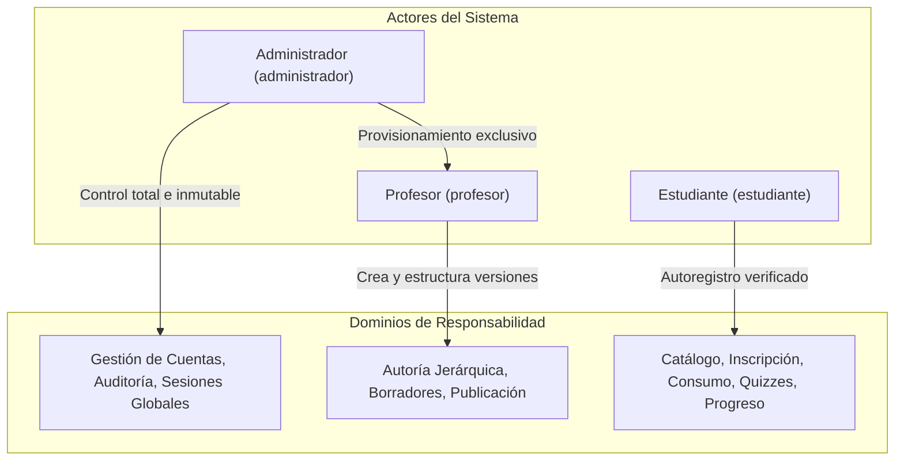

1. **Administrador (`administrador`):**
   * Control administrativo de cuentas, roles, suspensión/reactivación y sesiones.
   * Consulta de pista de auditoría inmutable forense.
   * **Regla Cardinal:** Es el único rol facultado para crear y promover cuentas de profesores (el registro público de docentes está prohibido).
   * **Regla de Protección:** El sistema bloquea de forma intransigente la eliminación, revocación o suspensión de la última cuenta administradora activa.
2. **Profesor (`profesor`):**
   * Creación, edición, estructuración y previsualización de cursos académicos.
   * Reordenamiento de módulos, unidades y recursos.
   * Solicitud de publicación de versiones inmutables y despublicación temporal en MVP.
3. **Estudiante (`estudiante`):**
   * Autoregistro público sujeto a verificación obligatoria por correo electrónico.
   * Exploración de catálogo público, inscripción y consumo asíncrono.
   * Presentación de evaluaciones y consulta de progreso e insignias ganadas.

### 2.3 Jerarquía Académica y Tipos de Recursos
La estructura de contenidos sigue una jerarquía formal de cuatro niveles ordenados:

$$\text{Curso} \longrightarrow \text{Módulo} \longrightarrow \text{Unidad} \longrightarrow \text{Recurso}$$

* **Curso (`Course`):** Agregado raíz de autoría. Contiene metadatos (título, descripción), autor responsable, versión numérica (`version`) y estado de ciclo de vida (`draft`, `published`, `unpublished`).
* **Módulo (`Module`):** Agrupador temático ordenado dentro de la versión del curso (`position`).
* **Unidad (`Unit`):** Subdivisión didáctica ordenada dentro de un módulo (`position`).
* **Recurso (`Resource`):** Unidad atómica de aprendizaje. Define visibilidad (`is_visible`), obligatoriedad para aprobación (`is_mandatory`) y descargabilidad (`allow_download`).

#### Tipos de Recursos Estandarizados (10 tipos soportados):
1. `text`: Texto enriquecido en formato Markdown Canónico Extendido persistido en base relacional.
2. `image`: Imagen en MinIO/S3 accedida mediante URL prefirmada.
3. `video`: Video transcodificado a formato adaptativo HLS (.m3u8).
4. `audio`: Pista de audio procesada para streaming asíncrono.
5. `pdf`: Documento consultable mediante visor integrado accesible.
6. `presentation`: Diapositivas convertidas y visualizables.
7. `downloadable`: Archivo binario descargable directo desde almacenamiento.
8. `iframe`: Contenido externo embebido bajo sandbox restringido y lista blanca.
9. `external_link`: Enlace saliente verificado.
10. `quiz`: Evaluación interactiva con preguntas de opción múltiple.

### 2.4 Guardrails y Principios Inquebrantables de Arquitectura

> [!CAUTION]
> Los siguientes 5 principios son invariantes arquitectónicos no negociables del sistema:
> 
> 1. **Quiz Key Secrecy:** La clave de respuestas correctas de un quiz NUNCA viaja al frontend/cliente. La calificación ocurre exclusivamente en el servidor.
> 2. **Progreso Verificado en Servidor:** Se rechazan y auditan intentos de inyección de porcentajes desde el cliente. El avance se computa a partir de permanencia y heartbeats validados.
> 3. **Inmutabilidad de Publicación:** Una versión de curso publicada (`published`) no admite modificaciones directas (HTTP 409 Conflict). Para editar en MVP se exige despublicación temporal.
> 4. **Identificadores Estables (`stable_id`):** Los elementos jerárquicos poseen un `stable_id` persistente entre versiones para preservar el progreso histórico del estudiante.
> 5. **Cero Binarios en Base Relacional:** Queda prohibido almacenar BLOBs en PostgreSQL. Todo binario reside en S3/MinIO y se accede vía URLs prefirmadas.

### 2.5 Alcance Funcional: Implementado vs. Proyectado

| Dominio Funcional | Estado Actual (MVP Línea Base) | Próximas Entregas (Etapa Siguiente) |
|---|---|---|
| **Identidad y Acceso** | Registro, verificación SMTP (Mailpit), login seguro, logout, sesiones revocables, recuperación de contraseña, rate limiting. | Integración con proveedores OAuth2 / SSO institucional. |
| **Administración** | Gestión de usuarios, cambio de roles, suspensión, protección de último admin, auditoría inmutable de eventos. | Dashboard analítico agregado con reportes de uso. |
| **Autoría de Cursos** | CRUD de cursos, módulos, unidades y recursos. Algoritmo de reordenamiento atómico, previsualización de borradores. | Coautoría colaborativa y exportación de cursos. |
| **Publicación** | Validación estructural agregada (HTTP 422 multi-error), inmutabilidad de versiones, despublicación y republicación. | Borradores de actualización concurrentes con diff automatizado. |
| **Almacenamiento y Media** | Infraestructura MinIO/S3 aprovisionada, cero binarios en BD, contratos de URLs prefirmadas. | Ingesta multipart directa (24h) y escaneo antimalware (ClamAV). |
| **Workers Asíncronos** | Cola distribuida Asynq/Redis, idempotencia, reintentos con backoff exponencial, Dead-Letter Queue (DLQ) y alertas. | Transcodificación de video/audio a segmentos HLS sin upscaling. |
| **Observabilidad** | OpenTelemetry traces y métricas Prometheus (`/api/v1/metrics`, `:9090/metrics`), logs estructurados slog (`X-Request-ID`, `trace_id`). | Dashboards centralizados en Grafana y alertas vía PagerDuty/Slack. |
| **Evaluación y Progreso** | Esquema relacional completo (`quizzes`, `student_progress`, `badges`), reglas y restricciones establecidas. | Ejecución interactiva de quizzes, motor de heartbeats y emisión de insignias. |

---

## 3. Atributos de Calidad y Requerimientos No Funcionales (ASRs)

Los Requerimientos de Atributos de Calidad (Architecturally Significant Requirements - ASRs) han guiado las decisiones estructurales del proyecto:

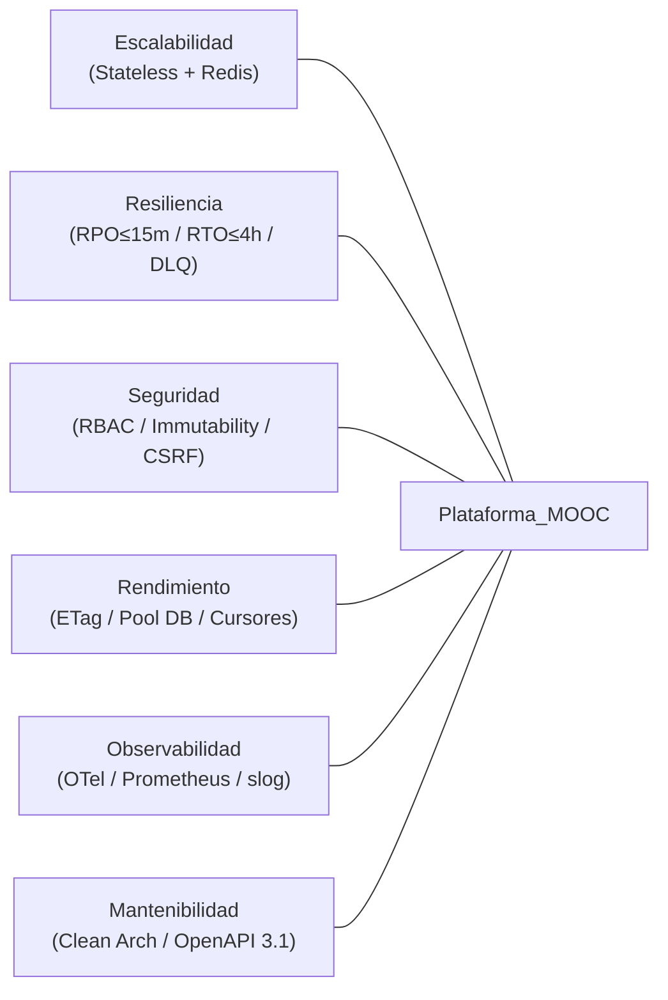

### 3.1 Escalabilidad y Concurrencia
* **Statelessness Estricto:** La API REST y los Workers no conservan estado en memoria de proceso ni en disco local. Cualquier petición puede ser atendida por cualquier réplica.
* **Manejo de Sesiones Distribuido:** Las sesiones se validan con tokens criptográficos opacos cuyo hash se consulta en PostgreSQL/Redis, permitiendo balanceo de carga sin afinidad de sesión (*sticky sessions*).
* **Particionamiento de Tareas:** Desacoplamiento de operaciones de alta latencia (transcodificación, escaneo, envío de correos) mediante la cola de tareas Asynq/Redis.

### 3.2 Disponibilidad y Resiliencia
* **RPO (Recovery Point Objective) $\le$ 15 minutos:** Garantizado mediante replicación continua de base de datos transaccional y respaldos de estado.
* **RTO (Recovery Time Objective) $\le$ 4 horas:** Capacidad de reconstrucción completa de la infraestructura mediante contenedores Docker y scripts de migración reversibles.
* **Tolerancia a Fallos en Workers:** Reintentos automáticos con backoff exponencial ($T_{delay} = 2^{retry} \text{ segundos}$) hasta un tope de 3 intentos. Derivación automática a Dead-Letter Queue (DLQ) ante agotamiento, disparando la alerta estructurada `DLQ_JOB_FAILED`.

### 3.3 Seguridad e Integridad Transaccional
* **Hashing de Contraseñas:** Algoritmo bcrypt con costo adaptativo.
* **Defensa en Profundidad:**
  * Mitigación de Cross-Site Request Forgery (CSRF) mediante verificación de cabeceras de origen (`Origin` / `Referer`) en peticiones mutativas.
  * Rate Limiting distribuido en Redis por IP y tipo de endpoint (login: 10 intentos/min, registro: 50 intentos/hora).
  * Sanitización de texto libre contra inyección de HTML/JavaScript malicioso (XSS).
* **Inmutabilidad Forense:** Restricción a nivel de base de datos mediante triggers PL/pgSQL que impiden modificaciones (`UPDATE` o `DELETE`) sobre la tabla `audit_logs`.

### 3.4 Rendimiento y Latencia
* **ETag y Validación Condicional de Caché:** Generación determinística de cabeceras `ETag` (`SHA-256(id + updated_at)`) en entidades maestras (cursos, usuarios). Respuestas inmediatas `304 Not Modified` ante coincidencia con `If-None-Match`.
* **Paginación por Cursores:** Eliminación del costoso `OFFSET` en consultas de grandes colecciones, utilizando cursores basados en identificador y fecha de creación (`idx_users_created_at_id`).
* **Optimización de Conexiones:** Pool de conexiones preconfigurado en PostgreSQL (`DB_MAX_OPEN_CONNS=25`, `DB_CONN_MAX_LIFETIME=5m`).

### 3.5 Observabilidad y Auditabilidad
* **Trazabilidad de Extremo a Extremo:** Correlación entre peticiones HTTP mediante `X-Request-ID` y `trace_id` de OpenTelemetry inyectados en cada línea de log estructurado JSON.
* **Métricas Estándar:** Endpoints de telemetría Prometheus en `/api/v1/metrics` (API) y `:9090/metrics` (Worker).

### 3.6 Mantenibilidad y Desacoplamiento
* **Arquitectura Hexagonal:** Dominio independiente de frameworks web (HTTP) y librerías de persistencia (SQL/Redis).
* **Contratos Estandarizados:** Contrato formal de API en **OpenAPI 3.1** (`api/openapi.yaml`) verificado en pipelines de integración continua con Spectral.

---

## 4. Registro de Decisiones de Arquitectura (ADRs)

A continuación se resumen los nueve Registros de Decisiones de Arquitectura (**Architecture Decision Records - ADRs**) que definen las directrices de diseño del sistema:

### ADR-01: Monolito Modular en Go con Arquitectura Hexagonal
* **Contexto:** El sistema requiere un desarrollo rápido para cumplir el horizonte del MVP (13 semanas, 4 desarrolladores) sin incurrir en la sobrecarga operativa, latencia de red e inconsistencia eventual de los microservicios, pero garantizando desacoplamiento estricto para escalar en el futuro.
* **Decisión:** Adoptar un Monolito Modular en Go estructurado bajo Arquitectura Hexagonal (Puertos y Adaptadores). El paquete `internal/domain` encapsula las reglas puras sin dependencias de infraestructura.
* **Consecuencias:** Alta velocidad de compilación, despliegue unificado, facilidad de refactorización y pruebas unitarias aisladas mediante mocks/fakes de puertos.

### ADR-02: Procesamiento Asíncrono con Workers Independientes (Asynq/Redis)
* **Contexto:** Tareas como transcodificación de video/audio, procesamiento de PDFs y notificaciones por correo tienen tiempos de ejecución no predecibles que bloquearían los hilos de la API HTTP.
* **Decisión:** Separar la ejecución en dos binarios independientes: `cmd/api` (servidor HTTP) y `cmd/worker` (procesador en background), comunicados mediante Redis a través de la librería `asynq`.
* **Consecuencias:** La API permanece ultra-rápida. Los workers pueden escalarse horizontalmente de forma independiente según la carga de procesamiento multimedia.

### ADR-03: Segregación de Binarios en Object Storage S3/MinIO
* **Contexto:** Almacenar archivos multimedia en la base de datos relacional degrada el rendimiento de los índices, infla los respaldos y satura la memoria del motor.
* **Decisión:** Regla estricta de cero binarios en PostgreSQL. Los archivos residen exclusivamente en S3/MinIO y se transfieren directamente entre el cliente y el storage mediante URLs prefirmadas (TTL 24h).
* **Consecuencias:** Rendimiento óptimo en PostgreSQL, descarga de tráfico en la API y compatibilidad nativa con redes de distribución de contenido (CDN).

### ADR-04: Identificadores Estables (`stable_id`) para Continuidad de Progreso
* **Contexto:** En un MOOC, cuando un profesor publica una actualización de un curso existente, los estudiantes inscritos no deben perder su historial de avance ni sus unidades completadas.
* **Decisión:** Cada entidad académica posee dos identificadores: `id` (específico de la versión/fila en PostgreSQL) y `stable_id` (permanente a través de todas las versiones). El progreso se vincula exclusivamente a `course_stable_id` y `resource_stable_id`.
* **Consecuencias:** Los profesores pueden reestructurar cursos o publicar nuevas versiones sin corromper el avance académico de los alumnos.

### ADR-05: Reordenamiento Atómico con Restricciones Diferidas
* **Contexto:** La jerarquía exige que los elementos hermanos (`modules`, `units`, `resources`) tengan posiciones contiguas sin huecos ni duplicados. Un reordenamiento secuencial tradicional causaría colisiones transitorias de claves únicas en base de datos.
* **Decisión:** Implementar el algoritmo `domain.Reposition` que recalcula todas las posiciones en una sola pasada densa ($0..n-1$) y definir las restricciones de ordenamiento en PostgreSQL como `UNIQUE (...) DEFERRABLE INITIALLY DEFERRED`.
* **Consecuencias:** Se eliminan totalmente las condiciones de carrera y las fallas por colisión de índices únicos a mitad de transacción.

### ADR-06: Idempotencia en Capa HTTP y Colas de Tareas
* **Contexto:** Redes móviles o clientes inestables pueden reenviar peticiones de cobro, inscripción o registro duplicadas. Igualmente, las colas de mensajes garantizan entrega *al menos una vez* (*at-least-once*), pudiendo duplicar entregas al worker.
* **Decisión:**
  1. En API HTTP: Soporte de cabecera `Idempotency-Key` almacenada en Redis (`internal/cache/idempotency_store.go`). Si la clave ya existe, se devuelve la respuesta previa sin reejecutar.
  2. En Worker: Deduplicación basada en Redis (`internal/worker/idempotency.go`) garantizando que un trabajo duplicado resulte en un único efecto persistido.
* **Consecuencias:** Consistencia total del sistema frente a fallas de red y reintentos automáticos.

### ADR-07: Validación Estructural Acumulativa e Inmutabilidad de Publicación
* **Contexto:** Validar un curso campo por campo obliga al docente a múltiples ciclos frustrantes de fallo-corrección. Además, modificar un curso en vivo corrompe la experiencia de estudiantes activos.
* **Decisión:** El validador de publicación recorre toda la jerarquía y acumula todos los incumplimientos en un array `ValidationErrors`, retornado en un solo payload HTTP 422. Una vez publicado, el curso pasa a estado `published` inmutable; cualquier cambio posterior exige despublicarlo temporalmente en MVP.
* **Consecuencias:** Mejor experiencia de autoría y protección integral contra inconsistencias curriculares.

### ADR-08: Inmutabilidad de Auditoría Garantizada a Nivel de Base de Datos
* **Contexto:** Los registros de auditoría (`audit_logs`) deben ser legalmente vinculantes y a prueba de manipulaciones, incluso si la aplicación es comprometida o un desarrollador accede a la consola.
* **Decisión:** Implementar un trigger PL/pgSQL en PostgreSQL (`migrations/000004_audit_immutability.up.sql`) que rechaza incondicionalmente cualquier operación `UPDATE` o `DELETE` sobre la tabla `audit_logs`.
* **Consecuencias:** La pista de auditoría es estrictamente *append-only* y resistente a cualquier actor o servicio.

### ADR-09: Observabilidad Nativa Correlacionada
* **Contexto:** En un sistema distribuido con workers asíncronos, diagnosticar incidentes requiere correlacionar el evento originado en la API con el trabajo procesado por el worker.
* **Decisión:** Adoptar **OpenTelemetry** para instrumentación de trazas y métricas, complementado con logs estructurados JSON (`log/slog`). El middleware inyecta `X-Request-ID` y `trace_id` en el contexto y en las cabeceras HTTP.
* **Consecuencias:** Capacidad de rastrear transacciones completas en segundos filtrando logs por `request_id` o `trace_id`.

---

## 5. Vistas de Arquitectura (Modelo C4 / ISO/IEC 42010)

### 5.1 Vista de Contexto del Sistema (C4 — Nivel 1)

El diagrama de contexto ilustra la interacción entre los diferentes tipos de usuarios, la Plataforma MOOC y los límites con sistemas externos.

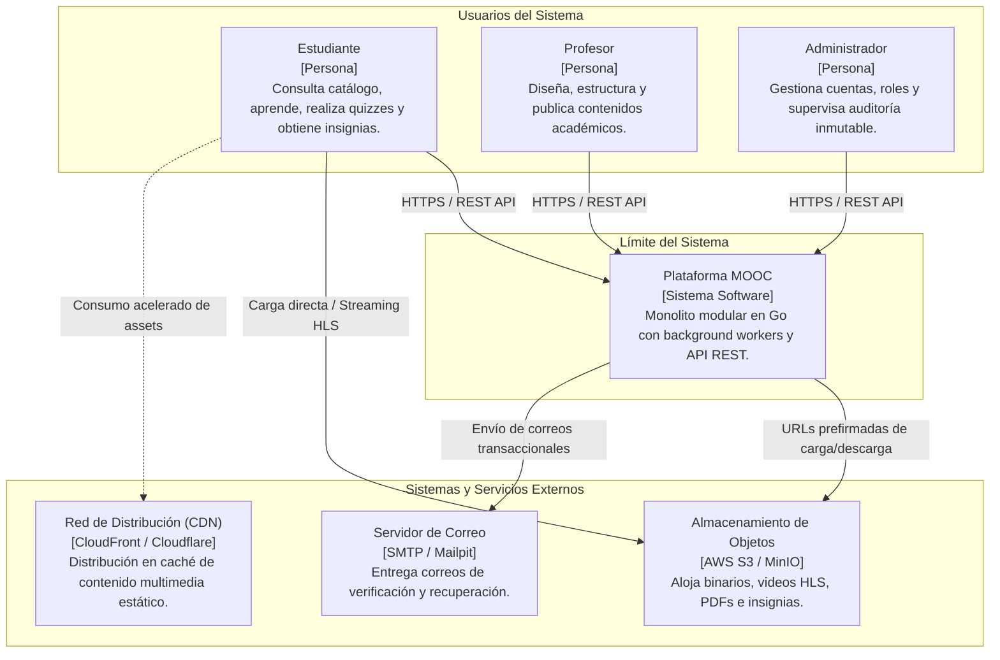

---

### 5.2 Vista de Contenedores y Topología (C4 — Nivel 2)

La topología de contenedores describe los subsistemas independientes que componen la solución y sus canales de comunicación en tiempo de ejecución:

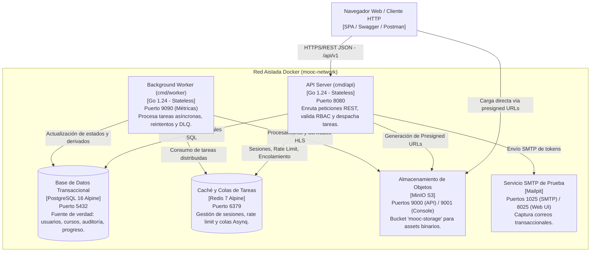

#### Especificación de Puertos y Responsabilidades de Contenedores:

| Contenedor / Servicio | Imagen Base | Puerto Expuesto | Función en la Arquitectura | Protocolo / Transporte |
|---|---|:---:|---|---|
| **`api`** | Multi-stage (`golang:1.24` $\rightarrow$ Alpine) | `8080` | Punto de entrada REST JSON (`/api/v1`), Swagger UI (`/api/docs`), métricas `/metrics`. | HTTP/1.1 / JSON |
| **`worker`** | Multi-stage (`golang:1.24` $\rightarrow$ Alpine) | `9090` | Procesador en segundo plano (Asynq), reintentos exponenciales, métricas worker. | Interno Redis / HTTP métricas |
| **`postgres`** | `postgres:16-alpine` | `5432` | Persistencia relacional, llaves foráneas, triggers de inmutabilidad y esquemas versionados. | TCP / PostgreSQL Wire Protocol |
| **`redis`** | `redis:7-alpine` | `6379` | Almacén volátil de alta velocidad: sesiones, rate limiting y colas de Asynq. | TCP / Redis RESP Protocol |
| **`minio`** | `minio/minio:latest` | `9000` / `9001` | Almacenamiento S3 compatible para assets multimedia, HLS e insignias. | S3 REST API / HTTP Console |
| **`mailpit`** | `axllent/mailpit:latest` | `1025` / `8025` | Receptor SMTP transaccional con visor Web UI para pruebas de confirmación de cuenta. | SMTP / HTTP Web UI |

---

### 5.3 Vista de Componentes y Modularidad del Backend (C4 — Nivel 3)

El backend implementa **Arquitectura Hexagonal (Puertos y Adaptadores)**, garantizando que el núcleo del negocio no conozca detalles de PostgreSQL, Redis, HTTP ni S3:

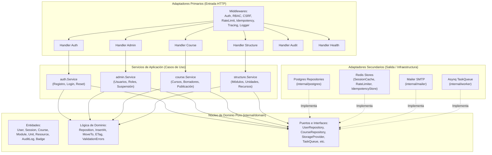

#### Estructura de Paquetes en Go:
* `cmd/`: Puntos de entrada ejecutables (`cmd/api/main.go`, `cmd/worker/main.go`).
* `internal/domain/`: Entidades puras de negocio, validadores, algoritmos de reposicionamiento e interfaces abstractas (puertos).
* `internal/auth/`: Casos de uso de registro de estudiantes, tokens de confirmación, hashing de credenciales y sesiones.
* `internal/admin/`: Casos de uso de supervisión de usuarios, modificación de roles y protección del último administrador.
* `internal/course/`: Casos de uso de ciclo de vida de cursos, control de estados (`draft`, `published`, `unpublished`) y validación exhaustiva de publicación.
* `internal/structure/`: Casos de uso de gestión jerárquica (módulos, unidades, recursos) y aplicación del algoritmo de reposicionamiento.
* `internal/http/`: Adaptador web HTTP (enrutador `chi`/estándar, handlers JSON y cadena de middlewares de seguridad).
* `internal/postgres/`: Adaptador de persistencia relacional con PostgreSQL mediante transacciones ACID y mapeo seguro de entidades.
* `internal/cache/`: Adaptador para Redis (almacenamiento de claves de idempotencia, control de límites y sesiones).
* `internal/worker/`: Motor de background processing, configuración de concurrencia, backoff exponencial, cliente Asynq y métricas.
* `internal/observability/`: Proveedor de trazas OTel, medidores de métricas y formateadores de logs estructurados.

---

### 5.4 Vista de Información y Datos (Modelo Relacional e Invariantes)

El modelo de datos se gestiona de forma centralizada en PostgreSQL 16 mediante migraciones SQL reversibles:

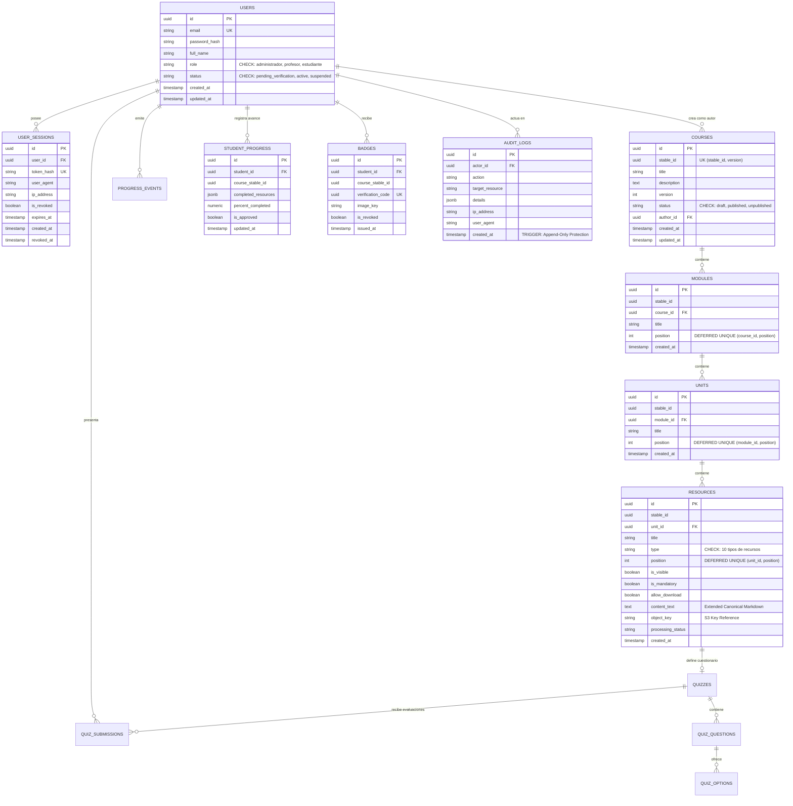

#### Migraciones del Esquema (`migrations/`):
1. `000001_init_schema`: Creación de tablas fundamentales, restricciones de integridad, índices B-Tree y llaves foráneas en cascada.
2. `000002_auth_tokens`: Creación de tablas de tokens temporales de verificación de correo y restablecimiento de contraseñas con hash criptográfico SHA-256.
3. `000003_academic_ordering`: Alteración de restricciones de posición a `UNIQUE (...) DEFERRABLE INITIALLY DEFERRED` en `modules`, `units` y `resources`.
4. `000004_audit_immutability`: Definición del trigger PL/pgSQL `reject_audit_log_mutation()` que convierte `audit_logs` en tabla inalterable (*append-only*).
5. `000005_resource_downloadable`: Inclusión de la columna `allow_download` (BOOLEAN) para recursos multimedia y PDFs.

---

### 5.5 Vista de Despliegue e Infraestructura Física / Runtime

El despliegue local y de staging se orquesta íntegramente mediante **Docker Compose v2** con preparación para escalamiento:

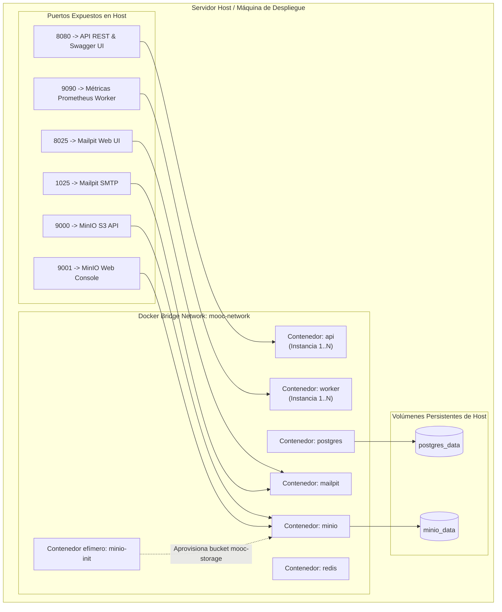

#### Construcción de Imágenes Multi-Stage en Go:
Las imágenes `Dockerfile.api` y `Dockerfile.worker` implementan el patrón multi-stage:
* **Stage 1 (Builder):** Utiliza `golang:1.24-alpine` para compilar binarios estáticos sin dependencias de CGO (`CGO_ENABLED=0 GOOS=linux go build -ldflags="-w -s"`).
* **Stage 2 (Runtime):** Utiliza `alpine:3.20` con certificados TLS actualizados (`ca-certificates`), ejecutando bajo un usuario sin privilegios (*non-root user*), reduciendo la superficie de ataque y logrando imágenes de menos de 30 MB.

---

### 5.6 Vista Dinámica: Flujos Críticos de Ejecución (Secuencia)

#### Flujo A: Registro de Estudiante, Verificación SMTP y Sesión Revocable

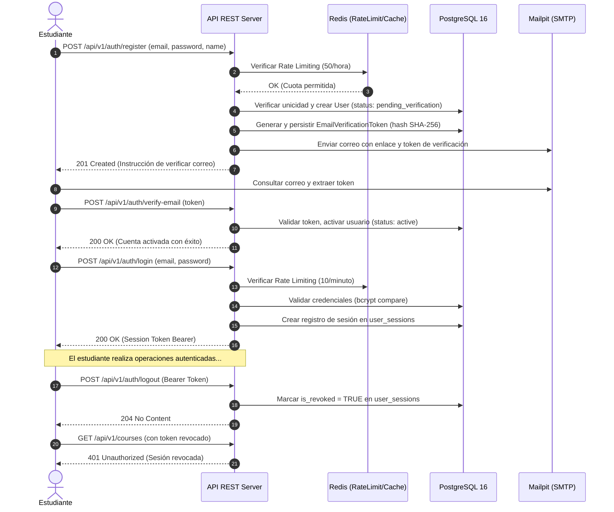

#### Flujo B: Autoría de Curso, Reordenamiento Atómico y Validación de Publicación

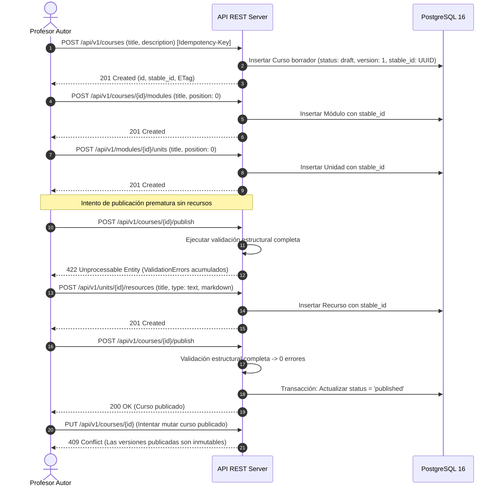

#### Flujo C: Procesamiento Asíncrono, Idempotencia, Reintentos y DLQ

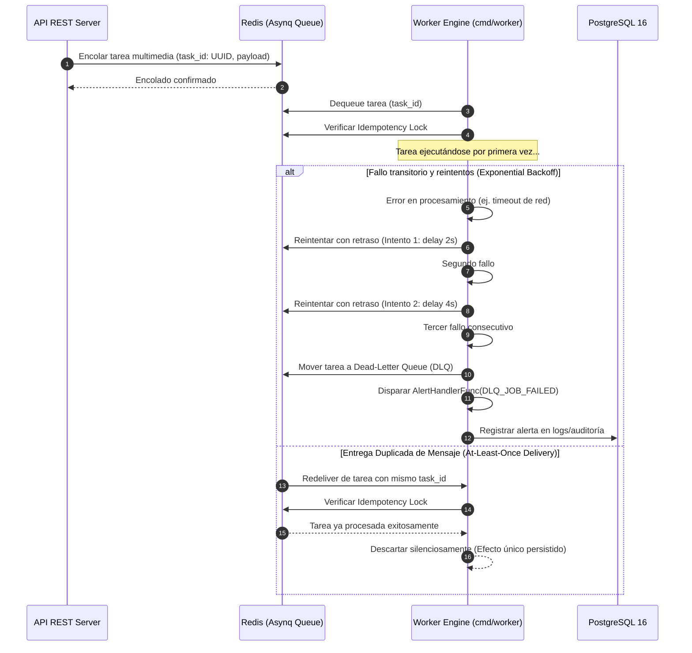

---

## 6. Estrategia de Seguridad, Gobierno y Cumplimiento

La plataforma aplica los principios de **Seguridad por Diseño (*Security by Design*)** y **Menor Privilegio**:

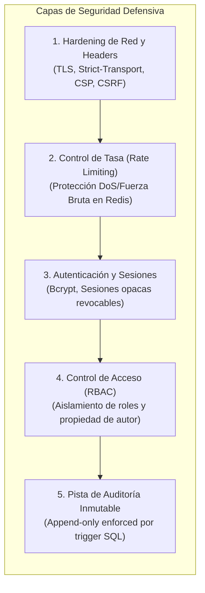

1. **Matriz de Control de Acceso (RBAC):**
   * Verificación granular en middleware de autorización (`internal/http/middleware/authorize.go`).
   * Protección de recursos propios: Un profesor solo puede editar sus propios cursos en borrador.
   * Endpoints de administración (`/api/v1/admin/*`, `/api/v1/audit/*`) accesibles estrictamente por usuarios con rol `administrador`.
2. **Protección Contra Amenazas Web Comunes:**
   * **CSRF:** Verificación estricta de dominios de origen en métodos mutativos (`POST`, `PUT`, `PATCH`, `DELETE`).
   * **Inyecciones SQL:** 100% de consultas parametrizadas mediante `$1, $2, ...` en `database/sql` de Go.
   * **Stored XSS:** Filtrado y normalización de texto libre antes de la persistencia.
3. **Privacidad de Datos del Estudiante (Data Minimization):**
   * Al emitir insignias digitales, la URL pública de verificación expone únicamente el identificador único de verificación (`verification_code`), el título del curso y la fecha de graduación, **ocultando el correo electrónico del estudiante**.
4. **Protección de Auditoría:**
   * Cualquier intento de alteración o borrado de registros de auditoría dispara una excepción a nivel de base de datos (`RAISE EXCEPTION 'audit_logs is append-only'`), impidiendo la evasión de registros forenses.

---

## 7. Estrategia de Resiliencia, Concurrencia y Recuperación ante Desastres (DRP)

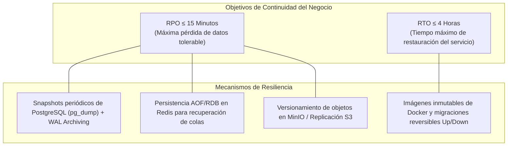

* **Concurrencia en API REST:** Go maneja cada conexión HTTP entrante en una goroutine independiente (ligera, ~2KB de stack inicial), permitiendo atender fácilmente los 2.000 usuarios concurrentes sin sobrecarga de hilos de sistema operativo.
* **Pool de Conexiones a Base de Datos:**
  * Límite de conexiones abiertas: 25.
  * Límite de conexiones ociosas: 25.
  * Tiempo máximo de vida de conexión: 5 minutos.
  * Previene la saturación del proceso PostgreSQL bajo picos de carga.
* **Tolerancia a Particiones y Reintentos:** Si PostgreSQL o Redis se desconectan temporalmente, los middlewares y workers reintentan la conexión antes de declarar fallos irrecuperables.
* **Recuperación ante Desastres (DRP):**
  * La infraestructura completa se reconstruye de cero ejecutando `docker compose up -d` y `make seed`.
  * Los esquemas se autogestionan mediante scripts de migración reversibles verificados en CI (`DOWN` $\rightarrow$ `UP` $\rightarrow$ `DOWN` $\rightarrow$ `UP`).

---

## 8. Estrategia de Observabilidad, Telemetría y Monitoreo

El sistema implementa el estándar **OpenTelemetry (OTel)** para correlacionar trazas, métricas y registros:

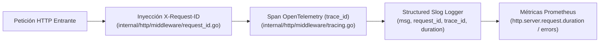

### 8.1 Correlación Transversal en Logs
Cada registro emitido por `log/slog` sigue el formato estructurado JSON incluyendo contexto de rastreo:
```json
{
  "time": "2026-09-14T17:25:00.123Z",
  "level": "INFO",
  "msg": "HTTP request completed",
  "request_id": "req-9c03db91-b3ca-4416",
  "trace_id": "4bf92f3577b34da6a3ce929d0e0e4736",
  "method": "POST",
  "path": "/api/v1/courses",
  "status": 201,
  "duration_ms": 14.5
}
```

### 8.2 Métricas Prometheus Expuestas
* **API REST (`GET /api/v1/metrics` en puerto 8080):**
  * `http_requests_total`: Conteo acumulado de peticiones segmentadas por método, ruta y código de respuesta HTTP.
  * `http_request_duration_seconds`: Histograma de latencias de peticiones para cálculo de percentiles p50, p95 y p99.
  * `http_requests_in_flight`: Peticiones activas simultáneas procesadas por el servidor.
* **Worker Engine (`GET /metrics` en puerto 9090):**
  * `worker_jobs_processed_total`: Trabajos procesados exitosamente por tipo de tarea.
  * `worker_jobs_failed_total`: Trabajos fallidos que agotaron reintentos y pasaron a la DLQ.
  * `worker_job_execution_duration_seconds`: Duración del procesamiento de tareas asíncronas.

---

## 9. Estado Actual de la Implementación y Métricas de Calidad

### 9.1 Matriz de Trazabilidad y Cumplimiento de Especificación

| Criterio de Evaluación (Sec. 9) | Segmento Crítico (Sec. 10.2) | Componentes Clave en el Código | Estado de Cumplimiento |
|---|---|---|:---:|
| **Identidad, autorización y seguridad** | Segmento 1: Identidad y administración | `internal/auth`, `internal/admin`, `internal/http/middleware/` | **100% PASS** |
| **Autoría y publicación** | Segmento 2: Autoría y publicación de curso | `internal/course`, `internal/structure`, `internal/domain/ordering.go` | **100% PASS** |
| **Arquitectura y despliegue** | Segmento 4: Procesamiento y tolerancia a fallos | `cmd/worker`, `internal/worker`, `docker-compose.yml` | **100% PASS** |
| **Calidad operativa (Observabilidad)** | Segmento 9: Operación y observabilidad | `internal/observability`, `cmd/api`, `cmd/worker` | **100% PASS** |
| **Multimedia y distribución** | Segmento 3: Carga multipart y derivados | `internal/domain/ports.go` (`StorageProvider`), MinIO | **Fundación Lista** |
| **Evaluación académica** | Segmento 6: Quizzes y calificación servidor | `migrations/000001_init_schema.up.sql` (`quizzes`) | **Modelo Listo** |
| **Progreso e insignias** | Segmento 7 y 8: Progreso validado e insignias | `migrations/000001_init_schema.up.sql` (`student_progress`) | **Modelo Listo** |

### 9.2 Métricas de Verificación Automatizada (Aseguramiento de Calidad)
* **Suite de Pruebas E2E (Newman / Postman en Docker):**
  * Total de peticiones ejecutadas: **112**
  * Total de aserciones automáticas evaluadas: **216**
  * Aserciones exitosas: **216 (100% PASS)**
  * Aserciones fallidas: **0 (0%)**
  * Defectos bloqueantes o críticos en la etapa: **0**
* **Pruebas de Reversibilidad de Base de Datos:**
  * Suite automatizada `migrations/migrations_test.go` valida el ciclo completo `DOWN` $\rightarrow$ `UP` $\rightarrow$ `DOWN` $\rightarrow$ `UP` garantizando limpieza y consistencia absoluta en el aprovisionamiento.
* **Pruebas de Tolerancia a Fallos e Idempotencia:**
  * Suite automatizada y script `make demo-segment4` validando deduplicación ante doble entrega y transición automática a DLQ con alertas tras 3 reintentos.

---

## 10. Plan de Evolución Arquitectónica y Roadmap Técnico

El desarrollo futuro de la plataforma contempla las siguientes etapas arquitectónicas para completar el 100% del ciclo del producto:

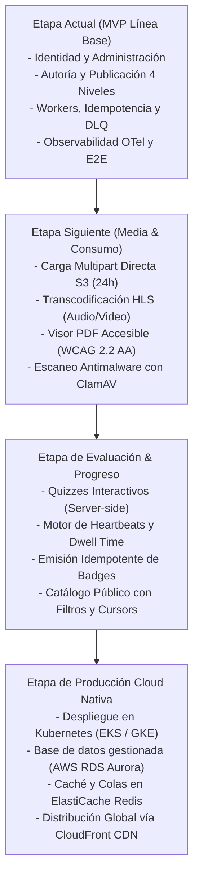

1. **Próxima Etapa Inmediata (Ingesta Multimedia y Consumo):**
   * Implementación de endpoints `/api/v1/media/uploads/presigned` para subida multipart directa a MinIO con verificación de checksum SHA-256.
   * Integración de worker con `ffmpeg` para transcodificación adaptativa HLS (.m3u8 y segmentos .ts) sin upscaling.
2. **Etapa de Quizzes y Progreso Validado:**
   * Implementación del motor de evaluación server-side (Quiz Key Secrecy) con soporte de intentos e idempotencia.
   * Procesador de eventos de progreso (`progress_events`) basado en señales de permanencia mínima y heartbeats, rechazando porcentajes externos.
   * Generador automatizado de diplomas/insignias digitales con almacenamiento en MinIO y URL pública de verificación criptográfica.
3. **Migración a la Nube (Producción):**
   * Transición del entorno Docker Compose a infraestructura como código (**Terraform**) sobre AWS/GCP: balanceador de carga de aplicaciones (ALB), clúster de cómputo elástico, base de datos relacional Multi-AZ y almacenamiento distribuido S3 con CDN CloudFront.

---

## 11. Glosario de Términos

* **Asynq:** Librería de procesamiento asíncrono y colas de tareas distribuidas en Go respaldada por Redis.
* **Dead-Letter Queue (DLQ):** Cola especial donde se almacenan las tareas que fallaron repetidamente tras agotar la cuota máxima de reintentos, evitando bloqueos y facilitando inspección forense.
* **ETag (Entity Tag):** Cabecera HTTP que representa la huella digital criptográfica de un recurso para validación de caché condicional.
* **HLS (HTTP Live Streaming):** Protocolo de streaming de video adaptativo basado en segmentos HTTP y listas de reproducción m3u8.
* **Idempotencia:** Propiedad según la cual una operación produce exactamente el mismo resultado y estado en el sistema sin importar cuántas veces consecutivas se ejecute con los mismos parámetros.
* **Monolito Modular:** Patrón arquitectónico donde el sistema se compila y ejecuta como una única unidad pero su diseño interno está estrictamente desacoplado en módulos con límites e interfaces claras.
* **OpenTelemetry (OTel):** Estándar de observabilidad independiente de proveedores para recopilar trazas, métricas y logs.
* **RBAC (Role-Based Access Control):** Mecanismo de control de acceso fundamentado en la asignación de permisos según el rol organizacional del usuario.
* **RPO (Recovery Point Objective):** Cantidad máxima de tiempo en que se pueden perder datos debido a un incidente grave.
* **RTO (Recovery Time Objective):** Duración máxima tolerable para restaurar la operatividad de los servicios del sistema tras una interrupción.
* **Stable ID:** Identificador inmutable asignado a una entidad de aprendizaje que permanece inalterable a lo largo de todas las versiones publicadas del curso.

