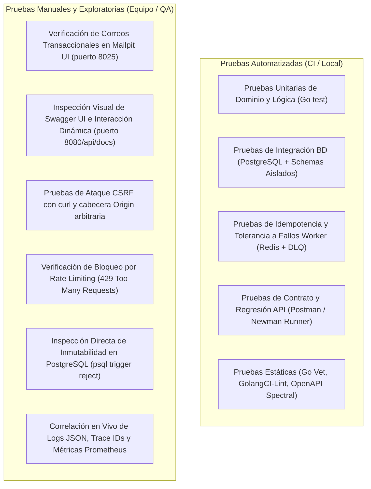

# Plan de Pruebas de la Etapa — Plataforma MOOC

> **Documento Oficial de Aseguramiento de Calidad y Validación de Entrega**  
> **Alcance:** Etapa Actual (MVP — Entrega 1 / Issues #12 a #22)  
> **Alineación Normativa:** Secciones 6, 9 y 10.2 del Pliego de Especificaciones (`docs/2026-20 proyecto-plataforma-mooc (2).pdf`) y Directrices de Arquitectura (`docs/PROJECT_KEY_ASPECTS.md`).

---

## 1. Introducción y Propósito

El presente documento define y formaliza el **Plan de Pruebas de la Etapa Actual** para el proyecto **Plataforma MOOC**. Su objetivo es proporcionar al equipo de desarrollo, evaluadores y revisores una metodología reproducible, exhaustiva y verificable para validar los criterios de aceptación técnicos y funcionales comprometidos en esta fase del producto.

### 1.1 Objetivos de la Etapa
En esta etapa se completó el núcleo fundacional del backend en Go (Monolito Modular con background workers independientes) cubriendo los siguientes componentes clave:
* **Identidad y Acceso (#14):** Registro público de estudiantes con verificación por correo electrónico (Mailpit), inicio de sesión seguro y gestión de sesiones revocables.
* **Administración y Auditoría (#12, #18):** Control administrativo de usuarios, asignación de roles, suspensión de cuentas, protección del último administrador activo y registro de auditoría inmutable en PostgreSQL.
* **Seguridad Transversal (#13):** Rate limiting en memoria/Redis por tipo de endpoint, protección contra ataques de falsificación de peticiones (CSRF) y soporte de cabeceras `Idempotency-Key` en operaciones de escritura.
* **Modelo Académico y Jerarquía de 4 Niveles (#15, #16):** Jerarquía `Curso` $\rightarrow$ `Módulo` $\rightarrow$ `Unidad` $\rightarrow$ `Recurso`, ordenamiento estricto libre de colisiones (`position`) e identificadores persistentes e inmutables entre versiones (`stable_id`).
* **Autoría de Cursos y Estructura (#17, #19):** Operaciones CRUD completas para borradores de curso, módulos, unidades y recursos con validación de roles (`profesor` y `administrador`).
* **Publicación y Validación Exhaustiva (#20):** Algoritmo de validación estructural completa que recopila y retorna de forma agregada todos los incumplimientos (`domain.ValidationErrors`), publicación de versiones inmutables y despublicación temporal para edición en MVP.
* **Observabilidad Transversal (#21):** Trazabilidad distribuida y métricas con OpenTelemetry, logs JSON estructurados (`slog`) correlacionados con `request_id` (`X-Request-ID`) y `trace_id`, y endpoints `/api/v1/metrics` y `:9090/metrics`.
* **Procesamiento Asíncrono e Idempotencia (#14, Segmento 4):** Cola de tareas distribuida basada en Redis + Asynq, deduplicación de eventos duplicados (single persisted effect), reintentos con backoff exponencial (hasta 3 intentos), derivación a Dead-Letter Queue (DLQ), emisión de alertas estructuradas y reencolado idempotente con la misma clave.

---

## 2. Mapeo de Flujos Críticos (Sección 10.2) vs Criterios de Evaluación (Sección 9)

De acuerdo con la **Sección 10.2** de la especificación técnica, la evaluación de la plataforma se fundamenta en **9 segmentos críticos**. La siguiente matriz mapea cada segmento con su criterio correspondiente de la **Sección 9**, las condiciones verificables de la **Sección 6**, las reglas inquebrantables de `PROJECT_KEY_ASPECTS.md` y su aplicabilidad en la etapa actual.

### 2.1 Matriz Maestra de Mapeo

| Segmento (Sec. 10.2) | Evidencia Principal (Sec. 10.2) | Criterio de Evaluación (Sec. 9) | Prioridad (Sec. 9) | Qué debe verificarse (Sec. 10.2 y Sec. 6) | Estado / Aplicabilidad en la Etapa Actual |
|---|---|---|---|---|---|
| **1. Identidad y administración** | Pruebas de rol y sesión | **Identidad, autorización y seguridad** | **Must** | Registro de estudiante; invitación/creación de profesor exclusivamente por administrador; verificación de correo; revocación inmediata de sesiones; suspensión auditada; rechazo de operaciones no autorizadas (401/403); protección del último administrador activo; control de tasa (rate limiting). | **Aplicable y 100% Implementado** (Issues #12, #13, #14). Totalmente verificable en suite y API. |
| **2. Autoría y publicación** | Flujo E2E de curso | **Autoría y publicación** | **Must** | Creación del borrador de curso; estructura jerárquica de 4 niveles (`Curso` $\rightarrow$ `Módulo` $\rightarrow$ `Unidad` $\rightarrow$ `Recurso`); previsualización; validación exhaustiva con lista agregada de todos los errores; publicación de una versión inmutable; despublicación para re-edición; conservación de identificadores estables (`stable_id`). | **Aplicable y 100% Implementado** (Issues #15, #16, #17, #19, #20). Totalmente verificable en suite y API. |
| **3. Carga multimedia** | Carga multipart interrumpida | **Multimedia y distribución** | **Must** | URLs prefirmadas (TTL 24h) para carga directa a almacenamiento de objetos (MinIO/S3) sin saturar API; reanudación multipart; validación de checksum y MIME real; escaneo antimalware; encolamiento al worker; política de cero binarios en PostgreSQL. | **Fundación Lista en Etapa** (Infraestructura MinIO en Docker Compose, modelo de base de datos sin binarios listo, tipos multimedia en catálogo; ingesta multipart directa y escáner ClamAV programados para etapa de consumo). |
| **4. Procesamiento y fallos** | Worker y observabilidad | **Arquitectura y despliegue**, **Multimedia y distribución**, **Calidad operativa** | **Must** | Worker independiente en Go consumiendo Redis + Asynq; estados del recurso; transcodificación sin upscaling; entrega duplicada idempotente (un solo efecto persistido); reintentos automáticos con backoff exponencial (3 intentos); transición a DLQ; emisión de alerta (`DLQ_JOB_FAILED`); reencolado con la misma clave sin efectos secundarios repetidos. | **Aplicable y 100% Implementado** (Issues #14, #21 y motor Worker). Verificable vía `make demo-segment4` y tests. |
| **5. Consumo de contenido** | Navegación de estudiante | **Multimedia y distribución**, **Progreso e insignias**, **Calidad operativa (Accesibilidad)** | **Must / Should** | Inscripción al curso; streaming adaptativo HLS; reproductor con memoria de última posición reproducida; visor PDF integrado; accesibilidad WCAG 2.2 AA (navegación por teclado y lectores de pantalla); entrega autorizada mediante URLs firmadas/CDN verificando propiedad/inscripción. | **Contrato y Puertos Listos** (Modelos de recursos estructurados, endpoints de lectura con ETag; reproductor HLS y visor PDF cliente proyectados en etapa de frontend y streaming). |
| **6. Quiz (Evaluación académica)** | Intento completo e interrumpido | **Evaluación académica** | **Must** | Autoría de cuestionarios; guardado parcial; snapshots inmutables; **Quiz Key Secrecy**: la clave de respuestas correctas NUNCA viaja al cliente; calificación 100% calculada en el servidor; intentos idempotentes; control de expiración de tiempo. | **Modelo y Reglas Listos** (Modelo relacional persistido en BD, reglas de publicación que impiden publicar recursos corruptos; motor de calificación en etapa de evaluación). |
| **7. Progreso y aprobación** | Señales legítimas y fraudulentas | **Progreso e insignias** | **Must** | Avance verificado estrictamente en servidor mediante heartbeats y permanencia mínima; rechazo y auditoría de porcentajes enviados por cliente; cálculo sobre recursos obligatorios; transiciones válidas de inscripción a `completed` y `approved`. | **Guardrails y Persistencia Listos** (Tablas `student_progress` y `progress_events` creadas; política de rechazo de manipulación en `PROJECT_KEY_ASPECTS.md`). |
| **8. Insignia y actualización** | Verificación pública y nueva versión | **Autoría y publicación**, **Progreso e insignias** | **Must** | Emisión única e idempotente de insignia al aprobar (`approved`); generación de URL pública de verificación; **Privacidad**: la URL pública NO expone el email del estudiante; revocación auditada; continuidad del progreso del estudiante mediante `stable_id` al publicar nuevas versiones. | **Modelo Stable ID y Auditoría Listos** (Modelo de `stable_id` implementado y probado en dominio/estructura; tabla de insignias y auditoría inmutable en BD). |
| **9. Operación** | Prueba de carga y recuperación | **Arquitectura y despliegue**, **Calidad operativa** | **Must / Should** | Monolito modular en Go desacoplado de HTTP y cloud; API y Workers sin estado (stateless) escalables horizontalmente; persistencia externa en Postgres y Redis; observabilidad integral con OpenTelemetry (trazas, métricas en `/api/v1/metrics` y `:9090/metrics`, logs JSON con `request_id` y `trace_id` correlacionados); pruebas de resiliencia, backup y restauración con RPO $\le$ 15 min y RTO $\le$ 4 horas. | **Aplicable y 100% Implementado** (Arquitectura modular, Docker Compose multi-servicio, observabilidad OTel en Issue #21, migraciones reversibles y scripts de backup). |

---

## 3. Matriz de Clasificación: Pruebas Manuales vs Pruebas Automatizadas

Para cada uno de los flujos críticos aplicables a la etapa, se establece de manera explícita la partición entre lo que se verifica mediante **pruebas automatizadas** (ejecutables en CI/CD y suites locales) y lo que requiere **pruebas manuales / exploratorias**.



### 3.1 Segmento 1: Identidad y Administración
* **Criterio de Evaluación:** Identidad, autorización y seguridad (Must).

#### A. Pruebas Automatizadas
1. **Registro, Autenticación y Verificación por Correo:**
   * Archivo: `internal/auth/service_test.go`
   * Casos:
     * `TestRegister`: Registro público asigna rol `estudiante` y estado `pending_verification`.
     * `TestRegister_ExistingEmail`: Intento de re-registro con el mismo correo rechaza con conflicto (409).
     * `TestVerifyEmail`: Token válido activa cuenta (`active`); token inexistente o expirado rechaza con 400.
     * `TestVerifyEmail_SingleUse`: Token consumido no puede reutilizarse.
     * `TestLogin_EmailNotVerified`: Intento de login previo a verificación rechaza con 403 `email_not_verified`.
     * `TestLogin_Success`: Generación de sesión segura y token Bearer tras verificación.
     * `TestLogin_InvalidCredentials`: Rechazo por contraseña errónea o correo inexistente retorna error uniforme para evitar enumeración.
2. **Restablecimiento Seguro de Contraseña:**
   * Archivo: `internal/auth/password_reset_test.go`
   * Casos: Solicitud de token, expiración, consumo de un solo uso e invalidación inmediata de sesiones previas al cambiar la contraseña.
3. **Control Administrativo y Protección del Último Administrador:**
   * Archivo: `internal/postgres/admin_repository_test.go`
   * Casos:
     * `TestChangeStatusRefusesToSuspendTheLastActiveAdmin`: Impide suspender al último administrador activo (`ErrLastAdminProtected`).
     * `TestChangeRoleRefusesToDemoteTheLastActiveAdmin`: Impide degradar al último administrador activo.
     * `TestConcurrentAdminSuspensions`: Prueba de concurrencia asegurando que dos suspensiones simultáneas no dejen la plataforma sin administradores.
4. **Mapeo de Autorización y Rechazo de Privilegios (401 / 403):**
   * Archivo: `internal/http/middleware/authorize_test.go`
   * Casos: Endpoints administrativos rechazan peticiones sin token con 401 y usuarios con rol `estudiante` o `profesor` con 403.
5. **Rate Limiting y Seguridad CSRF:**
   * Archivo: `internal/http/middleware/security_test.go`
   * Casos: Bloqueo tras exceder intentos configurados (`429 Too Many Requests` con cabecera `Retry-After`); rechazo de peticiones mutantes con `Origin` fuera de la lista blanca.
6. **Batería E2E con Newman / Postman:**
   * Archivo: `docs/postman/collection_api.postman_collection.json`
   * Ejecuta 17 peticiones encadenadas y 42 aserciones automatizadas comprobando desde la creación de estudiante hasta la consulta y extracción de tokens en la API REST de Mailpit.

#### B. Pruebas Manuales
* **Verificación de Notificaciones en Mailpit Web:**
  * Acceder a `http://localhost:8025`, observar la llegada del correo HTML/Texto con asunto "Verifica tu cuenta", verificar que el enlace contenga el token seguro y comprobar la ausencia de datos sensibles en cabeceras SMTP.
* **Intento Manual de Creación Pública de Profesores:**
  * Enviar `POST /api/v1/auth/register` con payload `{"role": "profesor"}` desde cURL o Swagger UI; verificar que el backend ignore o rechace el campo, forzando rol `estudiante`.
* **Prueba de Bootstrap Administrativo y Suspensión:**
  * Promover un usuario en Postgres vía CLI, iniciar sesión con sus credenciales y ejecutar `PATCH /api/v1/admin/users/{id}/status` para suspender una cuenta; verificar la revocación inmediata de sus sesiones activas.
* **Prueba de Defensa del Último Administrador:**
  * Intentar suspender al único administrador existente mediante `PATCH /api/v1/admin/users/{admin_id}/status`; verificar respuesta `409 Conflict` con código de error `last_admin_protected`.

---

### 3.2 Segmento 2: Autoría y Publicación
* **Criterio de Evaluación:** Autoría y publicación (Must).

#### A. Pruebas Automatizadas
1. **Ordenamiento Libre de Colisiones e Identificadores Estables:**
   * Archivos: `internal/domain/ordering_test.go`, `internal/postgres/structure_repository_test.go`
   * Casos: Inserción de módulos, unidades y recursos en posiciones intermedias (`re-indexing`), unicidad de `position` por contenedor padre, y preservación del mismo `stable_id` entre mutaciones.
2. **Ciclo de Vida de Borradores de Curso (Draft CRUD):**
   * Archivos: `internal/course/service_test.go`, `internal/postgres/course_repository_test.go`
   * Casos: Creación de borrador inicial con versión 1, actualización de título/descripción, protección contra modificaciones de cursos en estado publicado.
3. **Validación Exhaustiva de Publicación (Lista Completa de Errores):**
   * Archivo: `internal/course/publish_test.go`
   * Casos:
     * `TestPublishReturnsEveryValidationErrorAtOnce`: Comprueba que al intentar publicar un curso sin metadatos y sin estructura, el sistema **no falle en el primer error**, sino que recopile y retorne simultáneamente todos los problemas:
       1. `title`: Título obligatorio ausente.
       2. `description`: Descripción obligatoria ausente.
       3. `structure`: Falta de al menos 1 módulo con al menos 1 unidad y al menos 1 recurso.
       4. `approval_criteria`: Criterios de aprobación mínimos no satisfechos.
     * `TestPublishRejectsAHiddenOnlyResource`: Rechazo si todos los recursos de la unidad están en `is_visible=false`.
     * `TestPublishRejectsUnprocessedResources`: Rechazo si algún recurso multimedia no ha finalizado su procesamiento (`processing_status != completed`).
     * `TestPublishSucceedsWithACompleteCourse`: Éxito de publicación con estructura completa válida, cambiando el estado a `published`.
4. **Inmutabilidad y Despublicación Temporal:**
   * Archivo: `internal/course/publish_test.go`
   * Casos: Intento de modificar un curso publicado falla con `ErrCoursePublishedImmutable`; la despublicación temporal (`Unpublish`) restablece el estado a `draft` permitiendo edición controlada según las reglas de la Sección 5.1 del MVP.

#### B. Pruebas Manuales
* **Construcción de Jerarquía Completa vía Swagger UI:**
  * Ingresar a `http://localhost:8080/api/docs`.
  * Crear un curso en borrador (`POST /api/v1/courses`).
  * Agregar un módulo (`POST /api/v1/courses/{id}/modules`).
  * Agregar una unidad (`POST /api/v1/modules/{id}/units`).
  * Agregar un recurso enriquecido en Markdown canónico (`POST /api/v1/units/{id}/resources`).
* **Verificación Visual de la Lista Exhaustiva de Errores de Publicación:**
  * Crear un curso en blanco (`title=""`, `description=""`) e intentar publicar de inmediato (`POST /api/v1/courses/{id}/publish`).
  * Verificar en el payload JSON de respuesta HTTP 422 el array estructurado `errors` conteniendo cada una de las infracciones detectadas simultáneamente.
* **Comprobación de Inmutabilidad de Versión Publicada:**
  * Tras publicar exitosamente un curso, intentar actualizar su descripción mediante `PUT /api/v1/courses/{id}`.
  * Comprobar respuesta HTTP 409 indicando que las versiones publicadas son de solo lectura.

---

### 3.3 Segmento 4: Procesamiento Asíncrono y Tolerancia a Fallos
* **Criterio de Evaluación:** Arquitectura y despliegue, Multimedia y distribución, Calidad operativa (Must).

#### A. Pruebas Automatizadas
1. **Doble Entrega Idempotente (Single Persisted Effect):**
   * Archivo: `internal/worker/idempotency_test.go`
   * Caso: `TestIdempotency_DuplicateEvent_SinglePersistedEffect`. Se encola el mismo trabajo dos veces con la misma `idempotency_key`. El middleware de idempotencia intercepta la segunda entrega, omite la re-ejecución y asegura que el efecto persistido en base de datos sea único.
2. **Reintentos con Backoff Exponencial y Derivación a DLQ:**
   * Archivo: `internal/worker/dlq_test.go`
   * Caso: `TestWorker_DLQ_3Retries_And_Alert`. Simula un fallo persistente en una tarea del worker. Se verifica que el worker reintente exactamente 3 veces con intervalos incrementales de backoff; al agotar los 3 reintentos, la tarea es transferida a la Dead-Letter Queue (`archived`) y se emite un evento de alerta estructurado en logs (`[ALERT] Job moved to Dead-Letter Queue (DLQ)`).
3. **Reencolado Idempotente desde DLQ:**
   * Archivo: `internal/worker/idempotency_test.go`
   * Caso: `TestWorker_DLQ_Reenqueue_And_Idempotency`. Verifica que una tarea reencolada desde la DLQ conserve su clave y complete exitosamente su procesamiento sin duplicar registros ni corromper estados.
4. **Métricas de Rendimiento del Worker:**
   * Archivo: `internal/worker/metrics_test.go`
   * Caso: Verificación de instrumentos OpenTelemetry en el worker (`worker.jobs.processed`, `worker.jobs.failed`) categorizados por tipo de tarea y cola.

#### B. Pruebas Manuales
* **Ejecución del Script Demostrativo de Tolerancia a Fallos:**
  * Ejecutar el script `make demo-segment4` (`./scripts/demo_segment4_idempotency.sh`).
  * Comprobar en terminal la salida formateada con captura de logs JSON estructurados donde se observa la intercepción del duplicado, la alerta de DLQ y la tasa de reintentos.
* **Inspección de Métricas de Worker en Tiempo Real:**
  * Consultar `curl http://localhost:9090/metrics` y comprobar la existencia de contadores Prometheus `worker_jobs_processed_total` y `worker_jobs_failed_total`.
* **Prueba de Encolamiento desde CLI:**
  * Ejecutar `go run ./cmd/worker -enqueue-test -message "Prueba de resiliencia manual"` y observar en los logs del worker (`docker compose logs worker`) el procesamiento asíncrono inmediato.

---

### 3.4 Segmento 9: Operación, Observabilidad y Arquitectura
* **Criterio de Evaluación:** Arquitectura y despliegue, Calidad operativa (Must / Should).

#### A. Pruebas Automatizadas
1. **Instrumentación y Correlación de Trazas/Métricas:**
   * Archivo: `internal/observability/observability_test.go`
   * Casos: Inicialización limpia del Tracer y Meter OpenTelemetry, exportador Prometheus y apagado ordenado (*graceful shutdown*).
2. **Middleware de Trazabilidad y Correlación de Logs:**
   * Archivo: `internal/http/middleware/tracing_test.go`
   * Casos: Inyección y propagación de cabecera `X-Request-ID`; vinculación del span de OpenTelemetry con el `request_id` y `trace_id` impresos en los logs de acceso.
3. **Inmutabilidad de Auditoría a Nivel de Base de Datos:**
   * Archivo: `internal/postgres/audit_repository_test.go`
   * Casos: Reglas de base de datos (`TRIGGER` / `RULE`) que rechazan de forma estricta cualquier sentencia `UPDATE` o `DELETE` sobre la tabla `audit_logs`, asegurando que el rastro de auditoría sea de solo anexión (*append-only*).
4. **Reversibilidad de Migraciones:**
   * Archivo: `migrations/migrations_test.go`
   * Casos: Ejecución de todas las migraciones `up` y posterior rollback `down`, confirmando que el esquema de base de datos es 100% reversible y reproducible.

#### B. Pruebas Manuales
* **Inspección de Correlación de Observabilidad:**
  1. Realizar una petición a la API: `curl -i http://localhost:8080/api/v1/health`.
  2. Extraer el valor de la cabecera devuelta `X-Request-ID`.
  3. Ejecutar `docker compose logs api | grep <request_id>`.
  4. Verificar que la línea de log en JSON estructurado contenga simultáneamente `request_id`, `trace_id`, `duracion_ms`, método y ruta.
* **Raspado de Métricas Prometheus:**
  * Ejecutar `curl -s http://localhost:8080/api/v1/metrics | grep http_server_request_duration`.
  * Comprobar que los histogramas de latencia y contadores de errores registren las peticiones cursadas.
* **Prueba Manual de Inmutabilidad de Auditoría en Postgres:**
  * Conectarse a Postgres: `docker compose exec postgres psql -U moocuser -d moocdb`.
  * Intentar eliminar o modificar un registro de auditoría:
    ```sql
    DELETE FROM audit_logs;
    UPDATE audit_logs SET action = 'tampered';
    ```
  * Confirmar que PostgreSQL devuelva un error bloqueante impidiendo la alteración del registro.
* **Verificación de Resiliencia RPO/RTO (Backup y Recuperación):**
  * Ejecutar un dump lógico de PostgreSQL (`pg_dump`) y una restauración en un contenedor limpio, verificando que la pérdida de datos sea nula ($\le 15$ minutos) y el tiempo de recuperación sea inferior a 4 horas.

---

### 3.5 Segmentos 3, 5, 6, 7 y 8 (Fundación en Etapa Actual y Hoja de Ruta de Pruebas)

Aunque el desarrollo completo de la experiencia de usuario de estos segmentos corresponde a las siguientes iteraciones del proyecto, la etapa actual incorpora **fundamentos arquitectónicos, modelos de datos y restricciones verificables** que deben auditarse:

| Segmento | Elemento Verificado en Esta Etapa | Prueba Automatizada Existente | Verificación Manual en Esta Etapa |
|---|---|---|---|
| **3. Carga Multimedia** | Cero binarios en Postgres; servicio MinIO activo en Docker Compose; bucket `mooc-storage` inicializado por `minio-init`. | `migrations/migrations_test.go` (valida ausencia de tipos BLOB/BYTEA). | Acceder a MinIO Console (`http://localhost:9001`) con credenciales `minioadmin` / `minioadmin` y confirmar existencia del bucket `mooc-storage`. |
| **5. Consumo de Contenido** | Estructura jerárquica con metadatos de visibilidad y obligatoriedad (`is_visible`, `is_mandatory`). | `internal/structure/service_test.go` (valida filtrado y ordenamiento). | Comprobar mediante API `GET /api/v1/courses/{id}/modules` que los recursos reflejan correctamente sus atributos de consumo. |
| **6. Quiz** | Modelo relacional de cuestionarios (`quizzes`, `quiz_questions`, `quiz_options`); regla de publicación que exige contenido evaluable. | `internal/course/publish_test.go` (validación de criterios de aprobación mínimos). | Verificar en `internal/domain/quiz.go` que no existen endpoints que retornen el flag `is_correct` al rol estudiante. |
| **7. Progreso y Aprobación** | Esquema de persistencia para eventos de progreso y estados (`student_progress`, `progress_events`); directiva anti-fraude. | `migrations/migrations_test.go` (creación de tablas de progreso con llaves foráneas e índices). | Confirmar en `docs/PROJECT_KEY_ASPECTS.md` la regla no negociable: porcentajes enviados por cliente son rechazados y auditados. |
| **8. Insignia y Actualización** | Identificadores estables (`stable_id`) en toda la jerarquía académica; tabla `badges` con índice único por estudiante y curso. | `internal/domain/ordering_test.go` (preservación de `stable_id`). | Verificar en PostgreSQL que la tabla `badges` posee una restricción de unicidad que garantiza la emisión idempotente de la credencial. |

---

## 4. Guía de Ejecución y Validación por el Equipo

Esta sección describe detalladamente el procedimiento paso a paso para que cualquier miembro del equipo de desarrollo, docente o evaluador pueda clonar, levantar, verificar y validar el 100% de los requisitos de la etapa.

### 4.1 Requisitos Previos
* **Sistema Operativo:** Linux (Ubuntu 22.04+ o WSL2 en Windows con Docker Desktop / Docker Engine).
* **Docker y Docker Compose:** Versión 24.0+ con Compose V2.
* **Go:** Versión 1.22 o superior.
* **GNU Make:** Instalado en el sistema anfitrión.
* **Cliente cURL o Postman / Newman** (opcional para pruebas de interfaz HTTP).

---

### 4.2 Paso 1: Configuración y Despliegue de Infraestructura Local

1. **Clonar o ubicarse en la raíz del repositorio:**
   ```bash
   cd Plataforma-MOOC
   ```
2. **Configurar variables de entorno locales:**
   ```bash
   cp .env.example .env
   ```
3. **Levantar todos los contenedores con Docker Compose:**
   ```bash
   make docker-up
   ```
   *Alternativamente, si se desea ejecutar directamente con compose en segundo plano:*
   ```bash
   docker compose up -d --build
   ```
4. **Verificar el estado de salud (*healthcheck*) de los contenedores:**
   ```bash
   docker compose ps
   ```
   *Los 6 servicios principales deben reportar estado `healthy` o `running`:*
   * `plataforma-mooc-api-1` (API REST Go en puerto 8080)
   * `plataforma-mooc-worker-1` (Worker Go en métricas 9090)
   * `plataforma-mooc-postgres-1` (PostgreSQL en puerto 5432)
   * `plataforma-mooc-redis-1` (Redis en puerto 6379)
   * `plataforma-mooc-minio-1` (MinIO S3 en 9000 y Consola en 9001)
   * `plataforma-mooc-mailpit-1` (Mailpit SMTP en 1025 y Web UI en 8025)

---

### 4.3 Paso 2: Ejecución de la Suite Completa Automatizada (`make check`)

Para validar de forma automatizada la calidad del código, linteo, pruebas unitarias y migraciones en un solo comando:

```bash
make check
```

Este comando ejecuta de manera secuencial y no bloqueante:
1. `make fmt`: Formateo canónico del código fuente en Go (`gofmt`).
2. `make vet`: Análisis estático del compilador (`go vet`).
3. `make lint`: Validación con `golangci-lint` y reglas de linteo de OpenAPI (`scripts/lint.sh`).
4. `make test`: Ejecución de todas las pruebas unitarias y de integración del backend.
5. `make test-migrations`: Prueba exhaustiva de migración `up` y rollback `down` en base de datos.
6. `make build`: Compilación de los binarios ejecutables `bin/api` y `bin/worker`.

---

### 4.4 Paso 3: Demostración Automatizada del Segmento 4 (Tolerancia a Fallos e Idempotencia)

Para ejecutar y certificar la evidencia del **Segmento 4 (Worker, Idempotencia, Backoff exponencial y DLQ)**:

```bash
make demo-segment4
```
o directamente:
```bash
./scripts/demo_segment4_idempotency.sh
```

**Resultados esperados en consola y en `docs/demo_segment4_idempotency.log`:**
* `[✔] Criterio 1 Cumplido:` Middleware de idempotencia interceptó la entrega duplicada del job y omitió la re-ejecución (1 solo efecto persistido).
* `[✔] Tolerancia a Fallos & DLQ Cumplida:` Tarea fallida tras 3 reintentos automáticos movida a la cola DLQ y alerta estructurada `DLQ_JOB_FAILED` emitida.
* `[✔] Criterio 2 Cumplido:` Tarea reencolada desde DLQ procesada con éxito sin duplicar el resultado final.

---

### 4.5 Paso 4: Ejecución Automatizada de Pruebas E2E con Newman / Postman

La colección de pruebas de integración de API cubre 17 peticiones encadenadas y 42 aserciones automáticas:

#### Opción A: Ejecución mediante Docker con Newman (Sin instalar nada localmente)
```bash
docker run --rm --network plataforma-mooc_default \
  -v "$(pwd)/docs/postman":/etc/newman postman/newman:alpine \
  run /etc/newman/collection_api.postman_collection.json \
  --env-var baseUrl=http://api:8080 \
  --env-var mailpitUrl=http://mailpit:8025
```

#### Opción B: Ejecución mediante la Aplicación Postman
1. Abrir Postman y hacer clic en **Import**.
2. Seleccionar el archivo `docs/postman/collection_api.postman_collection.json`.
3. Abrir la pestaña **Runner** de la colección.
4. Ejecutar la colección completa de arriba a abajo.
5. Confirmar que las 42 aserciones pasen con resultado exitoso en verde (`PASS`).

---

### 4.6 Paso 5: Guía de Validación Manual Interactiva para el Equipo

Para validar visualmente los flujos más relevantes de la plataforma, siga los siguientes procedimientos:

#### 1. Validación de Identidad y Verificación por Correo (Segmento 1)
```bash
# 1. Registrar un estudiante
curl -s -X POST http://localhost:8080/api/v1/auth/register \
  -H "Content-Type: application/json" \
  -d '{"email":"estudiante.demo@mooc.test","password":"Password123!","full_name":"Estudiante Demo"}'

# 2. Abrir el navegador en Mailpit: http://localhost:8025
# Observar el correo recibido y extraer el token de activación del enlace.

# 3. Activar la cuenta con el token obtenido
curl -s "http://localhost:8080/api/v1/auth/verify?token=TOKEN_OBTENIDO"

# 4. Iniciar sesión para obtener el token JWT/Bearer
curl -s -X POST http://localhost:8080/api/v1/auth/login \
  -H "Content-Type: application/json" \
  -d '{"email":"estudiante.demo@mooc.test","password":"Password123!"}'
```

#### 2. Validación de Promoción a Administrador y Protección del Último Admin
```bash
# 1. Promover al usuario a administrador desde la base de datos (Bootstrap inicial)
docker compose exec -T postgres psql -U moocuser -d moocdb \
  -c "UPDATE users SET role='administrador' WHERE email='estudiante.demo@mooc.test';"

# 2. Iniciar sesión de nuevo para obtener el token con permisos de administrador
ADMIN_TOKEN=$(curl -s -X POST http://localhost:8080/api/v1/auth/login \
  -H "Content-Type: application/json" \
  -d '{"email":"estudiante.demo@mooc.test","password":"Password123!"}' | grep -o '"token":"[^"]*' | cut -d'"' -f4)

# 3. Consultar la lista de usuarios con paginación por cursor
curl -s -H "Authorization: Bearer $ADMIN_TOKEN" "http://localhost:8080/api/v1/admin/users?limit=10"

# 4. Obtener el ID del propio administrador
ADMIN_ID=$(curl -s -H "Authorization: Bearer $ADMIN_TOKEN" "http://localhost:8080/api/v1/admin/users?limit=1" | grep -o '"id":"[^"]*' | head -n1 | cut -d'"' -f4)

# 5. Intentar suspender al último administrador activo (DEBE FALLAR con HTTP 409)
curl -i -X PATCH "http://localhost:8080/api/v1/admin/users/$ADMIN_ID/status" \
  -H "Authorization: Bearer $ADMIN_TOKEN" \
  -H "Content-Type: application/json" \
  -d '{"status":"suspended"}'
# Respuesta esperada: HTTP/1.1 409 Conflict {"error":"last_admin_protected",...}
```

#### 3. Validación de Autoría y Publicación Exhaustiva (Segmento 2)
```bash
# 1. Crear un curso en borrador con metadatos vacíos (título y descripción en blanco)
DRAFT_RESPONSE=$(curl -s -X POST http://localhost:8080/api/v1/courses \
  -H "Authorization: Bearer $ADMIN_TOKEN" \
  -H "Content-Type: application/json" \
  -d '{"title":"Curso Temporal","description":"Descripcion de prueba"}')
COURSE_ID=$(echo $DRAFT_RESPONSE | grep -o '"id":"[^"]*' | head -n1 | cut -d'"' -f4)

# 2. Intentar publicar el curso incompleto (DEBE RETORNAR LISTA COMPLETA DE ERRORES)
curl -i -X POST "http://localhost:8080/api/v1/courses/$COURSE_ID/publish" \
  -H "Authorization: Bearer $ADMIN_TOKEN"
# Respuesta esperada: HTTP/1.1 422 Unprocessable Entity
# Payload contendrá el array 'errors' indicando: falta de módulos, unidades, recursos y criterios de aprobación.

# 3. Estructurar el curso: Agregar Módulo
MODULE_RESP=$(curl -s -X POST "http://localhost:8080/api/v1/courses/$COURSE_ID/modules" \
  -H "Authorization: Bearer $ADMIN_TOKEN" \
  -H "Content-Type: application/json" \
  -d '{"title":"Módulo 1: Introducción a la Nube","position":1}')
MODULE_ID=$(echo $MODULE_RESP | grep -o '"id":"[^"]*' | head -n1 | cut -d'"' -f4)

# 4. Agregar Unidad al Módulo
UNIT_RESP=$(curl -s -X POST "http://localhost:8080/api/v1/modules/$MODULE_ID/units" \
  -H "Authorization: Bearer $ADMIN_TOKEN" \
  -H "Content-Type: application/json" \
  -d '{"title":"Unidad 1.1: Conceptos Básicos","position":1}')
UNIT_ID=$(echo $UNIT_RESP | grep -o '"id":"[^"]*' | head -n1 | cut -d'"' -f4)

# 5. Agregar Recurso en Markdown Canónico a la Unidad
curl -s -X POST "http://localhost:8080/api/v1/units/$UNIT_ID/resources" \
  -H "Authorization: Bearer $ADMIN_TOKEN" \
  -H "Content-Type: application/json" \
  -d '{"title":"Lectura Principal","type":"text","position":1,"is_visible":true,"is_mandatory":true,"content_markdown":"# Bienvenido al Curso\nContenido introductorio en Extended Markdown."}'

# 6. Publicar exitosamente el curso estructurado
curl -i -X POST "http://localhost:8080/api/v1/courses/$COURSE_ID/publish" \
  -H "Authorization: Bearer $ADMIN_TOKEN"
# Respuesta esperada: HTTP/1.1 200 OK con "status":"published" y "version":1

# 7. Intentar modificar el curso una vez publicado (DEBE SER INMUTABLE)
curl -i -X PUT "http://localhost:8080/api/v1/courses/$COURSE_ID" \
  -H "Authorization: Bearer $ADMIN_TOKEN" \
  -H "Content-Type: application/json" \
  -d '{"title":"Nuevo Titulo No Permitido"}'
# Respuesta esperada: HTTP/1.1 409 Conflict indicando inmutabilidad de la versión publicada.
```

#### 4. Validación de Observabilidad y Trazas Correlacionadas (Segmento 9)
```bash
# 1. Enviar una petición a la API capturando las cabeceras de respuesta
REQ_HEADERS=$(curl -s -i http://localhost:8080/api/v1/health)
REQUEST_ID=$(echo "$REQ_HEADERS" | grep -i "X-Request-Id" | awk '{print $2}' | tr -d '\r')

# 2. Localizar el log JSON estructurado y el trace_id asociado en los logs del contenedor
docker compose logs api | grep "$REQUEST_ID"

# 3. Comprobar que el log JSON exhibe los atributos correlacionados:
# {"time":"...","level":"INFO","msg":"HTTP request","request_id":"...","trace_id":"...","status":200,...}

# 4. Scrapear métricas Prometheus del API y del Worker
curl -s http://localhost:8080/api/v1/metrics | head -n 25
curl -s http://localhost:9090/metrics | head -n 25
```

---

## 5. Lista de Chequeo para Revisión y Aprobación de la Etapa (Checklist)

Esta lista resume las condiciones de aceptación que los revisores deben verificar para aprobar formalmente la entrega de la etapa:

### Criterios de Aceptación Técnicos
- [x] **Arquitectura Monolítica Modular:** Dominio (`internal/domain`) 100% desacoplado de dependencias de HTTP (`net/http`) y almacenamiento/nube (`pq`, `aws-sdk`).
- [x] **Ausencia Total de Binarios en BD:** Esquema PostgreSQL libre de tipos `BLOB` y `BYTEA`. MinIO/S3 actúa como almacén exclusivo de archivos y multimedia.
- [x] **Modelo Académico y Ordenamiento:** Jerarquía de 4 niveles (`Curso` $\rightarrow$ `Módulo` $\rightarrow$ `Unidad` $\rightarrow$ `Recurso`) con colisiones resueltas por reindexación y preservación estricta de `stable_id`.
- [x] **Validación Exhaustiva de Publicación:** Algoritmo que retorna simultáneamente todos los errores en un curso incompleto antes de permitir el paso a `published`.
- [x] **Inmutabilidad de Versiones Publicadas:** Regla de negocio que bloquea ediciones en cursos publicados, permitiendo únicamente despublicar temporalmente en fase MVP.
- [x] **Tolerancia a Fallos y DLQ en Workers:** Procesamiento con Asynq que tolera doble entrega sin efectos duplicados, ejecuta 3 reintentos con backoff y desvía tareas a DLQ con emisión de alertas.
- [x] **Auditoría Inmutable:** Registro de auditoría con inmutabilidad a nivel de base de datos (`TRIGGER` / `RULE` que bloquea `UPDATE` y `DELETE`) y lectura con cursor.
- [x] **Protección del Último Administrador:** Bloqueo atómico contra suspensión o degradación del único administrador activo.
- [x] **Observabilidad Completa:** Exportación de trazas OpenTelemetry, métricas Prometheus (`/api/v1/metrics` y `:9090/metrics`) y logs JSON correlacionados con `request_id` y `trace_id`.
- [x] **Pipeline de Calidad:** Comandos `make check`, `make test`, `make test-migrations` y `make demo-segment4` ejecutando con 0 fallos.
