# Guía de Demostración: Segmentos 1 y 2 (Sección 10.2)

> **Alineación Normativa:** Secciones 6, 9 y 10.2 del Pliego de Especificaciones (`docs/2026-20 proyecto-plataforma-mooc (2).pdf`) y directrices de [`PROJECT_KEY_ASPECTS.md`](../PROJECT_KEY_ASPECTS.md).  
> **Pila de Ejecución:** Sistema desplegado en contenedores Docker Compose (`api`, `postgres`, `redis`, `minio`, `mailpit`, `worker`). **Cero mocks**: base de datos PostgreSQL transaccional, Redis en memoria, Mailpit SMTP y API REST en Go.  
> **Evidencia Asociada:** Capturas JSON de peticiones y respuestas, correos en Mailpit y logs estructurados en [`docs/e2e/evidencia/`](./evidencia/).

---

## 1. Visión General de la Demostración

La evaluación de la plataforma contempla dos segmentos fundamentales al inicio de la sustentación:

1. **Segmento 1: Identidad y Administración (Sección 10.2.1):** Pruebas en vivo del ciclo de vida del usuario (registro, verificación de correo en servidor real, login, revocación inmediata de sesiones, protección del último administrador activo, control de roles y rate limiting).
2. **Segmento 2: Autoría y Publicación (Sección 10.2.2):** Flujo E2E de creación de curso con jerarquía de 4 niveles (`Curso` $\rightarrow$ `Módulo` $\rightarrow$ `Unidad` $\rightarrow$ `Recurso`), previsualización de borrador con `ETag`, lista exhaustiva de errores de validación (HTTP 422), reordenamiento con preservación de `stable_id`, publicación inmutable (HTTP 409) y ciclo MVP 5.1 de despublicación temporal.

```mermaid
flowchart TD
    subgraph S1 [" Segmento 1: Identidad y Administración "]
        A1["Registro de Estudiante"] --> A2["Recepción en Mailpit (Puerto 8025)"]
        A2 --> A3["Activación con Token de 1 solo uso"]
        A3 --> A4["Login Seguro (Bearer Token)"]
        A4 --> A5["Revocación Inmediata de Sesión"]
        A5 --> A6["Intento con Token Revocado (401)"]
        A6 --> A7["Administración y Protección del Último Admin (409)"]
    end

    subgraph S2 [" Segmento 2: Autoría y Publicación "]
        B1["Crear Borrador de Curso (v1, stable_id)"] --> B2["Intento de Publicación (422 Multi-error)"]
        B2 --> B3["Construir Jerarquía (Módulo -> Unidad -> Recurso Markdown)"]
        B3 --> B4["Previsualización Draft con ETag"]
        B4 --> B5["Eliminar Recurso Intermedio (Re-indexado con stable_id intacto)"]
        B5 --> B6["Publicación Exitosa (HTTP 200, v1)"]
        B6 --> B7["Inmutabilidad Estricta (Edición Rechazada 409)"]
        B7 --> B8["Despublicación Temporal MVP 5.1 y Republicación"]
    end
```



---

## 2. Preparación del Entorno Previo a la Demo

Antes de iniciar la presentación, verifique que la infraestructura esté activa y saludable:

```bash
# 1. Comprobar que todos los contenedores estén saludables
docker compose ps

# 2. Cargar o reiniciar los datos sintéticos determinísticos (opcional si es entorno limpio)
make seed-reset

# 3. Limpiar contadores de tasa de Redis para una demostración fluida
docker compose exec -T redis redis-cli EVAL "for _,k in ipairs(redis.call('keys','ratelimit:*')) do redis.call('del',k) end" 0
```

---

## 3. Segmento 1: Identidad y Administración

### Paso 1: Autoregistro Público de Estudiante
* **Propósito:** Demostrar que el registro público asigna obligatoriamente el rol `estudiante` y estado `pending_verification`.
* **Comando:**
  ```bash
  curl -s -X POST http://localhost:8080/api/v1/auth/register \
    -H "Content-Type: application/json" \
    -d '{
      "email": "estudiante.demo@mooc.test",
      "password": "Password123!",
      "full_name": "Estudiante Demo E2E"
    }' | jq .
  ```
* **Respuesta Esperada:** HTTP `201 Created` con `"status": "pending_verification"` y `"role": "estudiante"`.
* **Evidencia Almacenada:** [`01_registro_estudiante.json`](./evidencia/segmento1_identidad_admin/01_registro_estudiante.json).

### Paso 2: Verificación del Correo en Mailpit (Servidor Real)
* **Propósito:** Mostrar que el sistema despacha un correo transaccional real sin mocks a través del servidor SMTP integrado.
* **Acción en Navegador:** Abrir `http://localhost:8025` y observar el mensaje con asunto *"Confirma tu cuenta en la Plataforma MOOC"*.
* **Extracción vía API:**
  ```bash
  # Obtener el último mensaje de Mailpit y extraer el enlace de activación
  MSG_ID=$(curl -s "http://localhost:8025/api/v1/search?query=to:estudiante.demo@mooc.test&limit=1" | jq -r '.messages[0].ID')
  echo "ID del Mensaje en Mailpit: $MSG_ID"
  curl -s "http://localhost:8025/api/v1/message/$MSG_ID" | jq -r '.Text'
  ```
* **Evidencia Almacenada:** [`mailpit_verification_email.json`](./evidencia/segmento1_identidad_admin/mailpit_verification_email.json).

### Paso 3: Activación de la Cuenta con Token de Un Solo Uso
* **Propósito:** Activar la cuenta mediante el token y verificar que la reutilización inmediata del mismo token falle.
* **Comando:**
  ```bash
  TOKEN=$(curl -s "http://localhost:8025/api/v1/message/$MSG_ID" | grep -o 'token=[^ ]*' | cut -d'=' -f2 | tr -d '\r\n')
  
  # Activación válida
  curl -s "http://localhost:8080/api/v1/auth/verify?token=$TOKEN" | jq .
  
  # Intento de reutilización (Token quemado)
  curl -i -s "http://localhost:8080/api/v1/auth/verify?token=$TOKEN" | head -n 5
  ```
* **Respuesta Esperada:** Primera petición responde `200 OK` (`"status": "active"`). Segunda petición responde `400 Bad Request` (`"code": "invalid_or_expired_token"`).
* **Evidencia Almacenada:** [`03_activacion_cuenta.json`](./evidencia/segmento1_identidad_admin/03_activacion_cuenta.json).

### Paso 4: Login Seguro y Emisión de Bearer Token
* **Propósito:** Autenticar al estudiante recién activado y recibir el token de sesión.
* **Comando:**
  ```bash
  STUDENT_LOGIN_RESP=$(curl -s -X POST http://localhost:8080/api/v1/auth/login \
    -H "Content-Type: application/json" \
    -d '{
      "email": "estudiante.demo@mooc.test",
      "password": "Password123!"
    }')
  echo $STUDENT_LOGIN_RESP | jq .
  STUDENT_TOKEN=$(echo $STUDENT_LOGIN_RESP | jq -r '.token')
  ```
* **Respuesta Esperada:** HTTP `200 OK` con `"token"` alfanumérico seguro y datos de usuario sin filtrar hashes de contraseña.
* **Evidencia Almacenada:** [`04_login_estudiante.json`](./evidencia/segmento1_identidad_admin/04_login_estudiante.json).

### Paso 5: Intento de Registro Público de Profesor (Rechazo de Seguridad)
* **Propósito:** Probar la regla fundamental de `PROJECT_KEY_ASPECTS.md`: las cuentas de profesor no pueden crearse por registro libre.
* **Comando:**
  ```bash
  curl -i -s -X POST http://localhost:8080/api/v1/auth/register \
    -H "Content-Type: application/json" \
    -d '{
      "email": "hacker.profesor@mooc.test",
      "password": "Password123!",
      "full_name": "Intento de Profesor",
      "role": "profesor"
    }'
  ```
* **Respuesta Esperada:** HTTP `400 Bad Request` indicando que el campo `role` no está permitido en el registro público.
* **Evidencia Almacenada:** [`05_intento_registro_profesor_publico.json`](./evidencia/segmento1_identidad_admin/05_intento_registro_profesor_publico.json).

### Paso 6: Revocación Inmediata de Sesiones y Logout
* **Propósito:** Demostrar que al cerrar sesión, el token es invalidado de inmediato en Redis y cualquier intento posterior es rechazado.
* **Comando:**
  ```bash
  # 1. Cierre de sesión
  curl -i -s -X POST http://localhost:8080/api/v1/auth/logout \
    -H "Authorization: Bearer $STUDENT_TOKEN"
  
  # 2. Intento de uso posterior del token revocado
  curl -i -s http://localhost:8080/api/v1/auth/sessions \
    -H "Authorization: Bearer $STUDENT_TOKEN"
  ```
* **Respuesta Esperada:** `POST /logout` retorna `204 No Content`. La siguiente petición retorna `401 Unauthorized` con cabecera `WWW-Authenticate: Bearer`.
* **Evidencia Almacenada:** [`06_logout_revocacion_sesion.json`](./evidencia/segmento1_identidad_admin/06_logout_revocacion_sesion.json) y [`07_acceso_token_revocado_401.json`](./evidencia/segmento1_identidad_admin/07_acceso_token_revocado_401.json).

### Paso 7: Operaciones Administrativas y Rechazo RBAC (403)
* **Propósito:** Mostrar que operaciones administrativas requieren rol `administrador` y rechazan usuarios no autorizados.
* **Comando:**
  ```bash
  # 1. Login como Administrador Principal (semilla)
  ADMIN_TOKEN=$(curl -s -X POST http://localhost:8080/api/v1/auth/login \
    -H "Content-Type: application/json" \
    -d '{"email":"admin@plataforma-mooc.test","password":"Password123!"}' | jq -r '.token')
  
  # 2. Consultar lista de usuarios con paginación
  curl -s -H "Authorization: Bearer $ADMIN_TOKEN" "http://localhost:8080/api/v1/admin/users?limit=5" | jq .
  
  # 3. Usuario estudiante intenta acceder a administración (DEBE FALLAR con 403)
  curl -i -s -H "Authorization: Bearer $STUDENT_TOKEN" "http://localhost:8080/api/v1/admin/users" | head -n 8
  ```
* **Evidencia Almacenada:** [`10_admin_listar_usuarios.json`](./evidencia/segmento1_identidad_admin/10_admin_listar_usuarios.json) y [`13_rbac_no_admin_rechazo_403.json`](./evidencia/segmento1_identidad_admin/13_rbac_no_admin_rechazo_403.json).

### Paso 8: Defensa del Último Administrador Activo (Caso Borde)
* **Propósito:** Demostrar la regla crítica de seguridad que impide suspender o degradar al último administrador activo del sistema.
* **Comando:**
  ```bash
  # Obtener ID del administrador principal
  ADMIN_ID=$(curl -s -H "Authorization: Bearer $ADMIN_TOKEN" "http://localhost:8080/api/v1/admin/users?role=administrador&limit=1" | jq -r '.items[0].id')
  
  # Intentar degradar su rol a estudiante
  curl -i -s -X PATCH "http://localhost:8080/api/v1/admin/users/$ADMIN_ID/role" \
    -H "Authorization: Bearer $ADMIN_TOKEN" \
    -H "Content-Type: application/json" \
    -d '{"role":"estudiante"}'
  ```
* **Respuesta Esperada:** HTTP `409 Conflict` con payload JSON:
  ```json
  {
    "code": "last_admin_protected",
    "message": "No es posible dejar la plataforma sin administradores activos."
  }
  ```
* **Evidencia Almacenada:** [`12_proteccion_ultimo_admin_409.json`](./evidencia/segmento1_identidad_admin/12_proteccion_ultimo_admin_409.json).

### Paso 9: Control de Tasa (Rate Limiting) y Logs de Auditoría
* **Propósito:** Demostrar protección por fuerza bruta en login retornando `429 Too Many Requests` y cabecera `Retry-After`.
* **Evidencia Almacenada:** [`09_rate_limiting_429.json`](./evidencia/segmento1_identidad_admin/09_rate_limiting_429.json) y [`api_container_segment1.log`](./evidencia/segmento1_identidad_admin/api_container_segment1.log).

---

## 4. Segmento 2: Autoría y Publicación

### Paso 1: Autenticación como Profesor y Creación de Borrador
* **Propósito:** Iniciar sesión con un profesor autorizado y crear un nuevo curso en estado `draft`.
* **Comando:**
  ```bash
  # 1. Login como Profesor
  PROF_TOKEN=$(curl -s -X POST http://localhost:8080/api/v1/auth/login \
    -H "Content-Type: application/json" \
    -d '{"email":"profesor1@plataforma-mooc.test","password":"Password123!"}' | jq -r '.token')
  
  # 2. Crear Curso en Borrador
  COURSE_RESP=$(curl -s -X POST http://localhost:8080/api/v1/courses \
    -H "Authorization: Bearer $PROF_TOKEN" \
    -H "Content-Type: application/json" \
    -d '{
      "title": "Arquitecturas Cloud Nativas y Resiliencia",
      "description": "Curso completo de microservicios, eventos y tolerancia a fallos."
    }')
  echo $COURSE_RESP | jq .
  COURSE_ID=$(echo $COURSE_RESP | jq -r '.id')
  COURSE_STABLE_ID=$(echo $COURSE_RESP | jq -r '.stable_id')
  ```
* **Respuesta Esperada:** HTTP `201 Created` con `"status": "draft"`, `"version": 1`, `"id"` y `"stable_id"`.
* **Evidencia Almacenada:** [`01_crear_curso_borrador.json`](./evidencia/segmento2_autoria_publicacion/01_crear_curso_borrador.json).

### Paso 2: Intento de Publicación con Validación Multi-Error
* **Propósito:** Demostrar que el sistema no falla en el primer error, sino que evalúa agregadamente la integridad y reporta todos los problemas a la vez.
* **Comando:**
  ```bash
  curl -i -s -X POST "http://localhost:8080/api/v1/courses/$COURSE_ID/publish" \
    -H "Authorization: Bearer $PROF_TOKEN"
  ```
* **Respuesta Esperada:** HTTP `422 Unprocessable Entity` con lista exhaustiva en `details`:
  ```json
  {
    "code": "validation_failed",
    "details": [
      {
        "field": "structure",
        "message": "El curso debe tener al menos un módulo con una unidad con un recurso visible y disponible."
      },
      {
        "field": "approval_criteria",
        "message": "El curso debe tener al menos un recurso obligatorio visible y disponible que defina el criterio de aprobación."
      }
    ],
    "message": "El curso no cumple los requisitos de publicación."
  }
  ```
* **Evidencia Almacenada:** [`02_intento_publicacion_errores_acumulados_422.json`](./evidencia/segmento2_autoria_publicacion/02_intento_publicacion_errores_acumulados_422.json).

### Paso 3: Estructuración Jerárquica de 4 Niveles
* **Propósito:** Crear la jerarquía completa: `Curso` $\rightarrow$ `Módulo` $\rightarrow$ `Unidad` $\rightarrow$ `Recursos` (Markdown canónico, complementario y quiz).
* **Comando:**
  ```bash
  # 1. Crear Módulo
  MOD_RESP=$(curl -s -X POST "http://localhost:8080/api/v1/courses/$COURSE_ID/modules" \
    -H "Authorization: Bearer $PROF_TOKEN" \
    -H "Content-Type: application/json" \
    -d '{"title":"Módulo 1: Fundamentos de Nube","position":0}')
  MOD_ID=$(echo $MOD_RESP | jq -r '.id')
  
  # 2. Crear Unidad
  UNIT_RESP=$(curl -s -X POST "http://localhost:8080/api/v1/modules/$MOD_ID/units" \
    -H "Authorization: Bearer $PROF_TOKEN" \
    -H "Content-Type: application/json" \
    -d '{"title":"Unidad 1.1: Computación Elástica","position":0}')
  UNIT_ID=$(echo $UNIT_RESP | jq -r '.id')
  
  # 3. Recurso 1: Lectura Obligatoria en Markdown Canónico (Posición 0)
  curl -s -X POST "http://localhost:8080/api/v1/units/$UNIT_ID/resources" \
    -H "Authorization: Bearer $PROF_TOKEN" \
    -H "Content-Type: application/json" \
    -d '{
      "title": "Lectura Principal: Principios 12-Factor",
      "type": "text",
      "position": 0,
      "is_mandatory": true,
      "is_visible": true,
      "content_markdown": "# Principios Cloud Native\nDiseño modular y desacoplado."
    }' | jq .
  
  # 4. Recurso 2: Recurso Complementario (Posición 1)
  RES2_RESP=$(curl -s -X POST "http://localhost:8080/api/v1/units/$UNIT_ID/resources" \
    -H "Authorization: Bearer $PROF_TOKEN" \
    -H "Content-Type: application/json" \
    -d '{
      "title": "Lectura Complementaria Opcional",
      "type": "text",
      "position": 1,
      "is_mandatory": false,
      "is_visible": true,
      "content_markdown": "Material adicional de profundización."
    }')
  RES2_ID=$(echo $RES2_RESP | jq -r '.id')
  
  # 5. Recurso 3: Quiz Formativo (Posición 2)
  RES3_RESP=$(curl -s -X POST "http://localhost:8080/api/v1/units/$UNIT_ID/resources" \
    -H "Authorization: Bearer $PROF_TOKEN" \
    -H "Content-Type: application/json" \
    -d '{
      "title": "Cuestionario de Autoevaluación",
      "type": "quiz",
      "position": 2,
      "is_mandatory": true,
      "is_visible": true
    }')
  RES3_ID=$(echo $RES3_RESP | jq -r '.id')
  RES3_STABLE_ID=$(echo $RES3_RESP | jq -r '.stable_id')
  ```
* **Evidencia Almacenada:** [`03_crear_modulo.json`](./evidencia/segmento2_autoria_publicacion/03_crear_modulo.json), [`04_crear_unidad.json`](./evidencia/segmento2_autoria_publicacion/04_crear_unidad.json) y [`05_crear_recurso_markdown_canonico.json`](./evidencia/segmento2_autoria_publicacion/05_crear_recurso_markdown_canonico.json).

### Paso 4: Previsualización de Borrador con ETag
* **Propósito:** Comprobar que el autor puede previsualizar el borrador y que la API emite cabeceras `ETag` para control de concurrencia y caché.
* **Comando:**
  ```bash
  curl -i -s "http://localhost:8080/api/v1/courses/$COURSE_ID" \
    -H "Authorization: Bearer $PROF_TOKEN" | grep -iE 'HTTP|etag|content-type'
  ```
* **Evidencia Almacenada:** [`06_previsualizar_curso_draft_etag.json`](./evidencia/segmento2_autoria_publicacion/06_previsualizar_curso_draft_etag.json).

### Paso 5: Reordenamiento y Preservación del Identificador Estable (`stable_id`)
* **Propósito:** Probar que al eliminar el recurso intermedio (posición 1), el recurso en posición 2 se reordena a posición 1 sin colisiones ni huecos, conservando su `stable_id` original.
* **Comando:**
  ```bash
  # 1. Eliminar recurso en posición 1
  curl -i -s -X DELETE "http://localhost:8080/api/v1/resources/$RES2_ID" \
    -H "Authorization: Bearer $PROF_TOKEN"
  
  # 2. Consultar los recursos restantes
  curl -s "http://localhost:8080/api/v1/units/$UNIT_ID/resources" \
    -H "Authorization: Bearer $PROF_TOKEN" | jq .
  ```
* **Resultado Verificado:** El recurso 3 ahora tiene `position: 1`, y su `stable_id` coincide exactamente con `$RES3_STABLE_ID`.
* **Evidencia Almacenada:** [`07_reordenamiento_eliminar_recurso_204.json`](./evidencia/segmento2_autoria_publicacion/07_reordenamiento_eliminar_recurso_204.json) y [`08_verificacion_stable_id_preservado.json`](./evidencia/segmento2_autoria_publicacion/08_verificacion_stable_id_preservado.json).

### Paso 6: Publicación Exitosa del Curso
* **Propósito:** Publicar el curso con toda su estructura válida y verificar la transición a `published` versión 1.
* **Comando:**
  ```bash
  curl -s -X POST "http://localhost:8080/api/v1/courses/$COURSE_ID/publish" \
    -H "Authorization: Bearer $PROF_TOKEN" | jq .
  ```
* **Respuesta Esperada:** HTTP `200 OK` con `"status": "published"` y `"version": 1`.
* **Evidencia Almacenada:** [`09_publicacion_exitosa_curso.json`](./evidencia/segmento2_autoria_publicacion/09_publicacion_exitosa_curso.json).

### Paso 7: Demostración de Inmutabilidad Estricta
* **Propósito:** Verificar que cualquier intento de editar metadatos o agregar/eliminar módulos/unidades/recursos en un curso publicado sea rechazado.
* **Comando:**
  ```bash
  # 1. Intentar editar metadatos
  curl -i -s -X PUT "http://localhost:8080/api/v1/courses/$COURSE_ID" \
    -H "Authorization: Bearer $PROF_TOKEN" \
    -H "Content-Type: application/json" \
    -d '{"title":"Título Modificado Ilegalmente"}'
  
  # 2. Intentar agregar módulo a curso publicado
  curl -i -s -X POST "http://localhost:8080/api/v1/courses/$COURSE_ID/modules" \
    -H "Authorization: Bearer $PROF_TOKEN" \
    -H "Content-Type: application/json" \
    -d '{"title":"Módulo Extemporáneo","position":1}'
  ```
* **Respuesta Esperada:** Ambos responden HTTP `409 Conflict` con `"code": "course_immutable"`.
* **Evidencia Almacenada:** [`10_inmutabilidad_rechazo_edicion_metadatos_409.json`](./evidencia/segmento2_autoria_publicacion/10_inmutabilidad_rechazo_edicion_metadatos_409.json) y [`11_inmutabilidad_rechazo_agregar_modulo_409.json`](./evidencia/segmento2_autoria_publicacion/11_inmutabilidad_rechazo_agregar_modulo_409.json).

### Paso 8: Despublicación Temporal y Republicación (Flujo MVP Sección 5.1)
* **Propósito:** Mostrar el mecanismo oficial del MVP para actualizar un curso: despublicar temporalmente (`/unpublish`), editar los metadatos y volver a publicar (`/publish`).
* **Comando:**
  ```bash
  # 1. Despublicar curso temporalmente
  curl -s -X POST "http://localhost:8080/api/v1/courses/$COURSE_ID/unpublish" \
    -H "Authorization: Bearer $PROF_TOKEN" | jq .
  
  # 2. Ahora la edición está permitida
  curl -s -X PUT "http://localhost:8080/api/v1/courses/$COURSE_ID" \
    -H "Authorization: Bearer $PROF_TOKEN" \
    -H "Content-Type: application/json" \
    -d '{
      "title": "Arquitecturas Cloud Nativas y Resiliencia (Actualizado)",
      "description": "Nueva versión con material ampliado sobre tolerancia a fallos."
    }' | jq .
  
  # 3. Republicar el curso actualizado
  curl -s -X POST "http://localhost:8080/api/v1/courses/$COURSE_ID/publish" \
    -H "Authorization: Bearer $PROF_TOKEN" | jq .
  ```
* **Evidencia Almacenada:** [`12_despublicacion_temporal_mvp51.json`](./evidencia/segmento2_autoria_publicacion/12_despublicacion_temporal_mvp51.json) y [`13_republicacion_exitosa.json`](./evidencia/segmento2_autoria_publicacion/13_republicacion_exitosa.json).

### Paso 9: Rechazo RBAC a No-Autores (403) y Peticiones Anónimas (401)
* **Propósito:** Comprobar que estudiantes no pueden crear cursos ni mutar su estructura (HTTP 403) y peticiones sin token reciben HTTP 401.
* **Evidencia Almacenada:** [`14_rbac_no_autor_rechazo_403.json`](./evidencia/segmento2_autoria_publicacion/14_rbac_no_autor_rechazo_403.json) y [`api_container_segment2.log`](./evidencia/segmento2_autoria_publicacion/api_container_segment2.log).

---

## 5. Script Demostrativo Automatizado

Para ejecutar la demostración completa de los Segmentos 1 y 2 en una sola instrucción con salida formateada en consola y recolección automática de evidencias:

```bash
make test-e2e
```

Este comando verifica la salud de Docker, ejecuta las colecciones contra el sistema real, extrae correos y logs, y regenera el informe [`docs/e2e/REPORTE_E2E_IDENTIDAD_Y_AUTORIA.md`](./REPORTE_E2E_IDENTIDAD_Y_AUTORIA.md).
