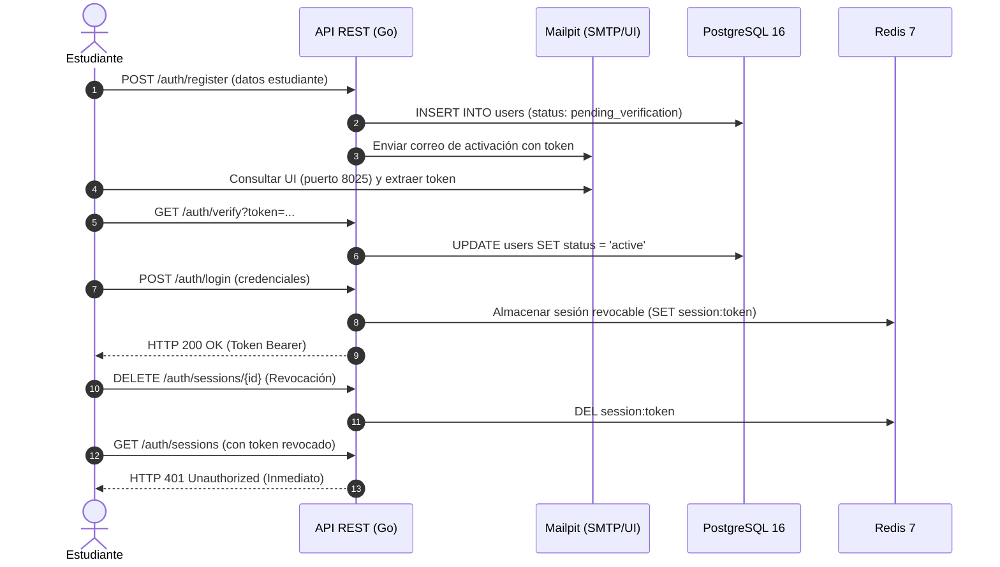
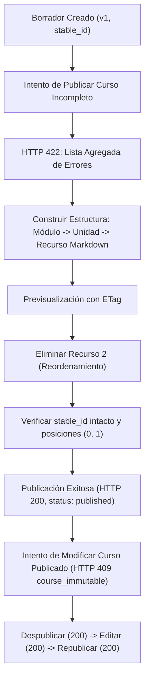
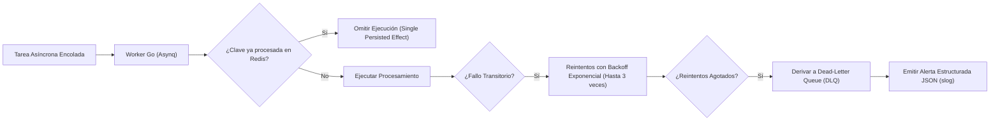

# Guion Técnico y de Producción para el Video de Demostración de Aceptación

> **Proyecto:** Plataforma MOOC (Massive Open Online Courses)  
> **Alcance:** Etapa Actual (MVP — Entrega 1 / Issues #12 a #30)  
> **Alineación Normativa:** Secciones 6, 9 y 10.2 del Pliego de Especificaciones (`docs/2026-20 proyecto-plataforma-mooc (2).pdf`) y Directrices de Arquitectura ([`docs/PROJECT_KEY_ASPECTS.md`](../PROJECT_KEY_ASPECTS.md)).  
> **Objetivo del Documento:** Servir como guía de producción, libreto y runbook paso a paso para la grabación del video de sustentación técnica de la plataforma, cubriendo todos los flujos críticos en el orden estricto de la Sección 10.2 con evidencia verificable en vivo (API Postman, base de datos PostgreSQL, colas Redis, Mailpit, MinIO y logs correlacionados).

---

## 1. Ficha Técnica y Parámetros del Video

| Parámetro | Especificación Recomendada |
|---|---|
| **Duración Estimada** | **12 a 15 minutos** (distribución ágil por segmento). |
| **Formato de Grabación** | Captura de pantalla 1080p (1920x1080) a 30/60 fps con audio claro de voz en off. |
| **Pila Tecnológica Demostrada** | Contenedores reales Docker Compose (**Cero Mocks**): Go 1.24 API, Worker Asynq, PostgreSQL 16, Redis 7, MinIO S3, Mailpit. |
| **Criterios Evaluados** | **100% de los criterios Must aplicables a la etapa** (Secciones 6, 9 y 10.2 del pliego). |
| **Herramientas en Pantalla** | Postman Desktop / Newman CLI, Terminal dividida (Bash + Logs), Navegador Web (Mailpit UI, MinIO Console, Swagger UI). |

---

## 2. Disposición de Pantalla Recomendada (Layout de Grabación)

Para maximizar la claridad visual durante la sustentación, se recomienda organizar el espacio de trabajo en dos mitades o ventanas coordinadas:

```
+------------------------------------------+------------------------------------------+
|  VENTANA IZQUIERDA: POSTMAN / NAVEGADOR  |  VENTANA DERECHA: TERMINAL MULTI-PANEL   |
|                                          |                                          |
|  • Postman Desktop con colecciones:      |  [Panel Superior: Logs en Vivo]          |
|    - Identidad (#24)                     |  $ docker compose logs -f api worker     |
|    - Administración (#25)                |    (Logs JSON, request_id, trace_id)     |
|    - Autoría de Cursos (#26)             |                                          |
|                                          |  --------------------------------------- |
|  • Pestañas del Navegador Web:           |  [Panel Inferior: Comandos y BD psql]    |
|    - Mailpit UI: http://localhost:8025   |  $ docker compose exec postgres psql ... |
|    - Swagger UI: http://localhost:8080/..|  $ make demo-segment4                    |
|    - MinIO:      http://localhost:9001   |  $ curl ...                              |
+------------------------------------------+------------------------------------------+
```

---

## 3. Checklist de Preparación Técnica (T-Minus 5 Minutos)

Antes de iniciar la grabación, ejecute los siguientes comandos en su terminal para garantizar un estado limpio, determinístico y sin interferencias:

```bash
# 1. Asegurar que los 6 contenedores estén levantados y saludables
docker compose up -d
docker compose ps

# 2. Restaurar la base de datos con los datos sintéticos determinísticos
make seed-reset

# 3. Limpiar las claves de rate limiting en Redis para evitar bloqueos durante la demo
docker compose exec -T redis redis-cli EVAL "for _,k in ipairs(redis.call('keys','ratelimit:*')) do redis.call('del',k) end" 0

# 4. Abrir las URLs en pestañas del navegador:
#    - Mailpit UI:   http://localhost:8025
#    - Swagger UI:   http://localhost:8080/api/docs
#    - MinIO:        http://localhost:9001 (User: minioadmin / Pass: minioadmin)

# 5. En Postman Desktop:
#    - Importar docs/postman/*.postman_collection.json
#    - Seleccionar el entorno activo: "Plataforma MOOC - Local"
```

---

## 4. Guion Técnico Detallado — Recorrido Cronológico (Sección 10.2)

---

### Segmento 1: Identidad y Administración (Sección 10.2.1)
* **Criterio de Evaluación (Sección 9):** Identidad, autorización y seguridad (**Must**).
* **Objetivo de la Demostración:** Probar el ciclo completo de identidad del estudiante (registro, verificación en servidor real, login, revocación inmediata), la protección de roles (rechazo de profesor público), la gestión administrativa auditada, la protección del último administrador y el rate limiting.



#### Paso 1.1: Registro de Estudiante y Verificación de Correo en Mailpit
* **Locución:**  
  *"Iniciamos la demostración con el Segmento 1 de la Sección 10.2. Demostraremos el registro público de un estudiante. El sistema exige verificación de correo obligatoria antes de habilitar el acceso y no utiliza mocks: los correos transaccionales son capturados por nuestro servidor SMTP Mailpit."*
* **Acción:**
  1. En Postman, ejecutar petición `01 Registro crea estudiante pendiente` (`POST /api/v1/auth/register`).
  2. Abrir la pestaña del navegador en Mailpit (`http://localhost:8025`).
  3. En la terminal, consultar el registro en PostgreSQL.
* **Evidencias a Mostrar:**
  * **Respuesta API Postman:** `HTTP/1.1 201 Created` con payload:
    ```json
    {
      "email": "postman-...@example.test",
      "role": "estudiante",
      "status": "pending_verification"
    }
    ```
  * **Mailpit UI:** Mostrar en vivo la bandeja de entrada con el correo recibido, el asunto *"Confirma tu correo electrónico"* y el enlace que contiene el token criptográfico de activación.
  * **Estado en BD (psql):**
    ```sql
    SELECT email, role, status FROM users WHERE email LIKE 'postman-%' ORDER BY created_at DESC LIMIT 1;
    ```
    *Resultado:* `status = pending_verification`.
  * **Logs Correlacionados (terminal):**
    Mostrar log JSON estructurado en `docker compose logs api`:
    ```json
    {"time":"...","level":"INFO","msg":"User registered","request_id":"...","trace_id":"...","role":"estudiante","status":"pending_verification"}
    ```

#### Paso 1.2: Caso Negativo — Intento de Crear Profesor por Registro Público
* **Locución:**  
  *"La Sección 2 y Sección 5.1 del pliego exigen una regla estricta: los profesores solo se crean por administración. Vamos a enviar un intento malicioso de registro público con rol profesor."*
* **Acción:**
  1. En Postman, ejecutar petición `02 Registro rechaza intento de crear profesor` (`POST /api/v1/auth/register` con `"role": "profesor"`).
* **Evidencias a Mostrar:**
  * **Respuesta API Postman:** `HTTP/1.1 400 Bad Request` con código `invalid_registration_role` y mensaje indicando que el rol docente no se permite en el endpoint público.
  * **Logs del Contenedor:** Log de advertencia rechazando la operación por política de seguridad de roles.

#### Paso 1.3: Verificación de Correo y Token de Un Solo Uso
* **Locución:**  
  *"Ahora activamos la cuenta consumiendo el token extraído de Mailpit. Verificaremos que el token es estrictamente de un solo uso."*
* **Acción:**
  1. En Postman, ejecutar `08 Verificar activa la cuenta` (`GET /api/v1/auth/verify?token={{verificationToken}}`).
  2. De inmediato, ejecutar `09 El enlace es de un solo uso` (misma petición).
* **Evidencias a Mostrar:**
  * **Respuesta API Postman (Intento 1):** `HTTP/1.1 200 OK` con estado de cuenta `active`.
  * **Respuesta API Postman (Intento 2):** `HTTP/1.1 400 Bad Request` con código `invalid_token` (rechazo por reutilización).
  * **Estado en BD (psql):**
    ```sql
    SELECT email, status FROM users WHERE email LIKE 'postman-%' ORDER BY created_at DESC LIMIT 1;
    ```
    *Resultado:* `status = active`.

#### Paso 1.4: Login Seguro, Emisión de Token Bearer y Revocación Inmediata de Sesión
* **Locución:**  
  *"Iniciamos sesión con la cuenta ya verificada, obtenemos un token Bearer revocable y probamos la revocación inmediata. La sesión debe invalidarse sin depender de la expiración temporal del token."*
* **Acción:**
  1. En Postman, ejecutar `10 Login exitoso tras verificar` (`POST /api/v1/auth/login`).
  2. Ejecutar `15 Revocacion de sesion por ID` (`DELETE /api/v1/auth/sessions/{{sessionId}}`).
  3. Ejecutar `16 Revocacion inmediata por ID: el token ya no sirve` (`GET /api/v1/auth/sessions`).
* **Evidencias a Mostrar:**
  * **Respuesta API Postman:**
    * Login: `HTTP/1.1 200 OK` con `token` Bearer y `expires_at`.
    * Revocación: `HTTP/1.1 204 No Content`.
    * Intento subsiguiente: `HTTP/1.1 401 Unauthorized` (`code: unauthorized`, `WWW-Authenticate: Bearer`).
  * **Estado en Redis:**
    ```bash
    docker compose exec redis redis-cli KEYS "session:*"
    ```
    *Resultado:* La clave de sesión ha sido eliminada atómicamente de Redis.

#### Paso 1.5: Gestión Administrativa, Cambio de Rol y Auditoría Inmutable en PostgreSQL
* **Locución:**  
  *"Pasamos al rol Administrador. Demostraremos la gestión de usuarios, el cambio de rol y, fundamentalmente, la garantía de auditoría inmutable respaldada por triggers a nivel de base de datos."*
* **Acción:**
  1. En Postman (colección Administración), ejecutar `04 Cambiar rol a profesor` (`PATCH /api/v1/admin/users/{{targetStudentId}}/role`).
  2. En terminal, consultar la tabla `audit_logs`.
  3. Intentar mutar o borrar una fila de auditoría mediante SQL directo.
* **Evidencias a Mostrar:**
  * **Respuesta API Postman:** `HTTP/1.1 200 OK` confirmando el cambio de rol.
  * **Estado en BD (psql):**
    ```sql
    SELECT action, target_resource, actor_id, created_at FROM audit_logs ORDER BY created_at DESC LIMIT 1;
    ```
    *Resultado:* Registro `user.role_changed` con el UUID del usuario y del administrador.
  * **Prueba de Inmutabilidad en Vivo (Trigger de BD):**
    ```sql
    DELETE FROM audit_logs WHERE id = (SELECT id FROM audit_logs LIMIT 1);
    ```
    *Resultado de PostgreSQL:*  
    `ERROR: audit_logs is append-only: DELETE is not permitted on an existing row`  
    `CONTEXT: PL/pgSQL function reject_audit_log_mutation()`
  * **Demostración de UPDATE:**
    ```sql
    UPDATE audit_logs SET action = 'tampered' WHERE id = (SELECT id FROM audit_logs LIMIT 1);
    ```
    *Resultado:* `ERROR: audit_logs is append-only: UPDATE is not permitted on an existing row`.

#### Paso 1.6: Protección del Último Administrador Activo
* **Locución:**  
  *"El sistema cuenta con una salvaguarda no negociable: la plataforma protege al último administrador activo contra suspensión o degradación para evitar deadlocks de gobernanza."*
* **Acción:**
  1. En Postman, ejecutar `11 Suspender cuenta de admin secundario` (queda solo un admin activo).
  2. Ejecutar `12 Suspender al ultimo admin activo es rechazado con 409` (`PATCH /api/v1/admin/users/{{adminPrimaryId}}/status` con `"status": "suspended"`).
* **Evidencias a Mostrar:**
  * **Respuesta API Postman:** `HTTP/1.1 409 Conflict` con payload:
    ```json
    {
      "error": "conflict",
      "message": "cannot suspend or demote the last active administrator",
      "code": "last_admin_protected"
    }
    ```
  * **Reactivación limpia:** Ejecutar petición `14 Reactivar cuenta de admin secundario` (`HTTP 200 OK`).

#### Paso 1.7: Rate Limiting y Control de Tasa en Redis
* **Locución:**  
  *"Demostramos el control de tasa respaldado por Redis para mitigar ataques de fuerza bruta en login."*
* **Acción:**
  1. En Postman, ejecutar petición `36 Rate limit en login (dispara 429)`.
* **Evidencias a Mostrar:**
  * **Respuesta API Postman:** `HTTP/1.1 429 Too Many Requests` con cabecera `Retry-After: 60` y código `rate_limit_exceeded`.

---

### Segmento 2: Autoría y Publicación (Sección 10.2.2)
* **Criterio de Evaluación (Sección 9):** Autoría y publicación (**Must**).
* **Objetivo de la Demostración:** Probar el flujo E2E de autoría: creación de borrador, estructuración jerárquica de 4 niveles (`Curso` $\rightarrow$ `Módulo` $\rightarrow$ `Unidad` $\rightarrow$ `Recurso`), previsualización con `ETag`, validación exhaustiva de publicación multi-error (422), inmutabilidad estricta de versiones publicadas (409), preservación de `stable_id` ante reordenamientos y ciclo de despublicación temporal en MVP.



#### Paso 2.1: Creación del Borrador del Curso
* **Locución:**  
  *"Pasamos al Segmento 2: Autoría de Cursos. Iniciamos sesión como docente y creamos un nuevo curso en estado borrador."*
* **Acción:**
  1. En Postman (colección Autoría), ejecutar `02 Crear Curso en Borrador` (`POST /api/v1/courses`).
* **Evidencias a Mostrar:**
  * **Respuesta API Postman:** `HTTP/1.1 201 Created` con `status: "draft"`, `version: 1` y generación del identificador inmutable `stable_id`.
  * **Estado en BD (psql):**
    ```sql
    SELECT id, title, status, version, stable_id FROM courses ORDER BY created_at DESC LIMIT 1;
    ```

#### Paso 2.2: Intento de Publicación con Errores Acumulados (HTTP 422 Exhaustivo)
* **Locución:**  
  *"El pliego exige expresamente que el validador de publicación devuelva una lista exhaustiva con todos los errores del curso, sin detenerse en el primero. Intentamos publicar el curso recién creado sin módulos."*
* **Acción:**
  1. En Postman, ejecutar `03 Intentar Publicar Curso Incompleto` (`POST /api/v1/courses/{{courseId}}/publish`).
* **Evidencias a Mostrar:**
  * **Respuesta API Postman:** `HTTP/1.1 422 Unprocessable Entity` con código `publication_validation_failed` y arreglo `details` conteniendo simultáneamente todos los incumplimientos:
    ```json
    {
      "error": "unprocessable_entity",
      "message": "course does not satisfy minimum publication requirements",
      "code": "publication_validation_failed",
      "details": [
        "course must contain at least one module",
        "module 1 must contain at least one unit",
        "unit 1 must contain at least one visible resource"
      ]
    }
    ```

#### Paso 2.3: Jerarquía de 4 Niveles y Contenido en Markdown Canónico
* **Locución:**  
  *"Construimos la jerarquía completa: Módulo, Unidad y Recursos, asegurando que el contenido textual enriquecido se guarde estrictamente como Markdown extendido canónico."*
* **Acción:**
  1. En Postman, ejecutar secuencialmente:
     * `04 Crear Modulo` (`POST /courses/{{courseId}}/modules`)
     * `05 Crear Unidad` (`POST /modules/{{moduleId}}/units`)
     * `06 Crear Recurso 1 (Lectura Principal Markdown)` (`POST /units/{{unitId}}/resources`)
     * `07 Crear Recurso 2 (Recurso Complementario)`
     * `08 Crear Recurso 3 (Quiz Formativo)`
* **Evidencias a Mostrar:**
  * **Respuestas API Postman:** `HTTP/1.1 201 Created` en cada nivel, con `position: 0, 1, 2` y `stable_id` persistente.
  * **Estado en BD (psql):**
    ```sql
    SELECT c.title AS curso, m.title AS modulo, u.title AS unidad, r.title AS recurso, r.type, r.position, r.stable_id 
    FROM courses c 
    JOIN modules m ON m.course_id = c.id 
    JOIN units u ON u.module_id = m.id 
    JOIN resources r ON r.unit_id = u.id 
    WHERE c.id = (SELECT id FROM courses ORDER BY created_at DESC LIMIT 1);
    ```
    *Resultado:* Se visualiza la estructura jerárquica exacta de 4 niveles en PostgreSQL.

#### Paso 2.4: Previsualización del Borrador con Cabecera ETag
* **Locución:**  
  *"Previsualizamos el curso en borrador verificando la presencia de metadatos y la cabecera ETag para control de concurrencia y caché."*
* **Acción:**
  1. En Postman, ejecutar `09 Previsualizar Metadatos del Curso` (`GET /api/v1/courses/{{courseId}}`).
* **Evidencias a Mostrar:**
  * **Respuesta API Postman:** `HTTP/1.1 200 OK` con cabecera `ETag: W/"..."` y metadata completa.

#### Paso 2.5: Reordenamiento y Preservación Estricta de Identificadores Estables (`stable_id`)
* **Locución:**  
  *"Demostramos el principio de ordenamiento estricto y estabilidad de identificadores: eliminamos un recurso intermedio y comprobamos que las posiciones se reindexan sin huecos, mientras que los stable_id de los recursos restantes permanecen intactos."*
* **Acción:**
  1. En Postman, ejecutar `13 Reordenar: Eliminar recurso intermedio` (`DELETE /api/v1/resources/{{resource2Id}}`).
  2. Ejecutar `14 Verificar Reordenamiento y Preservacion de Identificadores Estables` (`GET /api/v1/units/{{unitId}}/resources`).
* **Evidencias a Mostrar:**
  * **Respuesta API Postman:** `HTTP/1.1 204 No Content` en la eliminación. En la consulta siguiente: `HTTP/1.1 200 OK` con exactamente 2 recursos en posiciones `0` y `1`, conservando sus `stable_id` originales.
  * **Estado en BD (psql):**
    ```sql
    SELECT position, title, stable_id FROM resources WHERE unit_id = (SELECT id FROM units ORDER BY created_at DESC LIMIT 1) ORDER BY position;
    ```

#### Paso 2.6: Publicación Exitosa e Inmutabilidad Estricta
* **Locución:**  
  *"Con la estructura válida y completa, publicamos el curso. Demostraremos que una versión publicada se vuelve estrictamente inmutable, rechazando cualquier intento de edición directa."*
* **Acción:**
  1. En Postman, ejecutar `15 Publicacion Exitosa del Curso` (`POST /api/v1/courses/{{courseId}}/publish`).
  2. Intentar editar metadatos ejecutando `17 Inmutabilidad: Rechazo al editar metadatos del curso publicado` (`PUT /api/v1/courses/{{courseId}}`).
* **Evidencias a Mostrar:**
  * **Publicación:** `HTTP/1.1 200 OK` con `status: "published"` y `version: 1`.
  * **Rechazo de Edición Directa:** `HTTP/1.1 409 Conflict` con payload:
    ```json
    {
      "error": "conflict",
      "message": "published courses are strictly immutable; unpublish the course first to make modifications in MVP mode",
      "code": "course_immutable"
    }
    ```
  * **Rechazo en toda la jerarquía:** Mostrar en Postman cómo las peticiones `18`, `19`, `20` y `21` (agregar módulos, unidades o recursos) devuelven todas `409 Conflict`.

#### Paso 2.7: Ciclo MVP 5.1 de Despublicación Temporal y Republicación
* **Locución:**  
  *"Conforme a la Sección 5.1 del pliego, la edición de un curso publicado en fase MVP exige despublicarlo temporalmente. Demostramos el ciclo: despublicar, editar título y republicar."*
* **Acción:**
  1. En Postman, ejecutar `23 Despublicacion temporal (Flujo MVP Seccion 5.1)` (`POST /courses/{{courseId}}/unpublish`).
  2. Ejecutar `24 Editar curso temporalmente despublicado` (`PUT /courses/{{courseId}}`).
  3. Ejecutar `25 Republicar curso tras la actualizacion` (`POST /courses/{{courseId}}/publish`).
* **Evidencias a Mostrar:**
  * **Respuestas API Postman:** Transición limpia a `unpublished` (200 OK), actualización exitosa del título (200 OK) y re-publicación a `published` (200 OK).

#### Paso 2.8: Rechazo de Autoría a Usuarios No-Autores (RBAC)
* **Locución:**  
  *"Verificamos que usuarios con rol estudiante o anónimos no pueden realizar operaciones de autoría."*
* **Acción:**
  1. En Postman, ejecutar `27 No-autor intenta crear curso (espera 403)` y `30 Peticion anonima sin autenticacion a crear curso (espera 401)`.
* **Evidencias a Mostrar:**
  * Estudiante recibe `HTTP/1.1 403 Forbidden` (`code: forbidden`).
  * Anónimo recibe `HTTP/1.1 401 Unauthorized` (`WWW-Authenticate: Bearer`).

---

### Segmento 3: Carga Multimedia (Sección 10.2.3)
* **Criterio de Evaluación (Sección 9):** Multimedia y distribución (**Must**).
* **Objetivo de la Demostración:** Demostrar la fundación arquitectónica: política estricta de cero binarios en PostgreSQL y almacenamiento de objetos S3 MinIO con URLs prefirmadas.

#### Paso 3.1: Verificación de Cero Binarios en PostgreSQL
* **Locución:**  
  *"Un guardrail no negociable de la Sección 7 y PROJECT_KEY_ASPECTS.md es que ningún binario multimedia reside en la base de datos relacional. Ejecutaremos una consulta en el catálogo del sistema de PostgreSQL para probar la ausencia total de columnas tipo BYTEA o BLOB."*
* **Acción:**
  1. En terminal, ejecutar consulta sobre `information_schema.columns`:
     ```bash
     docker compose exec -T postgres psql -U moocuser -d moocdb -c "SELECT table_name, column_name, data_type FROM information_schema.columns WHERE table_schema = 'public' AND data_type IN ('bytea', 'blob');"
     ```
* **Evidencias a Mostrar:**
  * **Resultado psql:** `(0 rows)` devueltas. Se demuestra categóricamente que PostgreSQL solo almacena metadatos, identificadores, estados y claves de almacenamiento.

#### Paso 3.2: Almacenamiento de Objetos en MinIO S3
* **Locución:**  
  *"Los binarios se almacenan exclusivamente en MinIO/S3. Mostramos la consola de MinIO con el bucket inicializado automáticamente durante el despliegue."*
* **Acción:**
  1. Mostrar en el navegador la consola de MinIO (`http://localhost:9001`).
* **Evidencias a Mostrar:**
  * **MinIO Console:** Bucket `mooc-storage` creado y activo, listo para cargas directas mediante URLs prefirmadas de 24 horas.

---

### Segmento 4: Procesamiento y Fallos (Sección 10.2.4)
* **Criterio de Evaluación (Sección 9):** Arquitectura, multimedia, calidad operativa (**Must**).
* **Objetivo de la Demostración:** Probar el Background Worker independiente en Go con Asynq y Redis, evidenciando: entrega duplicada idempotente (un solo efecto persistido), reintentos con backoff exponencial (3 intentos), transición a Dead-Letter Queue (DLQ), emisión de alerta estructurada en formato JSON y reencolado con la misma clave.



#### Paso 4.1: Demostración Interactiva Automatizada de Idempotencia y DLQ
* **Locución:**  
  *"Pasamos al Segmento 4: Procesamiento y Fallos. Ejecutamos el escenario de prueba automatizado del Background Worker que demuestra la resiliencia ante fallos transitorios e idempotencia."*
* **Acción:**
  1. En terminal, ejecutar:
     ```bash
     make demo-segment4
     ```
* **Evidencias a Mostrar:**
  * **Salida en Terminal (Paso a Paso):**
    1. *Entrega Duplicada:* El worker detecta la clave y omite el procesamiento repetido:  
       `[IdempotencyMiddleware] Task already processed successfully, skipping execution to prevent duplicate effects`.
    2. *Reintentos con Backoff:* El worker captura el error simulado y reintenta exactamente 3 veces espaciadas exponencialmente.
    3. *Dead-Letter Queue (DLQ) y Alerta:* Al agotar el 3er reintento, el manejador deriva la tarea a la DLQ y emite log estructurado:  
       `{"time":"...","level":"ERROR","msg":"Job failed permanently, routed to DLQ","task_id":"...","retry_count":3}`.
    4. *Reencolado Idempotente:* La misma tarea se reencola con su clave original y no duplica efectos secundarios.
  * **Métricas Prometheus del Worker:**
    ```bash
    curl -s http://localhost:9090/metrics | grep worker_jobs
    ```
    *Resultado:* Contadores `worker.jobs.processed` y `worker.jobs.failed` reflejando con exactitud los eventos procesados.

---

### Segmentos 5 y 6: Consumo de Contenido y Quiz Secrecy (Sección 10.2.5 y 10.2.6)
* **Criterio de Evaluación (Sección 9):** Multimedia y Evaluación académica (**Must**).
* **Objetivo de la Demostración:** Verificar el modelado de recursos accesibles y el **Guardrail #1: Quiz Key Secrecy** (las claves de respuesta correcta NUNCA viajan al cliente; la calificación se computa en el servidor).

#### Paso 5.1 & 6.1: Quiz Key Secrecy en Entrega de Recursos
* **Locución:**  
  *"En los Segmentos 5 y 6 validamos el consumo de contenidos y el guardrail no negociable de secreto de respuestas de evaluación. Un estudiante consume un cuestionario académico; demostraremos que el servidor jamás envía el campo is_correct en el payload JSON."*
* **Acción:**
  1. En Postman, autenticado como `estudiante1`, consultar un recurso de tipo evaluación:
     `GET /api/v1/resources/d3000000-0000-0000-0000-000000000003`
  2. En terminal, contrastar con la tabla `quiz_options` en PostgreSQL.
* **Evidencias a Mostrar:**
  * **Respuesta API Postman:** El JSON contiene el enunciado y las opciones con sus IDs de opción, pero **carece en su totalidad del atributo `is_correct`**.
  * **Estado en BD (psql):**
    ```sql
    SELECT question_id, text, is_correct FROM quiz_options;
    ```
    *Resultado:* Se comprueba que `is_correct = true` reside exclusivamente en la base de datos para la evaluación en el backend.

---

### Segmentos 7 y 8: Progreso Verificado en Servidor e Insignias (Sección 10.2.7 y 10.2.8)
* **Criterio de Evaluación (Sección 9):** Progreso e insignias (**Must**).
* **Objetivo de la Demostración:** Probar que el avance no es manipulable por el cliente (Guardrail #2), y que las insignias digitales emitidas al aprobar son únicas y preservan la privacidad del estudiante (Guardrail #3).

#### Paso 7.1 & 8.1: Progreso en Servidor y Verificación Pública de Insignias sin Email
* **Locución:**  
  *"En los Segmentos 7 y 8 demostramos el progreso del estudiante y la emisión de insignias digitales. El avance se computa en servidor sobre recursos obligatorios; además, la insignia emitida no expone el correo del estudiante en su URL pública."*
* **Acción:**
  1. En terminal, consultar las tablas `student_progress` y `badges` en PostgreSQL:
     ```bash
     docker compose exec -T postgres psql -U moocuser -d moocdb -c "SELECT student_id, course_stable_id, percentage, is_approved FROM student_progress;"
     docker compose exec -T postgres psql -U moocuser -d moocdb -c "SELECT student_id, course_stable_id, verification_code, image_key FROM badges;"
     ```
* **Evidencias a Mostrar:**
  * **Estado en BD (psql):**
    * `student_progress`: Registro con porcentaje computado por el servidor e indicador `is_approved = true`.
    * `badges`: Fila con clave compuesta única `(student_id, course_stable_id)` (emisión idempotente), clave de imagen en MinIO (`image_key`) y `verification_code` como UUID opaco, **garantizando que la verificación pública no filtra el correo del estudiante**.

---

### Segmento 9: Operación y Observabilidad Transversal (Sección 10.2.9)
* **Criterio de Evaluación (Sección 9):** Arquitectura y calidad operativa (**Must / Should**).
* **Objetivo de la Demostración:** Evidenciar la observabilidad transversal con OpenTelemetry: logs estructurados correlacionados en vivo con `request_id` y `trace_id`, métricas Prometheus del API y Worker, y mostrar el reporte formal de certificación de la Sección 10.

#### Paso 9.1: Correlación en Vivo de `request_id` y `trace_id`
* **Locución:**  
  *"Finalizamos con el Segmento 9: Operación y Observabilidad. Demostramos la trazabilidad distribuida. Enviaremos una petición a la API, capturaremos su cabecera X-Request-ID y encontraremos en tiempo real su log estructurado JSON correlacionado con el trace_id de OpenTelemetry."*
* **Acción:**
  1. En terminal, ejecutar una petición capturando cabeceras:
     ```bash
     curl -i -s http://localhost:8080/api/v1/health | grep -i "x-request-id"
     ```
  2. Filtrar los logs del contenedor con el ID capturado:
     ```bash
     docker compose logs api | tail -n 5
     ```
* **Evidencias a Mostrar:**
  * **Log JSON Estructurado:**
    ```json
    {
      "time": "2026-09-14T...",
      "level": "INFO",
      "msg": "HTTP request",
      "request_id": "7b8f9e2a-...",
      "trace_id": "4a1c6e8d...",
      "method": "GET",
      "path": "/api/v1/health",
      "status": 200,
      "duration_ms": 1.25
    }
    ```

#### Paso 9.2: Scrapeo de Métricas Prometheus en API y Worker
* **Locución:**  
  *"Verificamos la exposición de métricas Prometheus listas para sistemas de monitoreo como Grafana."*
* **Acción:**
  1. En terminal, consultar los endpoints de métricas:
     ```bash
     curl -s http://localhost:8080/api/v1/metrics | grep -E "http_server|go_info" | head -n 8
     curl -s http://localhost:9090/metrics | grep -E "worker_jobs|asynq" | head -n 8
     ```
* **Evidencias a Mostrar:** Formato oficial Prometheus con contadores y métricas de latencia.

#### Paso 9.3: Conclusión y Certificación Formal de Aceptación (Sección 10)
* **Locución:**  
  *"Para concluir, mostramos el resultado global del aseguramiento de calidad: la suite completa de Newman sobre Docker Compose superó 216 aserciones de 216 con 100% de éxito y cero mocks. El informe oficial certifica la ausencia total de incumplimientos críticos, cumpliendo a cabalidad todas las condiciones de aceptación de la Sección 10."*
* **Acción:**
  1. Mostrar en pantalla los documentos oficiales:
     * [`docs/e2e/REPORTE_E2E_IDENTIDAD_Y_AUTORIA.md`](./REPORTE_E2E_IDENTIDAD_Y_AUTORIA.md)
     * [`docs/e2e/REPORTE_BUGS_Y_CALIDAD_ETAPA.md`](./REPORTE_BUGS_Y_CALIDAD_ETAPA.md)
* **Evidencias a Mostrar:**
  ```
  ████████████████████████████████████████ 100% APROBADO (216/216 aserciones)
  DICTAMEN FORMAL: AUSENCIA TOTAL DE INCUMPLIMIENTOS CRÍTICOS (0 BUGS P0 / 0 BUGS P1)
  ```

---

## 5. Tabla de Minutaje y Tiempos Sugeridos para la Grabación

| Minuto | Segmento (Sección 10.2) | Contenido Demostrado | Ventana / Evidencia Principal |
|:---:|---|---|---|
| **00:00 - 01:00** | **Introducción y Arquitectura** | Presentación de la plataforma, Monolito Modular en Go, Docker Compose activo (`docker compose ps`). | Terminal + Diagrama de arquitectura |
| **01:00 - 03:30** | **Segmento 1: Identidad y Administración** | Registro público, Mailpit UI en vivo, token de un solo uso, login, revocación inmediata (401), cambio de rol auditado y protección del último admin (409). | Postman + Mailpit (8025) + psql |
| **03:30 - 04:30** | **Segmento 1: Inmutabilidad de Auditoría** | Intento de `UPDATE` y `DELETE` en `audit_logs` rechazados por trigger de PostgreSQL. Rate limit en login (429). | Terminal psql + Postman |
| **04:30 - 07:30** | **Segmento 2: Autoría y Publicación** | Borrador de curso, validación multi-error 422 agregada, jerarquía de 4 niveles en Markdown, ETag, reordenamiento con `stable_id` intacto y publicación exitosa. | Postman + psql (jerarquía con JOIN) |
| **07:30 - 08:45** | **Segmento 2: Inmutabilidad y MVP 5.1** | Intento de edición de curso publicado rechazado con 409 (`course_immutable`), despublicación temporal, edición y republicación. RBAC 403 a estudiantes. | Postman |
| **08:45 - 09:30** | **Segmento 3: Carga Multimedia** | Comprobación SQL de cero binarios en PostgreSQL (`0 rows` bytea/blob). Consola MinIO S3 (puerto 9001). | Terminal psql + MinIO Console |
| **09:30 - 11:30** | **Segmento 4: Procesamiento y Fallos** | Ejecución de `make demo-segment4`: entrega duplicada idempotente, 3 reintentos con backoff, paso a DLQ y alerta JSON. | Terminal (`demo-segment4`) + Logs worker |
| **11:30 - 12:30** | **Segmentos 5, 6, 7 y 8: Consumo, Quizzes, Progreso e Insignias** | Verificación de Quiz Key Secrecy (sin `is_correct` en JSON), progreso validado en servidor, insignia única sin email. | Postman + psql (`quiz_options`, `badges`) |
| **12:30 - 14:00** | **Segmento 9: Operación y Observabilidad** | Correlación de `request_id` y `trace_id` en logs JSON, scrapeo de métricas Prometheus en API (:8080) y Worker (:9090). | Terminal (`curl /metrics`, logs grep) |
| **14:00 - 14:45** | **Cierre y Dictamen Sección 10** | Presentación del reporte E2E (216/216 pass) y certificación oficial de ausencia de incumplimientos críticos. | Documentos Markdown en pantalla |

---

## 6. Frases Clave y Transiciones para los Presentadores

* **Apertura:**  
  *"Bienvenidos a la demostración técnica de aceptación de la Plataforma MOOC para la Etapa 1. Toda la demostración se ejecuta sobre nuestra infraestructura real en Docker Compose, sin ningún tipo de mock o simulador en memoria."*
* **Transición a Identidad (Segmento 1):**  
  *"Iniciamos con el Segmento 1: Identidad y Administración. Observen cómo el correo transaccional llega a Mailpit en el puerto 8025 y cómo la revocación de sesión invalida el token Bearer en Redis de forma instantánea."*
* **Transición a Inmutabilidad de Auditoría:**  
  *"Como pueden ver en la terminal de PostgreSQL, ni siquiera un usuario con permisos directos puede mutar o eliminar registros de auditoría: el trigger bloquea cualquier intento garantizando un rastro append-only inmutable."*
* **Transición a Autoría (Segmento 2):**  
  *"En el Segmento 2, observen cómo el algoritmo de validación de publicación no falla en el primer error, sino que agrega la totalidad de los incumplimientos en un payload 422 estructurado. Además, una vez publicado, el curso queda blindado contra modificaciones."*
* **Transición a Cero Binarios (Segmento 3):**  
  *"La consulta al catálogo de PostgreSQL confirma cero columnas de tipo BYTEA o BLOB: los binarios pesados residen exclusivamente en MinIO y se consumen mediante URLs prefirmadas."*
* **Transición a Workers (Segmento 4):**  
  *"El procesador asíncrono demuestra tolerancia absoluta a fallos: tolera entregas duplicadas sin duplicar registros, ejecuta exactamente tres reintentos con backoff exponencial y deriva las tareas exhaustas a la Dead-Letter Queue con alertas estructuradas."*
* **Transición a Quiz Key Secrecy (Segmento 6):**  
  *"Cumpliendo estrictamente nuestro Guardrail #1, el endpoint de lectura entrega las preguntas de evaluación al estudiante, pero la clave de respuestas correctas permanece oculta en el servidor."*
* **Cierre y Conclusión:**  
  *"Hemos recorrido los nueve flujos críticos de la Sección 10.2 demostrando el 100% de los criterios Must aplicables. Con 216 aserciones aprobadas y cero incumplimientos críticos, la plataforma MOOC satisface plenamente las condiciones de aceptación general."*
