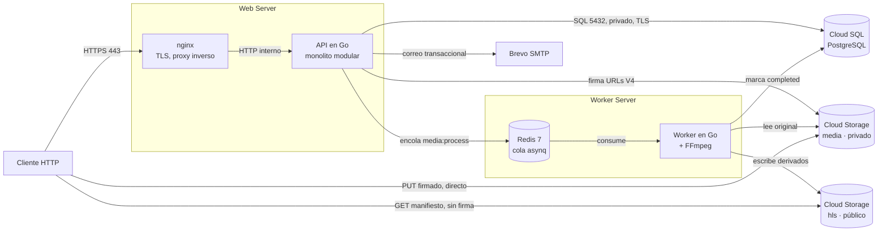
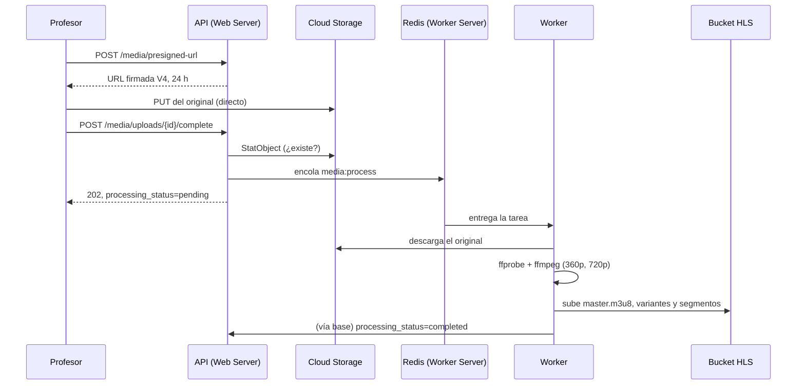
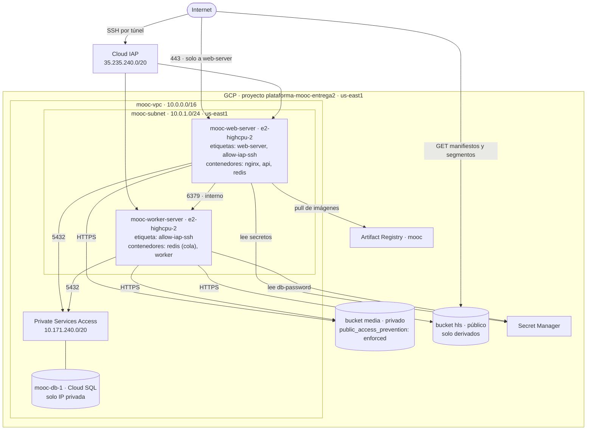

# Arquitectura de la Plataforma MOOC en la nube — Entrega 2

Issue **I1** (#136). Describe **la solución efectivamente desplegada**, no la
planeada: cada afirmación de este documento corresponde a algo que está corriendo
en `plataforma-mooc-entrega2` y verificado en `evidencias/`.

La otra mitad de la documentación de arquitectura —operación, recuperación,
capacidad, costos y limitaciones— está en I2 (#137). La configuración efectiva y
el marco de costos, en
[`CONFIGURACION_Y_COSTOS.md`](./CONFIGURACION_Y_COSTOS.md).

> Los diagramas son Mermaid embebido. **El bloque de código es el archivo
> fuente**: se versiona, se difunde en un `diff` y GitHub lo renderiza, que es
> justamente lo que un `.drawio` binario no permite.

---

## 1. Correspondencia con los servicios del proveedor

El enunciado pide identificar qué servicios del proveedor satisfacen cada
capacidad. Se usó **Google Cloud Platform**, región `us-east1`:

| Capacidad del enunciado | Servicio de GCP | Recurso concreto |
| :--- | :--- | :--- |
| Máquinas virtuales — Web Server | Compute Engine | `mooc-web-server`, `e2-highcpu-2` |
| Máquinas virtuales — Worker Server | Compute Engine | `mooc-worker-server`, `e2-highcpu-2` |
| Base de datos relacional administrada | Cloud SQL para PostgreSQL | `mooc-db-1`, zona única, sin réplicas |
| Almacenamiento de objetos | Cloud Storage | `…-media` (privado) y `…-hls` (público) |
| Red virtual privada y firewall | VPC + Cloud Firewall | `mooc-vpc`, `mooc-subnet` |
| Registro de imágenes | Artifact Registry | repositorio `mooc`, tags inmutables |
| Gestión de secretos | Secret Manager | `db-password`, `smtp-password` |
| Cola de mensajería | *Contenedor, no servicio administrado* | Redis 7 en el Worker Server |
| Correo saliente | *Proveedor externo* | Brevo, SMTP 587 con STARTTLS |

Las dos últimas filas son deliberadas y el enunciado las permite: pide
explícitamente que la cola se despliegue «en un contenedor en Worker Server» y
que no se usen servicios administrados de caché o mensajería en esta etapa.

---

## 2. Modelo de componentes

### 2.1 Vista general

Las dos flechas que salen del cliente sin pasar por la API son el punto del
diseño: **los bytes de los archivos nunca atraviesan el Web Server**. La API
autoriza y firma; la transferencia ocurre entre el cliente y el bucket.

### 2.2 Módulos de la API

Monolito modular en Go. Un solo proceso y un solo despliegue; la separación es de
paquetes y de responsabilidades, no de servicios. El enunciado lo permite
expresamente: separar componentes en VMs «no exige transformar los módulos de
negocio en microservicios».

| Paquete | Responsabilidad |
| :--- | :--- |
| `internal/auth` | Registro, verificación de correo, sesiones, contraseñas, tokens |
| `internal/admin` | Gestión de usuarios y cambios de rol |
| `internal/course` | Cursos, publicación y su validación |
| `internal/structure` | Módulos, unidades y recursos; ordenamiento |
| `internal/enrollment` | Inscripciones y su estado |
| `internal/media` | URLs firmadas de carga y lectura, confirmación, encolado |
| `internal/quiz` | Cuestionarios, preguntas y calificación |
| `internal/progress` | Latidos, proyección de avance e insignias |
| `internal/domain` | Entidades y reglas; no depende de infraestructura |

Adaptadores, en la misma frontera: `internal/postgres` (repositorios),
`internal/storage` (Cloud Storage y MinIO tras una interfaz común),
`internal/cache` (Redis), `internal/mailer` (SMTP), `internal/observability`.

`internal/http` expone **53 rutas** y encadena estos middlewares: identificador de
petición, trazas, registro, recuperación de pánico, cabeceras de proxy reenviadas,
autenticación, autorización por rol y por administrador, CSRF, limitador de tasa
e idempotencia.

### 2.3 Comunicaciones

| | Origen → destino | Mecanismo | Naturaleza |
| :--- | :--- | :--- | :--- |
| 1 | Cliente → nginx | HTTPS 443, Let's Encrypt | Síncrona |
| 2 | nginx → API | HTTP en la red de Compose | Síncrona |
| 3 | API → Cloud SQL | PostgreSQL 5432, IP privada, `sslmode=require` | Síncrona |
| 4 | API → Redis del worker | TCP 6379 por la VPC | Síncrona (encolar) |
| 5 | Redis → Worker | asynq, `media:process` | **Asíncrona** |
| 6 | Worker → Cloud SQL | PostgreSQL 5432, IP privada | Síncrona |
| 7 | API / Worker → Cloud Storage | HTTPS, credenciales de la VM | Síncrona |
| 8 | Cliente → Cloud Storage | HTTPS, URL firmada V4 (carga) o pública (HLS) | Síncrona, **sin la API** |
| 9 | API → Brevo | SMTP 587 con STARTTLS | Síncrona |

La única comunicación asíncrona es la número 5, y es la que sostiene el
procesamiento de multimedia. Verificada de punta a punta en
[`evidencias/G3/`](./evidencias/G3/README.md): de `pending` a `completed` en diez
segundos, cruzando las dos VMs.

### 2.4 El flujo asíncrono, en detalle

La confirmación responde `202` y no `200` a propósito: el trabajo quedó aceptado,
no hecho. El enunciado insiste en esa distinción —«un HTTP de aceptación de la
carga no equivale a una transcodificación exitosa»— y el estado del recurso es lo
que dice la verdad.

---

## 3. Modelo de despliegue

### 3.1 Topología

El detalle de reglas de firewall, rangos y administración está en
[`evidencias/B3/DIAGRAMA_RED.md`](./evidencias/B3/DIAGRAMA_RED.md).

### 3.2 Qué corre en cada máquina

| | Web Server | Worker Server |
| :--- | :--- | :--- |
| Perfil | `e2-highcpu-2` · 2 vCPU · 2 GiB · 30 GiB | `e2-highcpu-2` · 2 vCPU · 2 GiB · 30 GiB |
| Contenedores | `nginx`, `api`, `redis` | `redis` (la cola), `worker` |
| Compose | `docker-compose.prod.yml` | `docker-compose.worker.yml` |
| Arranque | `mooc-web.service` | `mooc-worker.service` |
| `.env` lo genera | `scripts/prepare_web_env.sh` | `scripts/prepare_worker_env.sh` |
| Cuenta de servicio | `sa-web-server` | `sa-worker-server` |
| IPv4 pública | Sí, estática | Sí, estática — **sin regla de ingreso** |

Las dos tienen dirección pública por una razón de costo: dos IPv4 externas
cuestan 3,65 USD/mes frente a 6,73 de una IPv4 más Cloud NAT. **Tener dirección
pública no es estar expuesto**: `mooc-allow-web-ingress` aplica solo a instancias
con la etiqueta `web-server`, y el worker no la lleva.

> El `redis` del Web Server es un residuo del despliegue de una sola VM y hoy no
> se usa: `REDIS_URL` apunta a la cola del Worker Server. Queda anotado para I2.

### 3.3 Almacenamiento

| Bucket | Prefijos | Acceso |
| :--- | :--- | :--- |
| `plataforma-mooc-entrega2-media` | `originals/`, `documents/`, `thumbnails/` | Privado. `public_access_prevention = enforced`. Lectura y escritura solo por URL firmada o cuenta de servicio |
| `plataforma-mooc-entrega2-hls` | `hls/` | **Lectura pública.** Escribe solo el worker |

IAM diferenciado por componente, con condiciones CEL sobre el bucket privado: la
API puede crear objetos en `originals/`, `documents/` y `thumbnails/` y en ningún
otro sitio; el worker solo lee de ahí. La separación está verificada en
[`evidencias/C3/`](./evidencias/C3/README.md).

### 3.4 Volúmenes persistentes

Poco, y a propósito. Ninguna de las dos máquinas guarda estado de la aplicación
en su disco: si una se pierde, se recrea y no se pierde nada que importe.

| Volumen | Dónde | Qué guarda | Si se pierde |
| :--- | :--- | :--- | :--- |
| Disco de arranque, 30 GiB `pd-balanced` | Las dos VMs | Sistema operativo, Docker, imágenes descargadas y los archivos del despliegue | Se recrea con el procedimiento de `ADMINISTRACION.md` |
| `redis_data` | Worker Server | Persistencia de la cola de asynq | Se pierden las tareas encoladas sin procesar, no el contenido: el recurso queda en `pending` y se puede reencolar |
| `worker_scratch` | Worker Server | Espacio temporal de transcodificación | Nada. Cada trabajo crea su subdirectorio y lo borra al terminar |
| — | Web Server | *No hay volumen de datos* | — |

El estado que importa vive fuera de las VMs: en Cloud SQL y en los dos buckets.
Ese reparto es lo que hace que reconstruir una máquina sea un trámite y no una
recuperación.

### 3.5 Persistencia relacional

Cloud SQL para PostgreSQL, **zona única y sin réplicas de lectura**, tal como
delimita el enunciado. Sin IP pública: se alcanza por Private Services Access
desde la subred, con `sslmode=require`.

El esquema lo aplican **siete migraciones** versionadas mediante
`scripts/migrate.sh`, que registra lo aplicado en `schema_migrations` y envuelve
cada migración con su registro en una sola transacción. Cloud SQL no tiene el
hook de inicialización que usa Postgres en local, así que migrar es un paso
explícito de todo despliegue y de toda reconstrucción.

---

## 4. Decisiones y adaptaciones

### 4.1 La cola vive en el Worker Server, y la API la alcanza por la VPC

El enunciado lo pide así. La consecuencia no obvia es que **la misma instancia de
Redis sirve para cuatro cosas**: la cola de asynq, el almacén de sesiones, el
limitador de tasa y el registro de idempotencia. Un solo `REDIS_URL` las gobierna.

Eso convierte al Worker Server en dependencia de arranque de la API: si la cola
no responde, la API no arranca —hace `ping` a Redis al iniciar— y el sitio no
sirve. Se comprobó en carne propia durante G3. Es un punto único de falla
declarado, y va al análisis de I2.

### 4.2 Los derivados HLS viven en un bucket aparte, público

La decisión original era servir el prefijo `hls/` sin firma dentro del bucket
privado. **No es implementable**, y se descubrió midiéndolo: un manifiesto
referencia sus variantes por ruta relativa, el reproductor no hereda la query
string donde viaja la firma, y GCP no admite condiciones IAM en enlaces
concedidos a `allUsers` —de modo que un prefijo público dentro de un bucket
privado no se puede expresar—.

Separarlos es lo único que no degrada nada: el bucket de media conserva
`public_access_prevention = enforced`, y público es solo lo que el worker genera,
que es material derivado de contenido que el estudiante inscrito ya puede ver.
Se descartó servirlo por el proxy porque metería el tráfico de video por la VM
web y falsearía las mediciones del escenario 2.

Detalle completo en la nota 1b de [`NOTAS_TECNICAS.md`](./NOTAS_TECNICAS.md) y en
el issue #167.

### 4.3 La migración al almacenamiento administrado no movió objetos

El enunciado pide documentar «la migración al servicio administrado de
almacenamiento de objetos del proveedor». Conviene ser exacto sobre en qué
consistió, porque no fue un traslado de archivos.

**La Entrega 1 no construyó nada de media**, así que no había un corpus en MinIO
que mover: no existían originales ni derivados persistidos. La migración
consistió en dos cosas distintas:

1. **Repuntar la aplicación al servicio administrado.** El adaptador se elige en
   ejecución con `STORAGE_BACKEND`, no en tiempo de compilación, así que el mismo
   binario corre contra MinIO en local y contra Cloud Storage en la nube. El
   validador de arranque rechaza en producción `minio` y el bucket de desarrollo,
   de modo que un despliegue mal configurado no arranca en vez de escribir en el
   sitio equivocado. Evidencia en [`evidencias/C4/`](./evidencias/C4/README.md).
2. **Sembrar el bucket con el conjunto de prueba.** `cmd/seed-media` genera los
   tres perfiles de duración y resolución que pide el escenario 2, los procesa
   por el mismo pipeline de producción y los sube. Son **714 objetos**.

La verificación de integridad que el enunciado exige se hizo sobre esa siembra:
el manifiesto registra clave, tamaño y SHA-256 de cada original, y la
conciliación compara el tamaño esperado contra el real objeto por objeto.
`reconciliation_ok: true`, lista de discrepancias vacía. Está en
[`evidencias/G1/`](./evidencias/G1/README.md).

La correspondencia entre los objetos y sus referencias en la base es estructural
y no depende de una tabla de equivalencias: la clave de cada objeto se **deriva**
del `stable_id` del recurso mediante los ayudantes de `internal/storage/keys.go`,
que son el único sitio donde se construye una clave. Por eso una clave escrita a
mano es un defecto detectable, y lo fue: la semilla tenía una llave de insignia
con otra forma, que se corrigió.

### 4.4 Carga directa y URLs firmadas

Se conserva el modelo de la entrega anterior. La API firma con **V4** y, en la
VM, **sin archivo de llave**: la librería delega la firma en `signBlob` de IAM
Credentials, lo que exige `roles/iam.serviceAccountTokenCreator` concedido
**sobre la propia cuenta** y no sobre el proyecto. A nivel de proyecto, la API
podría suplantar también a la del worker, que es justo la separación que estas
dos cuentas existen para mantener.

En la nube desaparece una complicación que el entorno local sí tiene: el host que
firma y el host que el cliente usa son el mismo, así que la firma resuelve desde
cualquier parte.

**Brecha declarada:** el enunciado habla de carga «directa y reanudable durante
24 horas». Lo implementado es una URL PUT firmada con vigencia de 24 horas:
directa, pero **no reanudable**. Reanudar exige sesiones de carga reanudable del
proveedor, que es otro mecanismo. La Entrega 1 no construyó nada de media, así
que no hay reanudación que preservar.

### 4.5 Configuración de los workers

Concurrencia fija en **2**, uno por vCPU del perfil: subirla no transcodifica más
rápido y arriesga el OOM killer en 2 GiB. Escalera de rendiciones `360p` y `720p`,
sin escalar por encima de la resolución del original. Espacio temporal en un
**volumen con nombre**, no un bind mount del host: la imagen corre sin
privilegios y Docker crea el directorio de un bind mount como `root`.

El worker valida su configuración con `ValidateWorker()` y no con la de la API.
Exigirle las variables de SMTP lo dejaba sin poder arrancar, porque `mail.tf` le
niega ese secreto a propósito. Notas 20 y 21.

### 4.6 El estado `available` del enunciado es `completed` en el código

El esquema de la Entrega 1 usa `completed` con ese significado y
`validateForPublish` ya lo lee para decidir si un curso puede publicarse.
Renombrarlo obligaría a una migración y a tocar las reglas de publicación sin
ganar nada. Se conserva `completed`; un evaluador que busque `available` debe
mirar ahí.

### 4.7 El contenido del curso dejó de ser público

Los tres listados de contenido exigen sesión **y una inscripción activa**; sin
inscripción responden `403` y sin sesión `401`. El catálogo sigue siendo público:
navegar no es consumir. El autor y el administrador leen el curso sin
inscribirse, incluso en borrador.

---

## 5. Diferencias frente a la arquitectura objetivo

| Arquitectura objetivo | Esta entrega | Por qué |
| :--- | :--- | :--- |
| Escalado automático y balanceador | Dos VMs de número fijo | El enunciado lo excluye de esta etapa |
| Alta disponibilidad y réplicas | Zona única, sin réplicas | Delimitado por el enunciado |
| CDN para multimedia | Servido directo desde el bucket | «La distribución mediante CDN se abordará en una etapa posterior» |
| Cola administrada | Redis en contenedor | Pedido así explícitamente |
| Carga reanudable | URL PUT firmada de 24 h | Brecha declarada, §4.4 |
| Frontend | No existe | Fuera del alcance de esta entrega |

---

## 6. Alcance funcional construido en esta entrega

El enunciado no pide funcionalidad nueva, pero sí partir de la entrega anterior
con sus correcciones. El bloque A cerró la deuda funcional que la Entrega 1 dejó
abierta y sin la cual no había nada de media que migrar:

| | Qué se construyó |
| :--- | :--- |
| A2, A3 | `StorageProvider` sobre el SDK del proveedor; procesamiento real con FFmpeg y derivados HLS |
| A4 | Inscripciones: migración, repositorio, servicio y endpoints |
| A5 | Cuestionarios y calificación con envío idempotente |
| A6 | Progreso e insignias verificables |

Lo verificado sobre el entorno desplegado está en
[`evidencias/G3/`](./evidencias/G3/README.md): 61 pasos, 61 en verde, con el
estado releído después de cada respuesta exitosa.

---

## 7. Dónde está cada cosa

| | |
| :--- | :--- |
| Configuración efectiva, estimación y presupuesto | [`CONFIGURACION_Y_COSTOS.md`](./CONFIGURACION_Y_COSTOS.md) |
| Hallazgos transversales, 21 notas | [`NOTAS_TECNICAS.md`](./NOTAS_TECNICAS.md) |
| Infraestructura como código | [`../../infra/terraform/README.md`](../../infra/terraform/README.md) |
| Tareas de administración y recreación | [`../../infra/terraform/ADMINISTRACION.md`](../../infra/terraform/ADMINISTRACION.md) |
| Red y firewall | [`evidencias/B3/`](./evidencias/B3/DIAGRAMA_RED.md) |
| Respaldo y restauración | [`evidencias/C2/`](./evidencias/C2/README.md) |
| Verificación E2E en la nube | [`evidencias/G3/`](./evidencias/G3/README.md) |

Este documento no contiene credenciales, llaves ni secretos. Las direcciones IP
privadas que aparecen son de una red interna y no son alcanzables desde internet.
