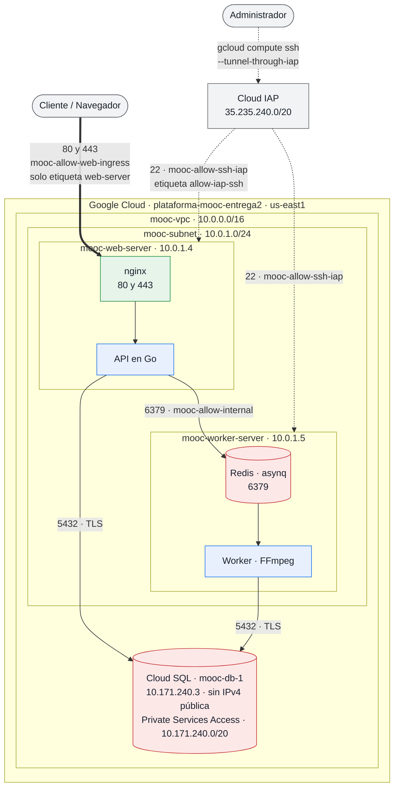

# Diagrama de Arquitectura de Red (Issue B3)

## Diagrama de Red de la Plataforma MOOC

> **Las direcciones privadas de las VMs no son fijas.** La subred las asigna por
> DHCP, así que una VM recreada recibe otra: estas dos ya pasaron de
> `10.0.1.2`/`10.0.1.3` a `10.0.1.4`/`10.0.1.5`. Lo que el diseño fija es la
> **subred** (`10.0.1.0/24`) y las reglas de firewall, que se expresan por
> etiquetas de red y por rango, nunca por IP. Los valores concretos se leen con
> `terraform output`, no se copian de aquí — la de Cloud SQL sí es estable,
> porque la reserva el peering de Private Services Access.

> **El Worker Server sí tiene dirección IPv4 pública** (estática, declarada en
> `compute.tf`), y aun así no es alcanzable desde internet. La protección la da la
> regla de firewall, no la ausencia de dirección: `mooc-allow-web-ingress` aplica
> solo a instancias con la etiqueta `web-server`, y el worker no la lleva. Es la
> decisión de costos de B1 —dos IPv4 externas cuestan 3,65 USD/mes frente a 6,73
> de una IPv4 más Cloud NAT—, y conviene leerla explícita porque «tiene IP
> pública» y «está expuesto» no son lo mismo.
>
> Consecuencia que conviene revisar en I2: **el Cloud NAT quedó aprovisionado y no
> se usa.** Una VM con dirección externa sale por ella, no por el NAT, así que
> `mooc-nat` no procesa tráfico de ninguna de las dos. O se retira, o se retiran
> las IPs externas; tener ambos paga dos veces por la misma salida.

Este diagrama ilustra la topología de red aprovisionada por Terraform (`network.tf`), mostrando la separación entre el acceso público desde Internet y los componentes internos aislados en la VPC privada.

---

## Explicación de los Límites de Red y Reglas de Firewall

1. **Web Server (Único Punto Público):**
   * **Regla `mooc-allow-web-ingress`:** Habilita el tráfico entrante desde `0.0.0.0/0` en los puertos TCP `80` (HTTP) y `443` (HTTPS) únicamente a instancias con la etiqueta `web-server`.

2. **Worker Server y Cola de Mensajería (Totalmente Isolados):**
   * El Worker Server no expone ningún puerto hacia internet. Su puerto Redis/Asynq (`6379`) y servicios internos solo son accesibles desde dentro del rango CIDR privado `10.0.1.0/24`.
   * **Salida a Internet (Egress):** Sale por su **propia dirección IPv4 externa**, no por el Cloud NAT. Fue la decisión de costos de B1 y no debilita nada: la salida no abre puertos entrantes, que los gobiernan las reglas de ingreso. `mooc-nat` existe en la infraestructura pero **no procesa tráfico de ninguna de las dos máquinas**, porque una VM con dirección externa no lo atraviesa — pendiente de resolver en I2.

3. **Base de Datos Administrada Cloud SQL (C1):**
   * Configurada mediante **Private Services Access** (`servicenetworking.googleapis.com`) sobre el rango de peering reservado `10.171.240.0/20`, que es el que asignó Google al crear la interconexión.
   * No posee dirección IP pública (`ipv4_enabled = false`). Únicamente acepta conexiones PostgreSQL (puerto `5432`) desde las direcciones IP privadas pertenecientes a la subred `10.0.1.0/24`.

4. **Administración Segura vía IAP:**
   * **Regla `mooc-allow-ssh-iap`:** Permite conexiones SSH (puerto `22`) exclusivamente desde el bloque de IPs de Google Identity-Aware Proxy (`35.235.240.0/20`). Las máquinas no tienen el puerto 22 abierto a todo Internet (`0.0.0.0/0`).
