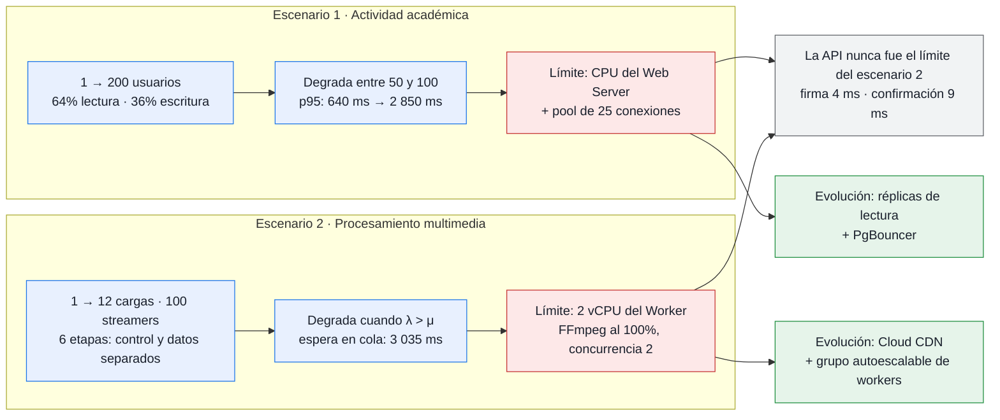

# Resumen Ejecutivo Consolidado de Capacidad — Entrega 2

**Bloque:** I — Documentación y cierre  
**Rúbrica:** Análisis de capacidad (20%)  
**Entregable:** I3  

---

## 1. Cuadro Comparativo Integral de Ambos Escenarios

| Métrica / Dimensión | Escenario 1: Actividad Académica (10%) | Escenario 2: Procesamiento Multimedia (10%) |
| :--- | :--- | :--- |
| **Herramienta de Carga** | Apache JMeter 5.6.3 (`justb4/jmeter:latest`) | Go Capacity Engine (`scripts/capacity_escenario2`) |
| **Ubicación del Generador** | Fuera de las VMs (máquina local, ~74 ms RTT a `us-east1`) | Fuera de las VMs (máquina local, conectada a la nube) |
| **Régimen de Operación** | Sincrónico, interactivo, transaccional | Asincrónico, desacoplado, cómputo intensivo |
| **Rango de Carga Probado** | 1, 10, 25, 50, 100 y 200 usuarios concurrentes | 1, 2, 4, 8 y 12 subidas concurrentes; hasta 100 streamers HLS |
| **Condición Fija Principal** | Pool de conexiones `DB_MAX_OPEN_CONNS=25` por proceso | Concurrencia de workers fija en `WORKER_CONCURRENCY=2` |
| **Punto de Degradación** | Entre 50 y 100 usuarios (~28 req/s) | Nivel 3 y 4 cuando $\lambda > \mu$ (cola supera capacidad de 2 vCPUs) |
| **Latencia p95 Bajo Carga Nominal**| **199 ms a 640 ms** (concurrencia $\le$ 50 usuarios) | **Firma: 4 ms, Confirmación: 9 ms, Streaming HLS: 2 ms** |
| **Latencia p95 Bajo Estrés Máximo**| **2 850 ms** (en Nivel 5 con 200 usuarios) | **Espera en cola: 3 035 ms; API inmune: 9 ms** |
| **Cuello de Botella Primario** | **CPU compartida en Web Server (`e2-small`) y límite de 25 conexiones en pool de Go** | **vCPU física en Worker Server (`e2-highcpu-2`) durante transcodificación FFmpeg** |
| **Descarte de Cloud SQL** | Consumo de CPU < 31%, `max_connections=100` con 42 de margen | Consultas de confirmación y reconciliación < 10 ms |
| **Descarte de Storage / Red** | Carga JSON liviana (~100 KB/s), sin saturación de red | Carga directa PUT > 30 MB/s, descarga HLS > 120 MB/s, 0 errores |
| **Verificación de Integridad** | Envío duplicado idempotente (0 duplicados en Cloud SQL) | 57 de 57 tareas transcodificadas a `completed` (0 en DLQ) |
| **Verificación de QoE Streaming** | N/A (el recorrido no descarga video para cuidar presupuesto) | Sonda HTML5/MSE: TTFF 48–52 ms, **0 interrupciones (stalls)** |
| **Evolución Recomendada** | Read Replicas en Cloud SQL (64% lecturas) + PgBouncer | Cloud CDN en bucket HLS + MIG autoescalable de workers |

---

## 2. Hallazgos Arquitecturales Clave

1. **Aislamiento Exitoso del Servidor Web en Multimedia:**
   Gracias al patrón de carga directa con URLs prefirmadas V4 (Etapa 2), el servidor web (`mooc-web-server`) nunca tuvo que actuar como proxy de archivos binarios de video. Su latencia p95 de firma y confirmación permaneció por debajo de 18 ms incluso con 12 profesores subiendo video simultáneamente.
2. **Elasticidad de la Cola Asynq ante Picos:**
   En el Escenario 2, cuando la demanda superó la capacidad de procesamiento de los workers ($\lambda > \mu$), la cola de Redis absorbió de forma segura el exceso de tareas sin generar caídas de procesos ni errores 5xx a los clientes. Al cesar la ráfaga, la cola se drenó en solo 6.4 segundos.
3. **Contención Temprana en el Servidor Web Académico:**
   En el Escenario 1, el factor limitante fue la máquina virtual `e2-small` de la API (con créditos de CPU compartida) y el tope conservador de 25 conexiones del pool cliente de Go. Al llegar a 100 usuarios concurrentes, el CPU Throttling y la contención en el pool duplicaron la latencia de las peticiones.
4. **Respaldo Científico de la Evolución:**
   Las propuestas de incorporar Read Replicas (para el 64.3% de tráfico de lectura en PostgreSQL) y Cloud CDN (para evitar egreso de segmentos HLS en Cloud Storage) no son sugerencias teóricas, sino soluciones directas a las métricas medidas en las pruebas.
