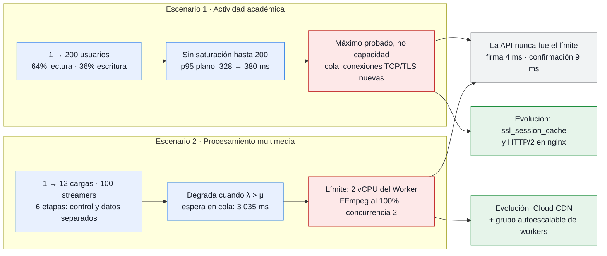

# Resumen Ejecutivo Consolidado de Capacidad — Entrega 2

**Bloque:** I — Documentación y cierre  
**Rúbrica:** Análisis de capacidad (20%)  
**Entregable:** I3  

---

## 0. Dónde se degrada el sistema, por qué y a partir de qué capacidad

| | Escenario 1 · actividad académica | Escenario 2 · multimedia |
| :--- | :--- | :--- |
| **¿Se degradó?** | **No**, en el rango probado | **Sí** |
| **¿Dónde?** | En ningún componente del servidor; se alarga la cola de latencia del cliente | En el **Worker Server**, durante la transcodificación |
| **¿Por qué?** | Por el **establecimiento de conexiones TCP/TLS nuevas**, no por procesar | La tasa de servicio está topada por vCPU (`WORKER_CONCURRENCY=2` sobre 2 vCPU); cuando λ > μ la cola acumula |
| **¿A partir de qué capacidad?** | No se encontró. **Máximo probado: 200 usuarios / 32,8 pet./s** | **8 profesores simultáneos**: la espera en cola p95 salta de 303 ms a 913 ms, y a 3 035 ms con 12 |
| **¿Cómo se manifiesta?** | p95 global ≈ 380 ms, plano de 10 a 200 usuarios; ≈ 117 ms sobre conexiones abiertas | **Como espera, no como error**: 0 fallos, 0 en DLQ; el tiempo hasta `completed` sube de 4,3 s a 6,1 s |
| **Descartado como límite** | CPU del web (12–34 %), CPU de Cloud SQL (máx. 27 %), memoria (≈ 31 %) | API (3–18 ms), Cloud Storage (30–48 MB/s), base (< 10 ms) |

**En el escenario 1 lo que degrada no es el servidor.** Sobre conexiones ya
abiertas el p95 es ≈ 117 ms y no se mueve con la carga; el p95 global sube por el
≈ 9,5 % de peticiones que abren conexión nueva (p95 de conexión ≈ 1 285 ms). Por
eso **200 usuarios es el máximo probado y no la capacidad máxima**: ningún nivel
activó los criterios de parada y la serie de presión no se ejecutó.

**En el escenario 2 el límite es aritmético.** Dos vCPU transcodifican dos videos
a la vez y cada uno tarda de 4 a 6 s, así que a partir de ocho llegadas
simultáneas la cola crece. El trabajo no se pierde ni se rechaza: espera. Al
cesar la ráfaga, la cola se drenó completa en 6,4 s.

**Primer recurso que se agotaría** con los dos escenarios a la vez: la CPU de
Cloud SQL (27 % con 32,8 pet./s; una extrapolación lineal —estimación, no
medición— la pondría en 80 % hacia las 240 pet./s). Segundo candidato: el pool de
conexiones de la API, que rozó su tope una vez (27 de ≈ 29).

---

## 1. Cuadro Comparativo Integral de Ambos Escenarios

| Métrica / Dimensión | Escenario 1: Actividad Académica (10%) | Escenario 2: Procesamiento Multimedia (10%) |
| :--- | :--- | :--- |
| **Herramienta de Carga** | Apache JMeter 5.6.3 (`justb4/jmeter:latest`) | Go Capacity Engine (`scripts/capacity_escenario2`) |
| **Ubicación del Generador** | Fuera de las VMs (máquina local, ~74 ms RTT a `us-east1`) | Fuera de las VMs (máquina local, conectada a la nube) |
| **Régimen de Operación** | Sincrónico, interactivo, transaccional | Asincrónico, desacoplado, cómputo intensivo |
| **Rango de Carga Probado** | 1, 10, 25, 50, 100 y 200 usuarios concurrentes (8 corridas; el nivel de 200 se repitió 3 veces) | 1, 2, 4, 8 y 12 subidas concurrentes; hasta 100 streamers HLS |
| **Condición Fija Principal** | Pool de conexiones `DB_MAX_OPEN_CONNS=25` por proceso | Concurrencia de workers fija en `WORKER_CONCURRENCY=2` |
| **Punto de Degradación** | **No se alcanzó.** Máximo probado: 200 usuarios (32,8 pet./s), sin errores ni fallos funcionales | Nivel 3 y 4 cuando $\lambda > \mu$ (cola supera capacidad de 2 vCPUs) |
| **Latencia p95 Bajo Carga Nominal**| **328 ms a 380 ms**, plana de 10 a 200 usuarios; ≈ 117 ms sobre conexiones ya abiertas | **Firma: 4 ms, Confirmación: 9 ms, Streaming HLS: 2 ms** |
| **Latencia p95 Bajo Estrés Máximo**| **380 ms** con 200 usuarios; la serie de presión que buscaría la saturación no se ejecutó | **Espera en cola: 3 035 ms; API inmune: 9 ms** |
| **Cuello de Botella Primario** | **Ninguno saturado.** Menor margen: CPU de Cloud SQL (máx. 27 %). La cola de latencia la produce el establecimiento de conexiones TCP/TLS nuevas (p95 de conexión ≈ 1 285 ms), no el procesamiento | **vCPU física en Worker Server (`e2-highcpu-2`) durante transcodificación FFmpeg** |
| **Observado en Cloud SQL** | CPU media 20 %, máx. 27 %; el pool de la API rozó su tope (27 de ≈ 29) en un pico | Consultas de confirmación y reconciliación < 10 ms |
| **Descarte de Storage / Red** | Carga JSON liviana (~100 KB/s), sin saturación de red | Carga directa PUT > 30 MB/s, descarga HLS > 120 MB/s, 0 errores |
| **Verificación de Integridad** | Envío duplicado idempotente (0 duplicados en Cloud SQL) | 57 de 57 tareas transcodificadas a `completed` (0 en DLQ) |
| **Verificación de QoE Streaming** | N/A (el recorrido no descarga video para cuidar presupuesto) | Sonda HTML5/MSE: TTFF 48–52 ms, **0 interrupciones (stalls)** |
| **Evolución Recomendada** | Confirmar el origen de la espera al conectar; `ssl_session_cache` y HTTP/2 en nginx. **Sin evidencia** para cambiar de VM ni para réplicas de lectura | Cloud CDN en bucket HLS + MIG autoescalable de workers |

---

## 2. Hallazgos Arquitecturales Clave

1. **Aislamiento Exitoso del Servidor Web en Multimedia:**
   Gracias al patrón de carga directa con URLs prefirmadas V4 (Etapa 2), el servidor web (`mooc-web-server`) nunca tuvo que actuar como proxy de archivos binarios de video. Su latencia p95 de firma y confirmación permaneció por debajo de 18 ms incluso con 12 profesores subiendo video simultáneamente.
2. **Elasticidad de la Cola Asynq ante Picos:**
   En el Escenario 2, cuando la demanda superó la capacidad de procesamiento de los workers ($\lambda > \mu$), la cola de Redis absorbió de forma segura el exceso de tareas sin generar caídas de procesos ni errores 5xx a los clientes. Al cesar la ráfaga, la cola se drenó en solo 6.4 segundos.
3. **El Servidor Web no fue el límite, y la latencia no viene de procesar:**
   En el Escenario 1 no se alcanzó saturación hasta 200 usuarios concurrentes (≈ 32,8 pet./s): 0 errores reales, 0 timeouts y 0 fallos de validación en las 8 corridas. La CPU del Web Server se movió entre 12 % y 34 % y la de Cloud SQL llegó a 27 %, así que **200 usuarios es el máximo probado y no la capacidad máxima**. Lo que sí encarece la cola de latencia es el establecimiento de conexiones nuevas: sobre conexiones ya abiertas el p95 del servidor es ≈ 117 ms, mientras que el ≈ 9,5 % de peticiones que abren conexión TCP/TLS tienen un p95 de conexión de ≈ 1 285 ms.

4. **Respaldo Científico de la Evolución:**
   La propuesta de Cloud CDN responde a una medición directa del Escenario 2 (egreso de segmentos HLS). Para el Escenario 1, en cambio, **las mediciones no respaldan** réplicas de lectura ni un cambio de tipo de VM: con la CPU del web entre 12 % y 34 % y la de la base en 27 %, el trabajo pendiente es confirmar el origen de la espera al conectar antes de dimensionar nada.
